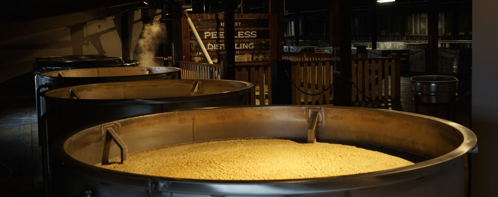

# Sour Mash

*The American whiskey-maker's consistency trick: stir spent grain from the previous batch into the new mash. Lowers the pH, suppresses wild yeast, and gives every batch the same starting acidity. Used by Jack Daniel's, Buffalo Trace, Maker's Mark, and most of Kentucky and Tennessee.*

**Read first:** [Whisky (the umbrella)](whisky.md), [Bourbon](bourbon.md), [Tennessee whiskey](tennessee-whiskey.md)

## Overview

Sour mash is the American answer to a problem every distillery faces: how do you get batch-to-batch consistency when you're working with a live fermentation that varies with the weather, the season, the freshness of the grain, and the mood of the yeast? The technique was developed by Dr. James Crow at Old Oscar Pepper distillery in Kentucky around 1830, and it's been the dominant practice in American whiskey ever since.

The principle: at the end of fermentation, when the mash has finished and gets stripped through the still, the **spent grain** (the de-alcoholised solids left in the boiler) is acidic, sterile, and full of dead yeast bodies that release nutrients. Save a portion of that spent grain and stir it into the NEXT mash before fermentation starts. The effect:

1. **Lowers the pH of the new mash** to around 4.0-4.5 - too acidic for most bacteria, hospitable for the distiller's yeast.
2. **Inoculates with familiar microflora** - the surviving yeast cells from the previous batch help kick-start the new fermentation.
3. **Provides nutrients** - autolysed yeast releases nitrogen and trace minerals into the new mash.
4. **Produces a recognisable house style** - because every batch carries some DNA from every batch before it, a distillery's whiskey develops a consistent character across years.

Despite the name, sour mash is NOT particularly sour-tasting. The acidity is a chemistry control, not a flavour. A finished sour-mash whiskey doesn't taste sourer than a "sweet mash" whiskey (the term for whiskey made without the technique - Woodford Reserve, Brown-Forman's smaller brands, some craft distillers).

Sour mash is **NOT** a federal or state requirement for bourbon or Tennessee whiskey. It's a tradition. The 51%-corn-and-new-charred-oak rules are what define bourbon legally; sour mash is just how almost everyone happens to make it.

## How much spent grain to save

The traditional ratio is **25-30% of the new mash volume**. For a 5-gallon wash:
- Save 5-6 litres of spent grain ("backset" or "stillage") from the previous run
- Stir into the new mash at the start of the cook (with the corn and water)

Higher ratios (up to 50%) give more flavour continuity and stronger acidity but can stress the yeast. Lower ratios (10-15%) are more forgiving for new distillers but give less effect.

## Storing the backset

The spent grain from a stripping run is hot when it comes out of the still (the boiler boiled). Cool it as fast as possible to refrigeration temperature; warm spent grain is a perfect medium for unwanted bacteria.

- Strain through cheesecloth to remove the grain particles. The liquid (clear, slightly amber, slightly sweet-acidic) is what you save.
- Cool in an ice bath or chiller; refrigerate at 4 °C.
- Use within 7 days; freeze for longer storage.
- Discard if it smells bad - vinegar-sharp, sulphurous, or actively spoiled means contamination, and stirring it into a new mash will spoil that one too.

A small operation that runs the still once a week can keep a "running backset" in the fridge: scoop out the volume you need for the next mash, replace with fresh spent grain after each run.

## Method (using sour mash in a bourbon-style wash)

This is a modification of the standard bourbon mash:

### Ingredients (5-gallon wash, traditional 70/15/15 bourbon mash bill + sour mash)
- 5 kg cracked corn
- 1 kg cracked rye
- 1 kg crushed malted barley
- 13 litres water (less than usual; backset replaces some of it)
- **5 litres of spent grain backset** from a previous run, cold from the fridge
- 25 g distiller's yeast

### Stage 1 - Cook the mash with backset
1. Heat 8 litres of water to 75 °C in a large stockpot. Add the cracked corn slowly, stirring continuously to prevent scorching. Hold 20 minutes.
2. **Add the cold backset.** This drops the mash temperature; that's intentional. Stir thoroughly.
3. **Add 5 litres more water** at 50 °C to bring everything back to 67 °C.
4. Stir; check the temperature.
5. Add the malted barley and rye. Hold at 65 °C for 90 minutes - same as a regular mash.

### Stage 2 - Cool and ferment
1. Cool the mash to 26 °C.
2. Test the pH: it should read 4.0-4.5 (use a pH meter or strips). If higher than 5.0, the backset wasn't acidic enough - you can still ferment but expect slower fermentation and slightly less character continuity.
3. Pitch the distiller's yeast. **Use less than you would for a sweet mash**: the backset already carries some living yeast, so 15 g (rather than 25 g) is enough.
4. Ferment 4-7 days at 25-30 °C. The fermentation typically starts slightly faster than a sweet mash because of the carried-over yeast.

### Stage 3 - Distil
Identical to a sweet-mash distillation. Same cuts, same heads/hearts/tails.

### Stage 4 - Save the new spent grain
After distilling, the spent grain in the bottom of the still is your backset for the NEXT batch. Strain, cool, refrigerate.

## What sour mash adds to the flavour

A direct comparison between a sweet-mash and sour-mash version of the same recipe (which a few craft distilleries do, deliberately, side-by-side) shows that the sour-mash version is:

- **Slightly drier** - the acidity reduces the perception of residual sugar
- **More integrated** - the flavours feel more "blended", less raw-grain
- **Subtly more savoury** - the autolysed yeast contributes umami notes
- **More consistent** - successive batches are more alike

A sweet mash gives a cleaner, brighter, more single-batch-distinct whiskey. A sour mash gives a more familiar, house-style whiskey. Both are valid choices.

## A note on the chain

A long sour mash lineage - say, 100 consecutive batches each using 25% from the previous - gives the whiskey a continuous identity. Buffalo Trace's mother yeast lineage allegedly goes back to the 1890s. Your family operation will start a new lineage with the first batch's spent grain; by batch 20 or 30 your house style will be recognisably yours.

## Stopping a sour mash chain

If a batch goes wrong (contaminated, off-flavour, accidentally over-fermented), break the chain: discard the spent grain, run the next batch as a sweet mash, and start a new sour mash chain from there. Don't carry forward a tainted backset.

## See also
- [Tennessee whiskey](tennessee-whiskey.md) - uses sour mash plus the Lincoln County Process
- [Bourbon](bourbon.md) - most commercial bourbon is sour mash, though not required by law
- [Whisky (the umbrella)](whisky.md) - the base process this modifies
