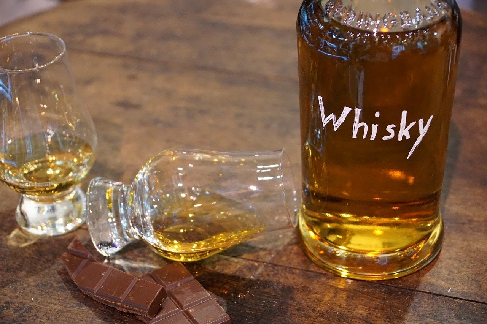

# Whisky

*The umbrella category: a fermented grain mash distilled and (usually) aged in oak. Different grain bills and barrel choices give the different American whiskies that follow.*

**Read first:** [Safety](safety.md), [Building a still](building-a-still.md)

## Overview

Whisky (or whiskey - American convention adds the "e") is fermented grain mash, distilled to between 60% and 80% ABV, and aged in oak barrels (with one exception, moonshine, which is the un-aged version). Every American whiskey on this course is built on the same five-stage process:

1. **Mash** - milled grains soaked in hot water to extract sugars
2. **Ferment** - yeast eats the sugars and produces alcohol (a "wash" or "distiller's beer")
3. **Distil** - the wash heated in a pot still; ethanol and flavour compounds vapourise and condense
4. **Cut** - the foreshots, heads, hearts and tails separated as described in [safety](safety.md)
5. **Age** - the spirit aged in oak barrels for months to years, picking up colour and flavour

This page covers the universal process. The individual whiskies - [bourbon](bourbon.md), [rye](rye.md), [Tennessee whiskey](tennessee-whiskey.md) - diverge in their grain bills and aging requirements.

## Stage 1 - Mashing

Whisky starts with milled grain. The two essential grains are CORN and MALTED BARLEY. Corn provides the fermentable starch and the sweet-soft flavour; malted barley provides the diastatic enzymes that convert the starch into sugar yeast can eat. Rye or wheat are added depending on the style.

A typical bourbon mash bill: 70% corn, 15% rye, 15% malted barley.

### Ingredients (for a 5-gallon wash)
- 5 kg corn (cracked, not flour - the texture of coarse cornmeal)
- 1 kg malted barley (crushed)
- 1 kg rye (cracked, for a bourbon-style mash; or 1 kg corn if not adding rye)
- 18 litres water
- 1 packet distiller's yeast (Red Star DADY or similar; 25 g)

### Method
1. **Heat 12 litres of water to 75 °C** (167 °F) in a large stockpot or mash tun.
2. **Add the corn.** Stir constantly for 30 seconds. The corn starch starts to gelatinise; the water will thicken slightly. Keep stirring intermittently for 20 minutes to prevent scorching at the bottom.
3. **Cool to 67 °C** (153 °F) by adding 4 litres of cool water. Stir.
4. **Add the malted barley and rye.** The barley's diastatic enzymes are now active at 65 °C. Stir.
5. **Hold at 65 °C for 90 minutes.** Stir every 15 minutes. The mash will thin noticeably as the starches convert to sugars (this is "conversion"). Test with a few drops of iodine on a small sample at 60 minutes: if it turns blue/black, starch remains and you need more time; if it stays brown/orange, conversion is complete.
6. **Cool to 26 °C** (79 °F). The fastest way is an immersion chiller (a coil of copper pipe with cold water running through it, dropped into the mash). Alternatively, leave overnight in a cool place.

## Stage 2 - Fermenting

Once the mash is at fermentation temperature, the yeast goes in.

1. **Add the distiller's yeast** directly to the cooled mash. Stir gently.
2. **Cover** with a loose lid or cloth, fitted with an airlock. (Some old-school whiskey makers ferment uncovered, with a layer of grain husks floating on top acting as a natural air seal.)
3. **Ferment 4-7 days at 25-30 °C.** Bubbles slow to nothing when fermentation is complete. The wash will taste sour and slightly alcoholic, with a faint cereal sweetness.
4. **Specific gravity check.** A hydrometer reading: when the gravity stops dropping (typically around 1.000-1.010), fermentation is done.

Expected ABV of the wash: 8-10%.

## Stage 3 - Distilling

This is the run. You have read [Safety](safety.md) by now.

1. **Strain the wash** through cheesecloth or a wide-mesh strainer to remove the grain (the "spent grain" is fed to livestock or composted).
2. **Charge the still** with the strained wash. Fill to 80% capacity.
3. **Heat slowly.** Bring to ~78 °C. Watch the thermometer; cooling water flowing.
4. **First drops emerge.** These are foreshots. Discard. (50 ml per gallon of wash - for a 5-gallon batch, the first 250 ml.)
5. **Heads.** The next 250-500 ml. Smell will be hot and grassy. Discard, or save in a separate "heads" jar for redistilling.
6. **Hearts.** The middle 1.5-2 litres of the run. Clean spirit smell, sweetly alcoholic, parrot hydrometer reading 70-85% ABV early in the run, dropping toward 60-65% mid-run. This is your whiskey.
7. **Tails.** When the parrot reads below 50% ABV, you are in tails. Smell will turn oily and wet. Discard or save for redistilling.
8. **Cut heat.** Cool the still. Total run time: 4-6 hours.

For a "single distillation" whiskey, this is your finished spirit. For a "double distillation" whiskey (Irish style, sometimes American), the hearts are redistilled in a second run. American whiskey is almost always single-distillation; the second run can give a cleaner result for vodka.

## Stage 4 - Aging

Whisky goes into oak barrels for aging. The barrels do four things:

1. **Add tannins and lignins from the wood** - vanilla, coconut, baking spice, smoke
2. **Concentrate the spirit** - water and alcohol evaporate through the wood ("angel's share")
3. **Mellow harsh notes** - fusel oils and other heavy compounds precipitate or react out
4. **Add colour** - the new whiskey comes off the still water-clear; oak gives the amber

**For American whiskies, the barrel MUST be new and charred** (this is the legal definition of straight bourbon). Charring caramelises wood sugars and creates the iconic flavour. A 5-gallon American oak barrel ($150-200) is the family-scale standard; commercial barrels are 53 gallons.

**Char levels:**
- **#1 char** (light): 15-30 seconds, gentle vanilla
- **#2 char**: 30-45 seconds, balanced
- **#3 char** (medium): 45-60 seconds, more caramel and spice
- **#4 char** ("alligator char"): 60+ seconds, blackened and crocodile-textured - the standard for most American bourbon

**Aging times** for family-scale whiskey:
- 6-12 months in a 5-gallon barrel approximates 2-4 years in a commercial 53-gallon barrel (the surface-area-to-volume ratio is much higher in small barrels, so aging is faster)
- Taste every 2 months from month 4 onward; the whiskey can over-oak in a small barrel within a year
- Once it tastes right, bottle it (further aging in glass slows almost to a stop)

**Storage during aging:** A consistent-temperature space (a cellar or insulated shed) is ideal. Daily temperature swings of more than 10 °C accelerate the aging but can also cause excessive evaporation. A barrel sitting on its side, with a clean cloth over the bung, is the traditional setup.

## Stage 5 - Cutting and bottling

Whiskey comes out of the barrel at around 60-65% ABV (depending on how much evaporation has happened). For bottling at 40% (the American standard), you cut with distilled or filtered spring water:

- 60% ABV → 40%: add 0.5 parts water by volume (250 ml water per litre of whiskey)
- 65% ABV → 40%: add 0.625 parts water
- 50% ABV → 40%: add 0.25 parts water

Cut slowly, stirring continuously. Let the cut whiskey rest a week before bottling (the marriage of water and spirit takes time to reach equilibrium).

Bottle in clean glass with a tight cap. Storage life: indefinite if sealed.

## Notes
- **Mash temperatures are not arbitrary.** Below 60 °C the starches don't gelatinise; above 70 °C the enzymes denature. The 65-67 °C hold is the sweet spot.
- **Distiller's yeast over bread yeast.** Bread yeast tops out at 8% ABV and produces more off-flavours. Distiller's yeast is bred for clean fermentation to 12-15% ABV.
- **Don't over-pitch the yeast.** A single 25g packet is correct for a 5-gallon wash. More yeast doesn't make a stronger wash; it just makes fermentation faster and sometimes less clean.
- **The grain matters more than people think.** Cheap supermarket cornmeal can work but lacks the depth of a fresh-cracked dent corn or heirloom variety. Find a local feed mill that sells distiller's-grade grain.

## See also
- [Bourbon](bourbon.md) - the specific whiskey style with 51% corn, new charred oak, the federal standard
- [Rye](rye.md) - the spicier whiskey with 51% rye
- [Tennessee whiskey](tennessee-whiskey.md) - the same as bourbon plus the Lincoln County Process
- [Ole Smoky moonshine](ole-smoky-moonshine.md) - un-aged corn whiskey
