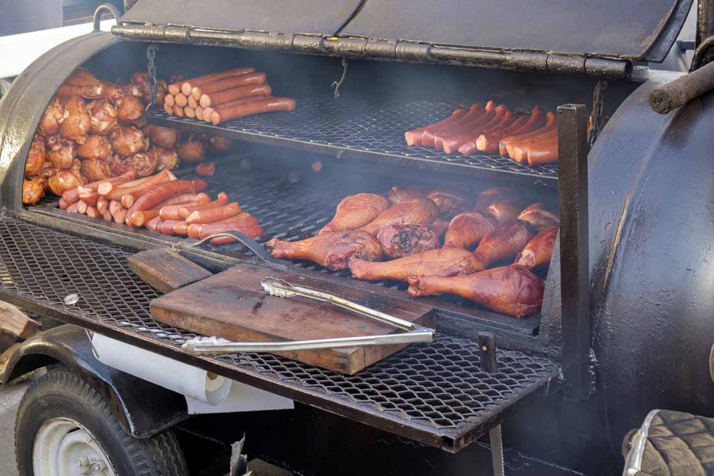

# BBQ & Smoking Course

*The American low-and-slow tradition. Brisket, ribs, pulled pork, and the techniques that turn tough connective-tissue cuts into the most extraordinary eating in the meat repertoire. Hours of smoke, hours of patience, a thermometer and a rub.*

## Overview
American barbecue is a long-cooking tradition originating in the slave kitchens of the South and refined into regional styles - Texan brisket, Memphis ribs, Carolina pulled pork, Kansas City sauce-everything. The common thread is collagen-rich cuts cooked at low temperatures (95-120 C) for hours over hardwood smoke, transforming connective tissue into gelatin, breaking down muscle fibres into pull-apart tenderness, and laying down a deep smoke-infused crust (the "bark") on the surface.

This course covers what is achievable at home with a smoker, a thermometer and a willingness to spend a Saturday tending a fire. Brisket is the spiritual centre of American barbecue; pulled pork is the most reliable result-for-effort; ribs are the project that fits a single afternoon. Side dishes, sauces and the regional traditions get their share.

The hardware question is real. A kettle barbecue (a Weber) can produce credible ribs and acceptable pulled pork; for genuine brisket-grade barbecue you want an offset stick burner or a pellet smoker. The course points out where the cheaper kit hits its ceiling.

## Course Outline

### 1. Foundations
- [Smoke Science](smoke-science.md): why low-and-slow works, the collagen-to-gelatin transition, the smoke ring, the stall, what wood smoke actually is and why the right kinds of wood (and the right amount) matter. The chemistry under everything that follows.
- [Woods and Fuels](woods-and-fuels.md): hickory, oak, mesquite, pecan, apple, cherry. The charcoal-vs-wood question. Pellets vs lump charcoal vs briquettes. Which wood for which meat.
- [Rubs, Mops and Sauces](rubs-mops-sauces.md): the three layers of bark, baste and finish. Memphis dry rub vs Kansas City sweet rub vs Texas salt-and-pepper. Mop sauces (vinegar-thin, kept on the side). Finishing sauces (sweet or vinegary, by region).

### 2. The Big Three
- [Brisket](brisket.md): the Texas centrepiece. 12-18 hours, two muscles, a low-and-slow that ends in a probe-tender meat that slices like a steak from the flat and shreds like pulled pork from the point.
- [Ribs](ribs.md): St Louis, baby back, beef short. Five-to-six-hour cooks, four phases (smoke, wrap, sauce, glaze), the bend test that confirms doneness.
- [Pulled Pork](pulled-pork.md): pork shoulder / Boston butt. The most forgiving long cook in the course. 10-14 hours; pulls apart with two forks; bun, slaw, sauce.

### 3. Supporting
- [Low-and-Slow](low-and-slow.md): the principles tying brisket, ribs and pulled pork together. Temperature curves; the stall and why it happens; the wrap question; the rest after cooking.

## The Three Things That Matter

Most of the course collapses into three principles.

1. **Time + temperature = tenderness.** Connective-tissue cuts (chuck, brisket, shoulder, ribs) cannot be rushed. The collagen breaks down to gelatin between 70-85 C internal, slowly. Cook fast and the meat is tough; cook slow and the same meat is meltingly tender. The temperature target is not steak doneness (medium-rare 55 C); it is well-past-done (95-98 C internal).

2. **Smoke is a seasoning.** Most home cooks oversmoke. The "smoke ring" - the pink layer 5-10 mm under the surface - is laid down in the first 3-4 hours of cooking; further smoke adds surface flavour only. A handful of wood chunks across an 8-hour cook is roughly right; whole logs are roughly right for offset smokers, with their constant airflow.

3. **The stall is real and you wait it out.** Every long cook hits a "stall" around 70-75 C internal, where the meat appears to stop cooking for 2-3 hours. This is evaporative cooling - moisture leaving the meat surface absorbs the heat. You either wait (it eventually breaks through) or wrap the meat (the "Texas crutch") which stops the evaporation and accelerates through the stall.

## Where to Start

- New to BBQ: [Ribs](ribs.md). Single afternoon, manageable size, dramatic results. A rack of pork ribs is the most forgiving first BBQ project.
- Want pulled pork sandwiches: [Pulled Pork](pulled-pork.md). Low-skill, high-reliability. Set the smoker, set the alarm for the morning.
- Want the showstopper: [Brisket](brisket.md). The hardest project in the course. Best left until you have a few cooks under your belt - the meat is expensive and the failure modes are visible.
- Curious about the science: [Smoke Science](smoke-science.md). Reads like a chemistry briefing; explains every other recipe.

## Where Next
- [Charcuterie](../charcuterie/charcuterie.md): the curing tradition that produces bacon, salumi and salami. Adjacent to BBQ; some shared techniques (the cold-smoking of bacon is the BBQ cold-smoke).
- [Stocks and Sauces](../stocks-sauces/stocks-sauces.md): when you have leftover smoked bones or skin, make smoked stock.
- [Cuisine: American Southern](../../cuisine/southern/) and [Cajun](../../cuisine/cajun/): the home cuisines of the tradition.

## A Note on Equipment

Three viable starter setups:

1. **Kettle barbecue (e.g. Weber Original).** Lump charcoal heaped to one side, a foil drip pan with water on the other; meat on the cool side. Add wood chunks. Maintain 110-130 C by adjusting vents. Works for ribs (5-6 hours) and pulled pork (8-10 hours, requires occasional fuel additions). Brisket is a stretch - the fuel demand exceeds the kettle's capacity for a 14-hour cook.

2. **Pellet smoker (e.g. Traeger, Camp Chef).** Electric thermostat-controlled. Set 105 C, walk away. Smoke profile is lighter than stick-burning; some pellet smokers add a "smoke tube" to deepen it. The easiest format; the lowest skill ceiling; the cleanest results for new cooks. Brisket comfortably possible.

3. **Offset stick burner (e.g. Oklahoma Joe Highland or a custom Lang).** A separate firebox burns wood; smoke and heat enter the cooking chamber. Temperature control by managing the fire. The classic American barbecue smoker. Highest skill ceiling; deepest smoke profile; the format that produces competition-grade results.

A useful intermediate is the **UDS / drum smoker**. A 200-litre barrel converted to a vertical smoker. Charcoal at the bottom, meat on a rack above, wood chunks for smoke. Holds temperature for 8-10 hours on one fuel load. Affordable, reliable, the smoker most enthusiasts move to after the kettle.

All four work with the same techniques. Pick what fits your budget and the time you want to invest in learning a fire.
