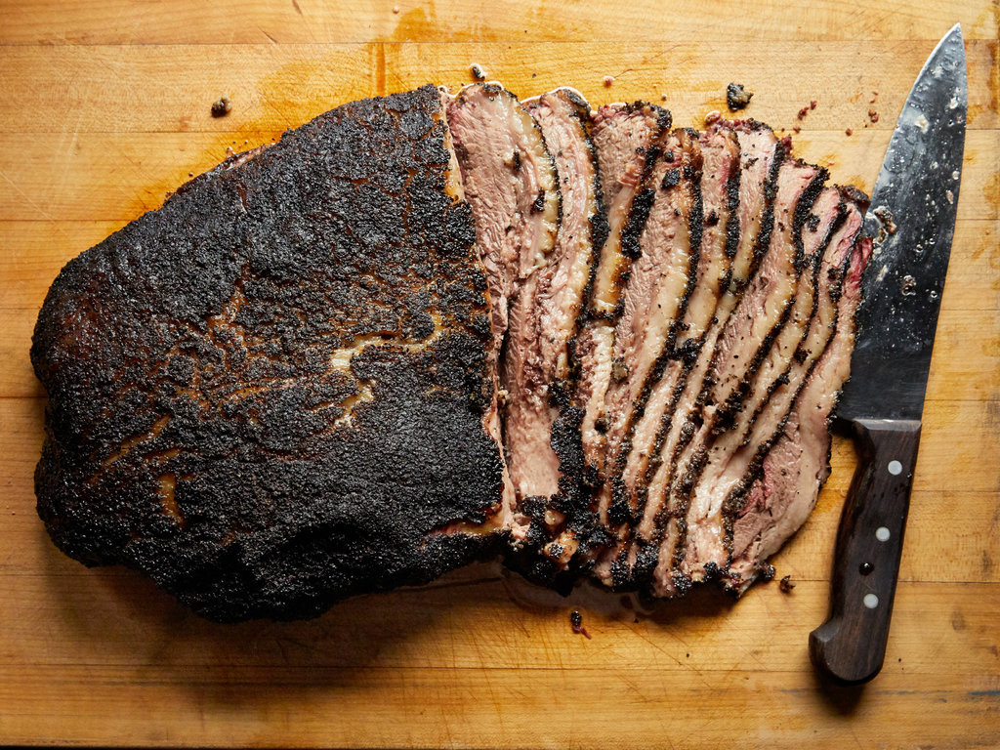

# Brisket

*The Texas centrepiece. A whole packer brisket - 5-7 kg of two interlocked muscles, is the hardest cook in American barbecue, and the most rewarding. Twelve to eighteen hours of slow smoke over post oak, an aggressive bark, a clean smoke ring, and slices that fall apart at the touch of a fork.*

## Overview
Brisket is the front-of-cow's-chest muscle, two interlocked but distinct cuts: the flat (the lean, longer, more uniform muscle that slices like a steak) and the point (the fattier, more marbled, shreddable muscle that becomes burnt ends or pulled-style brisket sandwich filling). The "packer brisket" is both muscles connected as one piece, sold whole; this is what serious BBQ uses. Trimmed flat or trimmed point are sold separately for smaller cooks.

The challenge: brisket needs to dwell at 70-85 C internal for 4-6 hours for the collagen to fully convert to gelatin. Below that temperature the meat is tough; above it for too long the meat is mushy. The cook is governed by the meat itself, some briskets cook in 10 hours, some in 16 - and the only way to know is to feel the probe-tender point with a thermometer probe.

This is the canonical worked recipe in the course. Other lessons reference back here for the long-cook principles.

## What You Need

**Packer brisket.** USDA prime if you can get it; choice if not. 5-7 kg trim-on weight; 4-5 kg after trimming. Look for marbling running through the flat, a generous fat cap (the white fat layer on one side), and a flexible texture when gently bent (a stiff brisket is overworked or old). Buy from a butcher who can talk about the cut.

**Texas salt-and-pepper rub.** 50/50 coarse kosher salt and coarse-cracked black pepper. About 4-5 tbsp per brisket. See [Rubs, Mops and Sauces](rubs-mops-sauces.md).

**Wood.** Post oak primary; white or red oak as substitutes. Cherry as a colour additive. 6-8 chunks of wood across the cook, or 4-5 splits if running an offset.

**Smoker.** Pellet smoker (easiest), drum smoker, kettle barbecue (for a small flat-only cook), or offset stick burner (the classic). The cook is the same regardless; the format affects the smoke profile.

**Dual-probe thermometer.** One for ambient, one for the meat. This is the central piece of kit.

**Butcher paper.** Pink/peach butcher paper, the unwaxed kind, sold in restaurant supply. The "Texas wrap." Foil works as a substitute but produces a slightly softer bark.

**Cooler or low oven.** For the rest at the end. Empty insulated cooler, or a cool oven at 60-70 C.

## Trimming

The brisket comes from the butcher in its full state. It needs trimming before cooking:

1. **Place fat-side-down.** Identify the two muscles: the flat (the larger, thinner, more uniform muscle) and the point (the thicker, fattier, more triangular muscle on top of the back end).
2. **Trim the meat side.** Remove hard fat, silver skin, any visible glands or unattractive matter. Leave the muscle largely intact.
3. **Flip fat-side-up.** Trim the fat cap to 5-8 mm thick across the whole brisket. Most packer briskets come with a 15-30 mm fat cap; you want it thinner so the rub touches the meat surface in places.
4. **Square the edges.** Trim off thin straggling pieces (the "tail" of the flat, any thin overhangs): they will burn before the bulk of the meat is done.
5. **The result.** A roughly rectangular brisket, 2-3 kg of flat-end and 2-3 kg of point-end, with a 5-8 mm fat cap on the top.

Save the trimmings for grinding (they make excellent brisket burgers) or rendering (the fat is good for cooking).

## The Rub

1. Mix the salt and pepper in a small bowl. 4-5 tbsp total.
2. Press onto every surface of the brisket, top, bottom, sides, ends. Heavily. The rub should look like the brisket has been dredged in pepper.
3. Cover loosely with plastic wrap and refrigerate for at least 1 hour, ideally overnight (the salt has time to penetrate).

A small amount of garlic powder (5-10% of the total rub) is optional. Some traditional Texas rubs include onion powder; most do not. Anything more elaborate becomes a different style.

## The Cook

### Setup

1. Light the smoker. Aim for 110 C ambient.
2. Place the brisket fat-side-up on the grate, in the cool zone (away from direct heat). The fat will baste the meat slowly as it renders down.
3. Insert the meat probe into the thickest part of the flat. This is your measurement point.

### Phase 1: The Climb (0-3 hours)

The brisket goes on cold. Ambient stays at 110 C. The meat climbs slowly toward 70 C internal.

What to do:
- Add wood chunks every 60-90 minutes for the first 3 hours. After that, the smoke ring has been laid down and additional smoke contributes diminishing returns.
- Spritz the meat with apple juice or thin apple-cider-vinegar mop every 90 minutes if running a particularly dry smoker (ovens and pellet smokers benefit from spritz; offset stick burners produce enough moisture in their own exhaust that spritzing is optional).
- Do not open the lid more than absolutely necessary, every opening loses 15-30 minutes of cook time.

### Phase 2: The Stall (3-7 hours)

Internal temperature hits 70-75 C and stops climbing. The bark is forming, darkening, hardening.

Decision: wrap or not wrap.

**To wrap:** When the bark is dark and feels firm to the touch (around hour 6-7), pull the brisket. Wrap tightly in butcher paper, one full sheet, fat-side-up. Add 60-100 ml beef tallow or beef stock to the wrap before sealing (the moisture against the meat). Return to the smoker.

**Not to wrap:** Continue at 110 C until the stall breaks naturally (around hour 8-10). The bark deepens further; the meat surface darkens to near-black. This produces the deepest bark but takes longer.

Texas competition cooks mostly wrap with butcher paper. Backyard cooks often go naked. Both are valid; the wrap is faster.

### Phase 3: The Final Climb (7-12 hours)

Internal climbs from 80 C toward 95 C. The collagen-to-gelatin conversion peaks. The meat is moving from "cooked" to "transcendent."

What to do:
- Maintain ambient temperature.
- Probe the meat every 20-30 minutes after it reaches 85 C internal.

### The Probe Test

The brisket is done when a thermometer probe (or a clean wooden skewer) slides into the thickest part of the flat with no resistance. The probe should slide in like the meat is room-temperature butter. The internal temperature at this point is usually 93-98 C, but the temperature is a guide; the probe feel is the truth.

If the meat is still resistant at 98 C internal, continue cooking, some briskets need to climb to 100 C. If the meat probes tender at 93 C, it is done; do not push further.

### Phase 4: The Rest

This is mandatory.

1. Take the brisket off the smoker. Leave it wrapped (or, if not wrapped, wrap it now in butcher paper).
2. Place in an insulated cooler with a couple of towels around it. Or place in a 60 C oven. Or wrap in a thick towel and place on a warm hob hob (off, just the residual radiator-style warm).
3. Rest minimum 1 hour. Ideally 2-3 hours. Up to 4 hours is fine.

During the rest, the meat's internal temperature actually rises slightly (carry-over cooking from the hot ambient) and then slowly falls. The juices redistribute. The connective-tissue gelatin firms. Slicing without resting gives you tough dry brisket; with proper rest, the brisket is meltingly tender and full of moisture.

## Slicing

1. Unwrap on a board large enough to hold the whole brisket.
2. **Separate the flat from the point.** Visible at the cut surface; the grain runs different directions in each muscle. The point sits on top of the back end of the flat; slice horizontally between them to separate.
3. **Slice the flat.** Across the grain. Pencil-thick slices (about 6-8 mm). The grain runs along the length of the brisket; slice perpendicular to it.
4. **Slice the point.** Across the grain (different angle than the flat, the point's grain runs almost perpendicular to the flat's). Slice thicker (1-2 cm); the point is fattier and meant to be eaten in chunks.
5. **Optional: Burnt ends from the point.** Cube the point into 3-4 cm cubes; return to the smoker for 30-60 minutes with a brush of BBQ sauce; the cubes caramelise into "burnt ends", the most prized morsels of the cook.

## Serving

- Whole sliced flat on a platter
- Burnt ends on the side
- **Optional:** Texas-style BBQ sauce, kept on the side (the meat is meant to stand alone)
- **Sides:** potato salad, coleslaw, baked beans, white bread, pickled jalapenos, sliced onion, pickles
- **Drink:** cold beer

## Common Failures

- **Tough brisket.** Undercooked. Probe-tender is the only test. If the meat is not probe-tender, continue cooking.
- **Dry brisket.** Either overcooked past probe-tender, or insufficient rest, or the rub did not penetrate, or the fat cap was trimmed too thin.
- **Mushy brisket.** Overcooked, the collagen has degraded past gelatin into a soft mass.
- **Bitter bark.** Smoke was too thick (smouldering) or the rub had too much sugar (this is why Texas rubs use no sugar).
- **Pale bark.** Smoker too humid; not enough surface drying; too much spritzing.

## Where Next
- [Pulled Pork](pulled-pork.md): the easier cousin, same principles, more forgiving.
- [Ribs](ribs.md): the shorter alternative.
- [Low-and-Slow](low-and-slow.md): the underlying principles applied here.
