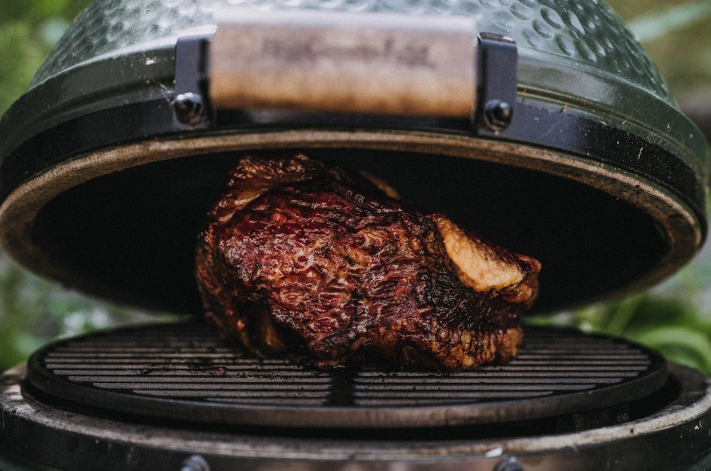

# Low-and-Slow

*The principles tying every BBQ cook together. Low temperature (105-120 C), long time (4-18 hours), the stall, the wrap, and the rest at the end. Read this once and the individual brisket / ribs / pulled pork lessons become recipes you can predict.*

## Overview
Every BBQ cook in this course follows the same temperature curve and the same general phases. Knowing the curve lets you predict where a cook is in its journey by looking at the meat's internal temperature, and lets you handle the surprises (the stall) calmly.

This lesson is the meta-lesson, the principles abstracted out of the individual recipes. It is short.

## The Temperature Targets

Two thermometers: one in the smoker measuring ambient temperature; one in the meat measuring internal temperature.

**Smoker ambient temperature.** This is what your smoker is running at. Maintain it within a narrow band:
- Brisket, beef short rib: 105-120 C
- Pulled pork, pork shoulder: 105-115 C
- Ribs (St Louis, baby back): 110-120 C
- Beef chuck roast: 110-120 C
- Beef back ribs: 110 C

**Meat internal temperature.** This is what the meat itself is at, measured at its thickest point. The targets:
- Brisket: probe-tender at 95-98 C
- Pulled pork: probe-tender at 92-95 C
- St Louis ribs: bend test (the rack should bend gracefully when picked up) at around 90-91 C
- Beef short ribs: probe-tender at 95-98 C

"Probe-tender" means: a probe (a thermometer needle, a skewer, a fork tine) slides into the meat with no resistance. The meat literally feels like butter. This is more important than the temperature reading; if the meat is probe-tender at 90 C, it is done; if it is still resistant at 100 C, it needs another 30 minutes.

## The Four Phases

Every long cook goes through approximately four phases:

### Phase 1: The Climb (0-3 hours)

The meat goes on cold from the fridge. The smoker is at temperature. The meat rises from 4 C internal up to about 70 C internal in 2-3 hours.

What is happening:
- The Maillard browning is starting on the surface
- The smoke ring is being laid down (this is when the cool wet surface absorbs nitric oxide most readily)
- The bark is beginning to form

What you do: nothing much. Keep the smoker steady; add wood chunks as needed for smoke; resist opening the lid.

### Phase 2: The Stall (3-7 hours)

The meat hits 70-75 C internal and the temperature stops climbing. Evaporative cooling from the meat surface equals the heat input from the smoker; the meat is in thermal equilibrium until something changes.

What is happening:
- The bark is hardening and drying
- The collagen-to-gelatin conversion is ramping up
- The meat is losing moisture (significant moisture, up to 15-20% of starting weight by the end of the stall)

What you do:
- **Wait.** Patience. Maintain temperature; the stall breaks eventually.
- **Or wrap.** Take the meat off, wrap in butcher paper or foil, return to the smoker. The wrap traps moisture against the meat; evaporation stops; the internal temperature begins climbing again within minutes.

The wrap question is regional. Texas tradition: butcher paper, which keeps the bark crisp. Kansas City / pulled pork tradition: foil, which softens the bark but accelerates the cook. No-wrap (the "naked brisket"): for purists; slowest but produces the deepest bark.

### Phase 3: The Final Climb (1-3 hours)

The meat climbs from about 80 C internal up to the final target (90-98 C). The connective tissue continues converting; the meat becomes increasingly tender.

What is happening:
- Collagen has mostly converted to gelatin
- Muscle fibres are softening
- The meat is now in the "probe-tender" zone; the right moment is approaching

What you do: probe the meat every 15-20 minutes. The moment it probes tender, it is done. Internal temperature is a guide; probe feel is the truth.

### Phase 4: The Rest

After cooking, the meat must rest. This is non-negotiable for brisket; important for pulled pork; significant for ribs.

- Brisket: rest minimum 1 hour, ideally 2-4 hours. Wrap in butcher paper or foil; place in an insulated cooler (a cool box with no ice) or a low oven (60-70 C). The juices redistribute; the meat finishes setting; the connective tissue that has converted to gelatin firms.
- Pulled pork: rest 30 minutes to 1 hour wrapped before pulling.
- Ribs: rest 15-30 minutes wrapped before slicing.

If you slice brisket the moment it comes off the smoker, the juices run out and the meat is dry and tough. The rest is part of the cook; build it into your timing.

## A Standard Brisket Cook Timeline

For a 6 kg untrimmed brisket (4-5 kg after trimming):

- 0:00 - Brisket on the smoker. Smoker at 110 C. Wood chunks added.
- 3:00 - Internal at about 70 C. Stall begins. Smoke ring laid down.
- 6:00 - Internal still around 75-78 C. Stall in full effect. Bark is dark and hardened. Decision time: wrap or wait.
- 6:30 - Wrap in butcher paper. Return to smoker.
- 9:00 - Internal at about 85 C. Climbing past the stall.
- 11:00 - Internal at about 93 C. Beginning to probe-test.
- 12:00 - Probe-tender at 95 C. Done.
- 12:00-14:00 - Rest in insulated cooler.
- 14:00 - Slice and serve.

A 6 kg brisket is a 14-hour project from go to serve. Plan accordingly.

## Common Failures

| Symptom | Cause | Fix |
|---------|-------|-----|
| Meat tough at finish temperature | Insufficient time at 70-85 C | Continue cooking until probe-tender, not until thermometer reads a number |
| Bark soft and pale | Cook too humid; not enough surface drying | Open vents more; reduce mopping; ensure airflow |
| Bark burnt and black | Cook too hot or sugar in rub burning | Drop temperature; reduce sugar in rub; or wrap once bark is set |
| Smoke flavour harsh / acrid | Smoke too thick (smouldering); too much wood | Improve airflow; use less wood; let the fire burn cleaner |
| Meat dry at slicing | Insufficient rest; or overcooked past target | Always rest minimum 30 min; check temp and probe simultaneously |
| Stall lasts forever | Smoker running too cool; or wet meat | Confirm ambient temp; consider wrapping |

## The Single Best Practical Advice

**Get a good thermometer.** A dual-probe wireless thermometer (one probe in the smoker, one in the meat) is the single highest-value piece of BBQ equipment. ThermoWorks Smoke, Inkbird IBT-4XS, the FireBoard, any will work. The cook becomes manageable when you can see the temperature without opening the smoker.

**Cook to probe-tender, not to temperature.** Temperature is a guide; the probe feel is the truth. Two briskets cook differently; the one is ready when it is ready.

**Plan for the timing not the meat.** A brisket might take 12 hours or it might take 18 hours. Plan to be done eating 2-3 hours later than the meat will be done. Use a cooler for warm-rest; the cooked brisket can sit wrapped at 60+ C for up to 4 hours without quality loss.

## Where Next
- [Brisket](brisket.md): the worked recipe.
- [Ribs](ribs.md): the medium-duration cook with the 3-2-1 / 4-1-1 timing.
- [Pulled Pork](pulled-pork.md): the most reliable beginner cook.
- [Smoke Science](smoke-science.md): the chemistry underlying these principles.
