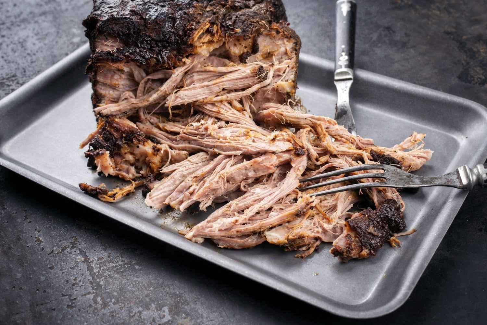

# Pulled Pork

*The most reliable, most forgiving long cook in American BBQ. A pork shoulder (or Boston butt) smoked for 10-14 hours becomes meltingly tender, pulls apart with two forks, and sits on a bun with coleslaw. The introduction to BBQ for most cooks.*

## Overview
Pulled pork is the dish that converts BBQ skeptics. Pork shoulder is heavily marbled with intramuscular fat and tough connective tissue, both of which break down beautifully on a 10-14 hour low-and-slow cook. The forgiveness is the key: a brisket overcooked by 30 minutes is mushy; a pork shoulder cooked for an extra hour is still glorious. You can leave the cook unattended for hours and come back to a successful project.

The dish itself is famous in Carolina (both Carolinas, with different sauce traditions), Memphis (sweet), and Kansas City (sauced thick). The pork is the same; the sauces and serving traditions differ.

## What You Need

- Pork shoulder (bone-in is best). Often labelled "Boston butt" - despite the name, this is the shoulder, not the rear. 3-5 kg piece. Bone-in cooks more evenly and adds gelatin.
- BBQ rub - Kansas City sweet rub or Carolina light rub (see [Rubs, Mops and Sauces](rubs-mops-sauces.md))
- Wood for smoke - hickory primary, applewood secondary
- Smoker
- BBQ sauce of choice (regional preference)
- Soft burger buns
- Coleslaw

## The Cook

### Preparation

1. **Trim the shoulder.** Most pork shoulders come with a thick layer of fat on one side; trim this down to 5-8 mm. Some cooks leave more; reduces over the cook. Leave the bone in.
2. **Apply the rub.** Coat all surfaces heavily with the rub. About 3-4 tbsp for a 4 kg shoulder. Let rest at room temperature 30 minutes, or refrigerate uncovered overnight (the dry refrigerate concentrates the rub onto the meat and dries the surface for better bark).
3. **Set up the smoker.** Target 110 C. Add hickory chunks - 4-6 across the cook.

### The Cook

1. **Place fat-side-up on the grate.** The fat slowly renders down through the meat as it cooks.
2. **Insert the meat probe** into the thickest part, avoiding the bone.
3. **Maintain 110 C ambient** for the whole cook.
4. **Spritz with apple juice** every 90 minutes for the first 4 hours. After that, the bark is set and spritzing is less important.

### Phase 1: The Climb (0-3 hours)

Meat climbs from fridge cold to about 70 C internal. Bark begins to form. Smoke ring lays down.

### Phase 2: The Stall (3-8 hours)

Internal stops climbing at 70-75 C. The stall lasts longer than for brisket because the pork shoulder is rounder and has more surface area for evaporative cooling.

**Wrap or not?** Pork shoulder works either way. Wrapping in foil at the stall (around hour 6-7) speeds the cook by 2-3 hours and produces a softer bark; not wrapping produces a deeper, drier bark but takes longer.

For a wrap: at hour 6, when bark is dark and firm, wrap tightly in foil with 60 ml apple juice or cider vinegar. Return to smoker.

For naked: continue at 110 C; the stall lasts 3-4 hours; eventually breaks.

### Phase 3: The Final Climb (3-5 more hours)

The internal temperature climbs through 80 C up to 92-95 C. The connective tissue converts. The meat softens.

Begin probing at 88 C internal:
- Insert a probe into the meat at multiple points; the probe should slide in like into butter
- Specifically, probe near the bone: the meat should slide off the bone easily
- The bone itself should be loose - if you grasp it, it should pull cleanly out of the meat

When all these tests pass, the pork is done. Internal temperature: usually 92-95 C, occasionally 96 C.

### The Rest

Wrap (or re-wrap) in foil. Place in an insulated cooler or low oven (60 C). Rest minimum 30 minutes, ideally 1 hour. The juices redistribute; the meat finishes setting.

## Pulling

1. Unwrap on a large board or tray (the meat releases liquid; have something to catch it).
2. Pull the bone out cleanly. If it does not come out cleanly, the meat was undercooked - return to the smoker for 30 more minutes.
3. With two forks (or wearing food-safe gloves), shred the meat against the grain. Pull apart into stringy chunks.
4. The bark mixed through the shred is the textural highlight; do not separate the bark out, mix it in.
5. Pour over any reserved cooking liquid from the foil wrap; this adds moisture and seasoning. Stir to coat.

A 4 kg shoulder yields about 2-2.5 kg of pulled meat. Feeds 8-12 people.

## Serving

The four regional traditions:

### Carolina East-Style

- Pulled pork on a soft bun
- Tossed with vinegar-pepper Carolina East sauce (vinegar + red pepper flakes + salt)
- Topped with a generous helping of coleslaw

### Carolina West-Style (Lexington)

- Pulled pork on a soft bun
- Tossed with vinegar-tomato Carolina West sauce
- Topped with red slaw (vinegar-based slaw, no mayonnaise)

### Memphis-Style

- Pulled pork on a soft bun
- Tossed with sweet KC-style sauce
- Topped with coleslaw

### Plate (No Bun)

- Pulled pork over baked beans or mac and cheese
- Sauces on the side
- Plus traditional sides: corn bread, collard greens, potato salad

## Sides That Belong

- **Coleslaw:** vinegar-and-mayo or vinegar-only.
- **Baked beans:** slow-cooked navy beans with molasses, brown sugar, bacon.
- **Mac and cheese:** béchamel-based, baked, traditional.
- **Cornbread:** in skillet, slightly sweet, served warm with butter.
- **Pickled jalapenos:** sharp acid cuts the richness.
- **Sweet tea:** the Southern drink that goes with pork.

## Variations

### Carnitas (Mexican Pulled Pork)

Same shoulder, different technique. Instead of smoking, braise in lard with orange, garlic, bay, cumin and salt for 3-4 hours. Crisp the pulled meat on a hot dry pan before serving. See [Mexican Fundamentals](../mexican-fundamentals/mexican-fundamentals.md).

### Cuban Pulled Pork (Lechon Asado)

Marinate overnight in mojo (sour orange, garlic, oregano, cumin, salt). Roast or slow-cook. Used in Cuban sandwiches and rice-and-beans plates.

### Cochinita Pibil (Yucatecan Pulled Pork)

Marinate in achiote and bitter orange. Wrap in banana leaves; slow-roast. Bright, intensely-coloured pulled pork served with red pickled onions.

These are all pulled-pork techniques in the same family; the BBQ version above is the American smoke variant.

## Common Failures

| Symptom | Cause | Fix |
|---------|-------|-----|
| Bone won't pull out | Undercooked | Continue cooking; probe-test |
| Dry meat | Insufficient rest, or trimmed too lean | Always rest; do not trim away all the fat |
| Burnt bark | Smoker too hot | Lower temperature; insulate from direct heat |
| Pale bark | Too humid, too cool, too much spritzing | More airflow; raise temperature slightly; less spritz |
| Sauce burnt | Sauce applied to meat too long in cook | Apply only at serving or in last 30 min |

## A Note on Why This is the Best Beginner BBQ

Pulled pork is forgiving because the pork shoulder is a thick, fat-marbled cut that can take the slow cook without drying out. The fat keeps it moist; the connective tissue gradually breaks down to gelatin which lubricates the shredded meat. You can over-cook the shoulder by a couple of hours and the meat is still good.

Brisket is unforgiving in both directions: undercook by an hour and the meat is tough; overcook by an hour and the meat is mushy. Ribs are unforgiving in the other direction: the meat-to-bone ratio means even small overcooking shows up as meat falling off the bone before you serve.

Pulled pork is the warmer, softer cook. The right project to learn BBQ on.

## Where Next
- [Brisket](brisket.md): the harder project once pulled pork feels routine.
- [Ribs](ribs.md): the medium-difficulty project for shorter weekend cooks.
- [Rubs, Mops and Sauces](rubs-mops-sauces.md): the regional sauce traditions that pair with pulled pork.
- [Carolina cuisine](../../cuisine/southern/): the home of the dish.
