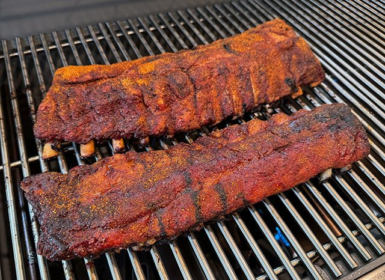

# Ribs

*The most accessible BBQ project. Pork ribs, St Louis or baby back, cook in 5-6 hours, fit on any smoker, and feed a crowd. The 3-2-1 method gives reliable results; the bend test confirms doneness; the regional sauce or dry rub finishes the dish.*

## Overview
Ribs are the BBQ project that fits a Saturday afternoon. Where brisket is a 14-hour commitment and pulled pork is overnight, a rack of pork ribs is on the smoker by 11 AM and off by 5 PM, eaten with friends, hands, a stack of paper towels, and a cold drink.

This lesson covers the three most common rib formats, St Louis, baby back, and beef short ribs, with the standard 3-2-1 timing for pork ribs and a worked recipe for each. The bend test is the doneness test; rib internal temperature is a guide but not the truth.

## The Three Major Rib Cuts

### St Louis Ribs (Pork)

The classic American BBQ rib. Cut from the belly side of the pig, removed of the rib tips and squared into a rectangle. Larger and meatier than baby backs; the most flavour-forward of the pork ribs.

A rack is about 1.5-2 kg, 11-13 ribs. Serves 2-3 people.

### Baby Back Ribs (Pork)

Cut from the back loin area, smaller and curved. Leaner than St Louis; cook slightly faster.

A rack is about 1-1.5 kg, 10-13 ribs. Serves 2 people.

### Beef Short Ribs (Beef)

A completely different beast. Cut from the chuck end of the rib cage, much larger and fattier than pork. Three or four meaty bones per rack of 4-5; each bone supports a thick slab of beef.

A short rib plate is about 1.5-2 kg. Serves 2-3 people. Cook longer than pork ribs (8-10 hours total).

## What You Need

- 2 racks of ribs (pork) or 1 plate beef short ribs
- BBQ rub, Memphis dry rub for ribs (see [Rubs, Mops and Sauces](rubs-mops-sauces.md))
- BBQ sauce (Kansas City sweet for the classic; or omit for dry-rub Memphis ribs)
- Wood for smoke (cherry + hickory is the classic pork rib combo; oak for beef)
- Smoker
- Aluminium foil (for the wrapping phase)
- Butter, brown sugar, honey or apple juice (for the wrap)

## The 3-2-1 Method (Pork Ribs)

The standard timing for St Louis-style ribs at 110 C. Three numbers, three phases.

- **3 hours, unwrapped.** The smoke phase. Bark forms, smoke ring lays down, the rub sets into the surface.
- **2 hours, wrapped.** The braise phase. Wrapped tightly with a small amount of liquid; the heat softens the ribs faster.
- **1 hour, unwrapped, sauced.** The finishing phase. Unwrap, brush with sauce, let the sugar in the sauce caramelise without burning.

Total: 6 hours.

For baby back ribs (smaller, leaner), use 2-2-1 instead. Total: 5 hours.

For beef short ribs (bigger, fattier), use 3-3-2 or similar. Total: 8 hours.

## The 3-2-1 Walkthrough (St Louis Ribs)

### Preparation

1. **Remove the membrane.** The silver skin on the back of the ribs, the side facing the bones, away from the meat. Slide a butter knife under one corner of the membrane; pry it up; grip with a paper towel (for purchase); peel off in one piece. Critical step, the membrane blocks smoke and rub from penetrating.
2. **Apply the rub.** Coat both sides of the ribs heavily with the Memphis dry rub. 2 tbsp per rack on the meat side, 1 tbsp on the bone side. Press into the meat. Let rest at room temperature 30 minutes (or refrigerate overnight if planning ahead).
3. **Set up the smoker.** Target 110 C. Add cherry and hickory wood chunks - 3-4 chunks for the cook.

### Phase 1: Smoke (3 hours)

1. Place ribs bone-side-down on the grate. (The bones protect the meat from direct heat from below.)
2. Close the smoker. Maintain 110 C ambient.
3. Spritz the ribs with apple juice every 60 minutes. Open the lid quickly, spray, close.
4. After 3 hours, the bark should be set and the meat starting to pull back from the bones (the bone ends visible).

### Phase 2: Wrap (2 hours)

1. Lay out 2 large sheets of heavy-duty aluminium foil (per rack).
2. Place ribs meat-side-down on the foil.
3. Add to the foil with the ribs:
   - 2 tbsp butter (cubes scattered)
   - 2 tbsp brown sugar
   - 2 tbsp honey
   - A few drops of cider vinegar
   - A small splash (about 30 ml) of apple juice for the steam
4. Wrap tightly, sealing all edges. The package should hold the steam in.
5. Return to the smoker bone-side-down for 2 hours.

The wrap accelerates the cook (the meat is in a moist steam environment) and tenderises (the steam helps soften the collagen). After 2 hours, the meat will be tender and starting to fall off the bone.

### Phase 3: Sauce and Set (1 hour)

1. Open the foil packages carefully (the steam will be hot).
2. Lift the ribs onto the grate, meat-side-up. Discard the foil and the cooking liquid (or save it for a rib glaze).
3. Brush BBQ sauce on the meat side, heavily for a sauced rib, lightly for a dry-rubbed rib finished with a glossy glaze.
4. Return to the smoker for 30-60 minutes, lid closed.
5. The sauce caramelises and sets onto the meat; the bark crisps slightly; the meat firms back up after the wrap-tender phase.

### The Bend Test

Lift one end of the rack with tongs. The rack should bend gracefully, the meat should pull slightly apart between the bones, the rack should arc 30-45 degrees without snapping or falling apart.

- Rack stiff and flat: not done; continue cooking.
- Rack bends and meat splits open between bones, but holds together: done. Right.
- Rack falls apart, meat comes off the bones: overcooked. Still edible but not the right texture.

The internal temperature at the right moment is around 90-91 C, but the bend test is the truth.

## The 2-2-1 Walkthrough (Baby Back Ribs)

Identical to St Louis, with the timing compressed:
- 2 hours unwrapped
- 2 hours wrapped (same wrap ingredients as St Louis)
- 1 hour sauced

Watch closely after 4 hours. Baby backs are smaller and cook faster; the bend test arrives earlier.

## Beef Short Rib Walkthrough

Treat them more like brisket than pork ribs. The cook is longer; the fat is more abundant; the meat is denser.

1. **Trim.** Remove silver skin from the meat surface. Leave the fat cap on top.
2. **Apply Texas salt-and-pepper rub** (NOT the Memphis sweet rub, beef short ribs are a beef cook). 4-5 tbsp per plate.
3. **Smoke at 110 C with oak.** 6 hours unwrapped.
4. **Wrap in butcher paper** with 60 ml beef stock. 2 hours.
5. **Continue unwrapped** for 1-2 hours, until probe-tender at 95-98 C internal.
6. **Rest 30 minutes** wrapped in butcher paper.

Slice between the bones, each bone-and-meat slice is one portion. Serve simply: salt, the natural juices, a side of bread.

## Variations

### Memphis Dry-Rub Ribs

- Skip the sauce phase. After the 2-hour wrap, return the ribs to the smoker unwrapped for the last hour but instead of sauce, sprinkle with a second light dusting of Memphis dry rub. The finishing dust adds a fresh hit of seasoning that complements the bark.

### Kansas City Sweet-Sauce Ribs

- Apply Kansas City sauce twice during the sauce phase: at the start (the sugar in the sauce caramelises over the hour), and at the end (a fresh coat for serving). The result is glossy, sticky, sweet.

### Korean-style Short Ribs (Kalbi)

- Beef short ribs marinated in soy, sugar, garlic, sesame, ginger, then grilled over high heat 3-5 minutes per side. NOT a low-and-slow cook; cross-references the [Stir Fry](../stir-fry/stir-fry.md) tutorial.

### Sticky Pork Ribs (Asian-inflected)

- Mid-cook (after the wrap), substitute soy + brown sugar + ginger + garlic + rice vinegar for the BBQ sauce. The result is closer to Char Siu, a Chinese-style sticky pork rib rather than American BBQ.

## Serving

- Slice between the bones; serve as individual rib portions.
- Sides: coleslaw, potato salad, baked beans, corn bread, mac and cheese, pickled vegetables.
- Drink: cold beer, sweet tea, dry hard cider.

## Common Failures

| Symptom | Cause | Fix |
|---------|-------|-----|
| Tough chewy ribs | Undercooked (collagen not fully broken down) | Wrap longer, or extend the cook with the foil on |
| Mushy / falling-off-the-bone | Overcooked (too long in the wrap) | Reduce wrap time; check bend test earlier |
| Pale bark | Too humid; too much spritzing; smoker too cool | Hotter smoke; less spritz; let surface dry |
| Burnt sauce | Sauce applied too long, sugar burned | Apply sauce in the last 30-60 min only |
| Membrane chewy | Membrane not removed | Always remove the membrane before rubbing |

## Where Next
- [Brisket](brisket.md): the longer, harder, more dramatic project.
- [Pulled Pork](pulled-pork.md): the easier project for the next BBQ session.
- [Rubs, Mops and Sauces](rubs-mops-sauces.md): the rub and sauce variations.
