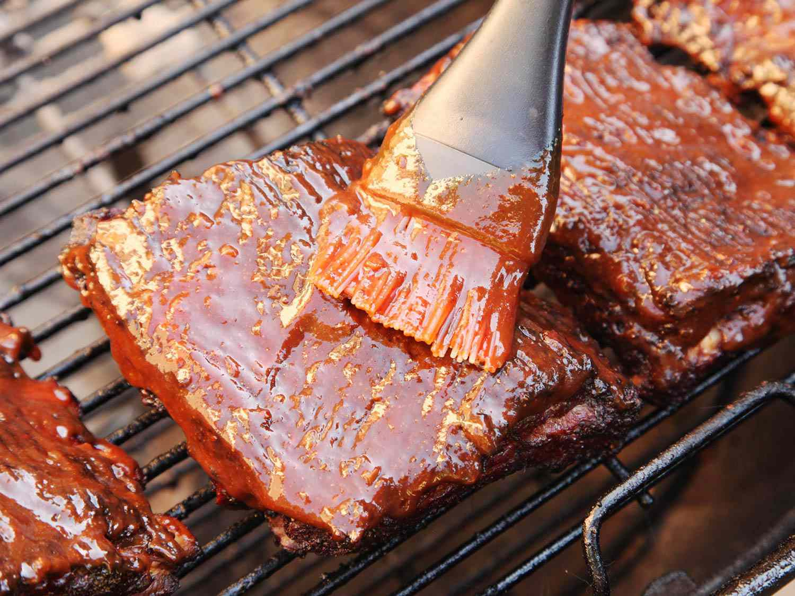

# Rubs, Mops and Sauces

*Three layers of flavour on the meat. Rub goes on raw before the cook. Mop is the wet sauce applied during the cook to keep the surface moist. Finishing sauce is the sweet, acidic or salty glaze at the table. Different regional traditions, same architecture.*

## Overview
BBQ flavour is built in layers: a dry rub before cooking; an optional mop during the cook; a finishing sauce at the table. The regional styles of American BBQ are mostly distinguished by what goes in each layer:

- **Texas:** Heavy salt-and-pepper rub. Often no mop. No or minimal sauce at the table (the meat should stand alone).
- **Memphis:** Sweet-and-spicy rub heavy with paprika. Mop with vinegar-and-mop-sauce. Sauce on the side.
- **Kansas City:** Sweet rub with cumin and onion. Mop with mop sauce. Sweet thick tomato sauce on top.
- **Carolina (East):** Light rub. Vinegar-pepper mop. Vinegar-and-pepper finishing sauce, thin, sharp, no tomato.
- **Carolina (West) / Lexington:** Tomato-vinegar mop and sauce.
- **Carolina (South):** Mustard-based sauce.
- **Alabama (white BBQ):** Mayonnaise-based sauce, especially with chicken.

This lesson covers the rubs (mostly), the mops (briefly), and the sauces (with worked recipes for each major regional tradition).

## Rubs

The rub goes on the raw meat at least 30 minutes before cooking, often the night before. It does several things:

- Adds flavour to the surface
- Draws out a small amount of moisture which then dissolves the rub, forming a glaze that sets into bark during cooking
- Adds colour to the bark
- Provides the surface for the smoke to layer onto

### Texas Salt-and-Pepper (Brisket and Beef)

The most influential modern BBQ rub. Simple, savoury, lets the meat and smoke do the talking. The single rub Joe Riscky and Aaron Franklin built reputations on.

- 50% coarse kosher salt (or sea salt)
- 50% coarse-cracked black pepper

By volume. Apply heavily - 2-3 tbsp per kg of meat. Press into every surface.

Optionally add 5-10% garlic powder for richer depth. Some recipes add 5-10% onion powder. Anything more becomes a different rub.

### Memphis Dry Rub (Ribs)

The sweet-and-spicy classic of the Memphis tradition. Applied to ribs, often as the only flavouring (no sauce at the end).

- 4 tbsp paprika (sweet, smoked, or a mix)
- 2 tbsp brown sugar (light or dark)
- 2 tbsp kosher salt
- 1 tbsp black pepper
- 1 tbsp garlic powder
- 1 tbsp onion powder
- 2 tsp mustard powder
- 2 tsp chilli powder
- 1 tsp cayenne (adjustable)
- 1 tsp cumin
- 1 tsp dried thyme

Mix. Apply heavily; ribs are about 1 tbsp per side per rack.

### Kansas City Sweet Rub (Ribs, Pulled Pork)

Slightly sweeter than Memphis. Heavier on the brown sugar.

- 4 tbsp brown sugar
- 3 tbsp paprika (sweet)
- 1 tbsp smoked paprika
- 1.5 tbsp kosher salt
- 1 tbsp black pepper
- 1 tbsp garlic powder
- 1 tbsp onion powder
- 1 tsp mustard powder
- 1 tsp cumin
- 1 tsp celery seed
- 1 tsp cayenne

The sweetness sits behind a Kansas City sauce; the rub plus sauce reads as the regional sweet-tomato BBQ.

### Carolina-Style Light Rub (Pulled Pork)

Less aggressive than other regional rubs because the vinegar sauce does most of the flavour work.

- 3 tbsp paprika
- 2 tbsp brown sugar
- 1.5 tbsp kosher salt
- 1 tbsp black pepper
- 1 tbsp chilli powder
- 1 tsp cayenne
- 1 tsp garlic powder

Light application; the meat should mostly carry its own character with smoke and the vinegar sauce as the dominant finish.

### Generic All-Purpose

A starting rub for anyone learning the form:

- 3 parts paprika (mostly sweet, 1 part smoked)
- 2 parts brown sugar
- 2 parts kosher salt
- 1 part black pepper
- 1 part garlic powder
- 1 part onion powder
- 0.5 parts cayenne
- 0.5 parts cumin

Works on pork, beef, chicken. Adjustable.

## Mop Sauces

The mop is a thin, vinegar-based sauce brushed or sprayed onto the meat during cooking, every hour or so. It does two things: keeps the surface moist (so the bark forms slowly rather than burning) and adds layers of acid and aromatic flavour over the cook.

Mops are not strictly required, many top-tier BBQ cooks skip them entirely. They are most useful in dry, hot environments or when the meat is going through an extended cook in a dry smoker.

### Texas Beef Mop

- 250 ml beef stock
- 125 ml apple cider vinegar
- 60 ml Worcestershire sauce
- 2 tbsp vegetable oil
- 1 tbsp salt
- 1 tbsp black pepper
- 1 tbsp brown sugar
- 1 tsp garlic powder

Heat briefly to dissolve everything; cool before use. Apply with a small mop or a spray bottle every 90 minutes. Carries Worcestershire's umami over the surface.

### Carolina Vinegar Mop and Sauce

The mop doubles as the finishing sauce. Thin, sharp, no thickener.

- 500 ml cider vinegar
- 125 ml water
- 2 tbsp brown sugar
- 2 tbsp red pepper flakes (adjust to taste)
- 1 tbsp salt
- 1 tsp black pepper
- 1/2 tsp cayenne

Whisk to combine; sugar dissolves over 10 minutes. Keep at room temperature; use as mop during the cook and as the table sauce. Dressed over pulled pork it cuts the fat dramatically.

### Memphis Mop

- 250 ml apple juice
- 125 ml cider vinegar
- 60 ml vegetable oil
- 2 tbsp soy sauce
- 1 tbsp Memphis dry rub (above)

Spray every hour through the rib cook.

## Finishing Sauces

The sauce served at the table or brushed on during the last 30 minutes of the cook (when sugar in the sauce won't burn). Five regional families:

### Kansas City (Sweet Tomato)

The most globally recognised "BBQ sauce", thick, sweet, tomato-based. KC Masterpiece is the commercial template.

- 250 ml ketchup
- 100 ml apple cider vinegar
- 100 ml molasses (or substitute brown sugar)
- 60 ml Worcestershire sauce
- 2 tbsp brown sugar
- 2 tbsp Dijon mustard
- 2 cloves garlic, minced
- 1 tsp smoked paprika
- 1 tsp onion powder
- 1 tsp chilli powder
- 1/2 tsp cayenne
- 1/2 tsp black pepper

Simmer 15-20 minutes until thickened. Cool, store. Refrigerates 2 weeks.

### Carolina (East / Vinegar)

The sharpest BBQ sauce in the American canon. Eastern North Carolina pulled pork is shocked with this at the table.

- 500 ml cider vinegar
- 125 ml water
- 2 tbsp brown sugar
- 2 tbsp red pepper flakes
- 1 tbsp salt
- 1 tsp black pepper

The same as the mop. Apply liberally.

### Carolina (West / Lexington-Style)

The Western North Carolina version, vinegar with a tomato base.

- 250 ml cider vinegar
- 100 ml ketchup
- 60 ml water
- 2 tbsp brown sugar
- 1 tbsp Worcestershire
- 1 tsp red pepper flakes
- 1 tsp salt
- 1 tsp black pepper

Simmer 10 minutes; cool. Lighter than KC but tangier than the East.

### Carolina (South / Mustard)

The South Carolina mustard-based tradition. Goes on pulled pork.

- 250 ml yellow mustard
- 60 ml cider vinegar
- 50 g brown sugar
- 2 tbsp honey
- 1 tbsp Worcestershire
- 1 tsp salt
- 1 tsp black pepper
- 1 tsp cayenne
- 1 tsp paprika

Simmer 5-10 minutes. Cool.

### Alabama (White / Mayonnaise)

The unusual Northern Alabama tradition, mayonnaise plus vinegar, dressed on smoked chicken. Big Bob Gibson Bar-B-Q in Decatur is the original.

- 250 ml mayonnaise
- 60 ml apple cider vinegar
- 1 tbsp prepared horseradish
- 1 tbsp lemon juice
- 1 tsp black pepper
- 1 tsp sugar
- 1/2 tsp salt
- 1/2 tsp cayenne

Whisk. Refrigerate before use. Spectacular on smoked chicken.

## Application Timing

- **Rub:** Apply 30 minutes to 12 hours before cooking. Longer is better for thick cuts (brisket benefits from overnight); not strictly necessary for thinner cuts.
- **Mop:** Apply every 60-90 minutes during the cook, after the first 2-3 hours (so the bark has begun to form). Skip the mop during the wrapped phase.
- **Sauce:** Brush on during the last 30 minutes of the cook OR serve at the table. Sauce applied earlier than 30 minutes from the finish has time to burn (the sugar in most sauces caramelises and turns acrid above 150 C).

## Where Next
- [Brisket](brisket.md): the Texas rub in practice.
- [Ribs](ribs.md): where the Memphis dry rub and the KC sweet sauce both shine.
- [Pulled Pork](pulled-pork.md): the dish where regional sauce styles are most distinct.
