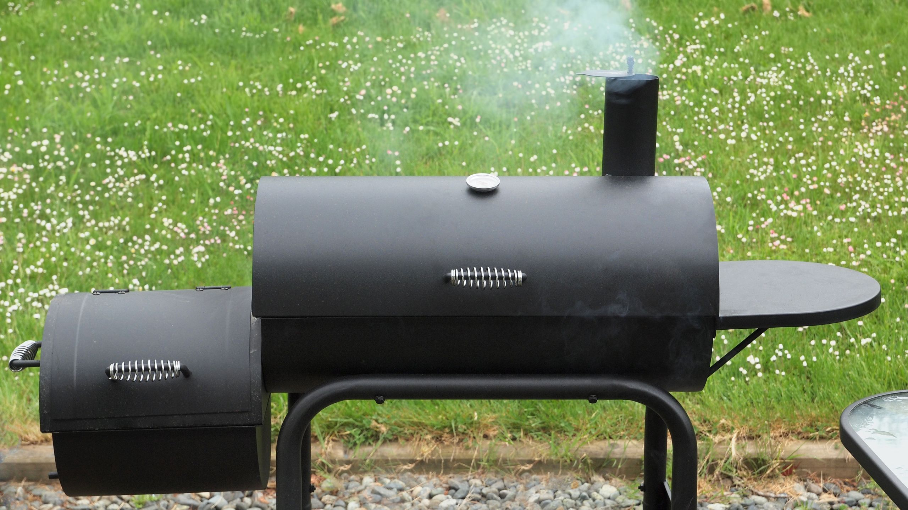

# Smoke Science

*Why low-and-slow turns chuck and brisket into meltingly tender meat. What collagen does between 70 and 85 C, why the "stall" happens around 75 C internal, what creates the smoke ring, and why too much wood smoke tastes acrid instead of delicious.*

## Overview
BBQ works because of a small cluster of physical and chemical transformations that need time and steady moderate heat to complete. This lesson covers them: the collagen-to-gelatin transition that tenderises tough cuts, the stall that everyone hits at around 75 C internal, the smoke ring that signals a properly-smoked piece of meat, and the wood-smoke chemistry that determines what flavour ends up on the surface.

Knowing the science explains why every step of every BBQ recipe matters. You can follow recipes without it, but you cannot improvise.

## The Collagen-to-Gelatin Transition

Tough cuts (brisket, chuck, shoulder, ribs, oxtail) are tough because they contain large amounts of connective tissue - collagen, the protein that holds muscle fibres together. Collagen is a triple-helix molecule that is rubbery and chewy when raw or undercooked. But heated in moist conditions to between 70 and 85 C, the collagen slowly hydrolyses - the helices unwind - and becomes gelatin, which is soft, lubricating, and accounts for the slippery-rich mouthfeel of well-cooked tough meat.

The collagen breakdown is slow. At 65 C it barely happens. At 70 C it takes hours. At 85 C it takes longer than you might expect - the meat needs to dwell at this temperature for the conversion to complete. This is why BBQ smokers run at 105-120 C ambient - the meat slowly climbs through the collagen transition zone over many hours.

Brisket cooked to 65 C internal is a tough chewy piece of meat. Brisket cooked to 95 C internal is the slow-smoked transcendence everyone talks about. Same cut, same protein, different outcome because of the time spent above 70 C.

## The Stall

Around 70-75 C internal, every long cook hits "the stall" - the temperature stops rising for 2-4 hours. The first time it happens it is alarming; veteran cooks just shrug.

What is happening: the meat surface is releasing moisture. As water evaporates from the surface, it absorbs energy (latent heat of vapourisation), and that energy is taken from the meat itself. The result is evaporative cooling - the meat is being chilled from the outside even as the smoker pours heat at it.

The stall ends when most of the surface moisture has evaporated. The bark (the dried crust) forms during the stall; once it has formed, the evaporation slows, and the meat starts climbing in temperature again.

Three ways to handle it:

1. **Wait.** The simplest. The cook just takes 2-3 hours longer than you expected. The bark forms perfectly. You learn patience.
2. **Wrap (the "Texas crutch").** Wrap the meat in butcher paper or aluminium foil. The wrap traps moisture against the meat; evaporation stops; the stall breaks through quickly. Cooks faster but the bark softens slightly under the wrap (foil softens more than paper).
3. **Bump the temperature.** Raise the smoker from 110 C to 130 C. The extra heat overpowers the evaporative cooling. Works but you lose some of the slow-cook tenderness benefit; the meat texture can suffer.

Most competition cooks use butcher paper - it lets the bark stay crisp while pushing through the stall. Most home cooks use foil for convenience.

## The Smoke Ring

The pink layer 5-10 mm under the surface of a properly-smoked piece of meat. It is not the smoke flavour itself; it is a chemical reaction between nitric oxide (from the wood smoke and burning charcoal) and the meat's myoglobin.

How it forms:

1. Wood smoke contains nitric oxide (NO) and nitrogen dioxide (NO2) from the combustion.
2. The cool meat surface (early in the cook, before it dries) absorbs the NO into the outer 5-10 mm of flesh.
3. NO binds to myoglobin (the pigment in muscle), forming nitric oxide myoglobin - the same pink-red colour as cured meat.
4. As the meat heats and the myoglobin denatures, the pink colour is locked in.

The ring forms only when the meat surface is cool and moist - so the first 2-4 hours of the cook are the critical period. By the time the surface has dried into bark, no more nitric oxide can be absorbed. This is why "running cool" at the start (e.g. starting brisket on a smoker held at 105 C for the first few hours, then bumping to 115 C later) gives a more pronounced smoke ring.

The smoke ring is purely cosmetic - it has no flavour - but it is treated as a sign of properly-cooked barbecue. Competition judges look for it. Critics are suspicious of brisket with no smoke ring.

A note: the smoke ring does NOT indicate good smoke flavour. A pellet smoker can produce excellent smoke flavour with little or no smoke ring (because pellet smokers burn cleaner, producing less NO). The flavour and the ring are different things. Beginner cooks often confuse them and judge their cook by ring depth, which is the wrong metric.

## What Wood Smoke Actually Is

Wood smoke is a mix of gases, water vapour, and tiny particles. The flavours come from:

- **Volatile phenols** - guaiacol, syringol, the major contributors to the smoky aroma we associate with BBQ. The "creosote" smell of burned wood is from over-burnt phenols.
- **Volatile aldehydes** - vanillin, syringaldehyde. These contribute the sweet, vanilla-edged background notes in some woods (especially oak and cherry).
- **Furans and other sugar-burnt molecules** - caramel-like notes from the wood's natural sugars.
- **Acetic acid** - the slight tang at the surface of well-smoked meat.
- **Carbonyl compounds** - reactive molecules that bind to meat surface proteins, creating both flavour and the dark colour of bark.

Different woods burn at slightly different temperatures and produce slightly different ratios of these compounds. Hickory is high in guaiacol (strongly smoky); oak is high in syringaldehyde (sweet, warm); mesquite is high in volatile acids (sharp, intense); applewood is low overall (mild). See [Woods and Fuels](woods-and-fuels.md) for the practical implications.

## Why Too Much Smoke Is Bad

The same compounds that make smoke delicious become harsh and acrid at high concentrations. Phenols at moderate levels read as smoky-rich; at high levels they read as creosote, ashtray, acrid. Once a piece of meat is "over-smoked," that flavour is locked into the surface and cannot be undone.

Two ways to over-smoke:

1. **Too much wood.** Pellet smokers and electric smokers tend to produce more smoke than the meat can usefully absorb. A pellet smoker running for 12 hours can layer smoke onto meat far past the saturation point.
2. **Wrong wood, smouldering.** Wood that smoulders rather than burns hot produces incomplete combustion, which means high levels of harsh creosote-y phenols. The "clean smoke" rule: aim for thin blue smoke (TBS), not thick white smoke. Thick white smoke is the signal that the fire is starving for oxygen and smouldering.

The fix: less wood, more airflow. A handful of wood chunks for the first 4 hours of an 8-hour cook is usually plenty.

## Why Low-and-Slow Works Better Than Other Approaches

A few alternatives:

- **Pressure cooker.** Tenderises tough cuts in 90 minutes. The collagen-to-gelatin transition happens fast at high pressure (which raises the boiling point and effectively raises the cooking temperature). Result: tender meat without bark, smoke ring or any of the surface flavour.
- **Sous vide.** Holds the meat at a specific temperature for hours. A 72-hour sous vide brisket at 64 C is tender but slightly mushy and has no bark, smoke ring or smoke flavour.
- **Braising.** Tough cuts cooked covered in liquid at 130-160 C. Tenderises well. No smoke, no bark; the surface is in liquid throughout.
- **Quick high heat.** Won't work. The collagen does not have time to convert; the meat ends up tough and dry.

Low-and-slow gives you everything together: tenderness from the long collagen conversion, bark from the slow surface dehydration, smoke ring from the early-cook surface absorption, and the flavour layers from rub + smoke + slow Maillard browning of the bark. Each component takes hours; together they take 8-18.

## A Quick Reference Table

| Phenomenon | Temperature | Notes |
|------------|-------------|-------|
| Collagen begins to denature | 65 C | Slow at this temperature |
| Active collagen-to-gelatin | 70-85 C | The transformation zone; takes hours |
| Stall starts | 70-75 C internal | Evaporative cooling reaches equilibrium |
| Stall breaks | 80-83 C internal | Bark formed; evaporation slowed |
| Probe-tender for brisket | 93-98 C internal | Connective tissue mostly converted |
| Pulled pork pulls apart | 92-95 C internal | Same logic, smaller muscle |

## Where Next
- [Woods and Fuels](woods-and-fuels.md): which wood for which meat, the clean smoke principle.
- [Low-and-Slow](low-and-slow.md): the practical application of these principles to a smoker.
- [Brisket](brisket.md): the canonical worked example.
