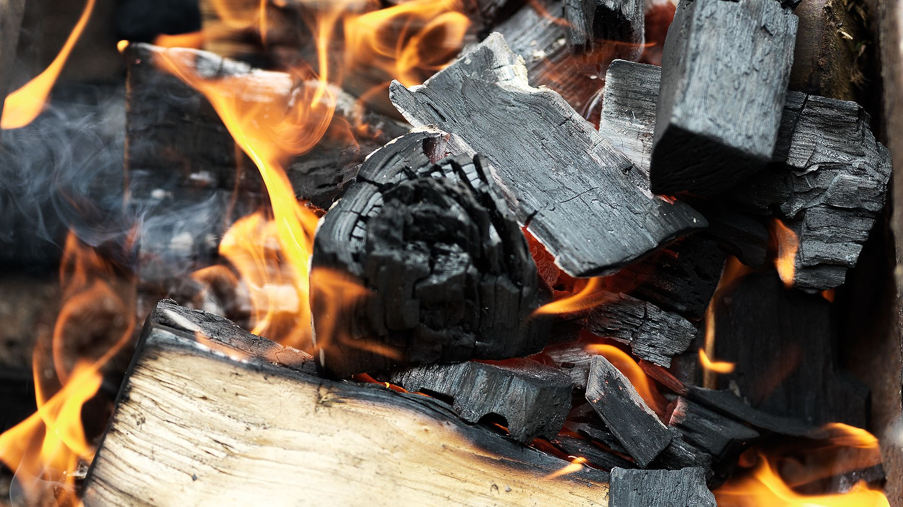

# Woods and Fuels

*Different woods give different smoke. The wrong wood ruins a 14-hour cook; the right wood makes it sing. This lesson lays out what to use, what to avoid, and how charcoal fits in.*

## Overview
The fuel is half the cook. Charcoal supplies most of the heat in most smoker formats; wood (chunks, chips, splits or pellets) supplies the smoke flavour. The combinations available are many; the principles are simple.

The most important rule: never burn softwood. Pine, fir, cedar, spruce, redwood, any conifer. They produce harsh, resinous, acrid smoke that ruins meat. The list below is all hardwoods.

## The Major BBQ Woods

| Wood | Character | Best for |
|------|-----------|----------|
| **Oak** | Medium, balanced, slightly sweet. The all-purpose BBQ wood. | Brisket (especially post oak in Texas), beef short rib, lamb, all-day cooks |
| **Hickory** | Bold, classic American "smoky," slightly bacon-adjacent. Strong. | Pulled pork, ribs, bacon. The default if you can have only one wood |
| **Mesquite** | Very strong, slightly acrid in long doses, intense | Quick smokes (chicken, vegetables, short steaks). Use sparingly for long cooks |
| **Pecan** | Medium, slightly sweet, hickory-adjacent but milder | Brisket (Texas alternative to oak), pulled pork, ribs |
| **Apple** | Mild, slightly sweet, fruity | Pork, poultry, fish, cheese, longer cooks where strong wood would overpower |
| **Cherry** | Mild, fruity, gives a reddish colour to the bark | Pork (especially ribs), poultry, beef. The looks-pretty wood |
| **Maple** | Mild, slightly sweet | Bacon, ham, poultry. Cleaner than fruit woods, sweeter than oak |
| **Alder** | Mild, slightly sweet, traditional for fish in the Pacific Northwest | Salmon, fish, poultry. The lightest of the BBQ woods |
| **Beech** | Mild, neutral, traditional in northern Europe | Ham, sausage, fish. A clean smoke without the strong character of hickory |
| **Whisky barrel oak** | Oak with a residual sweet whisky note | Specialty smokes, finishing wood for the last hour |

## What to Avoid

- **Pine, fir, cedar, spruce, redwood.** All softwoods. Resinous, acrid, sometimes toxic. Cedar is occasionally used in plank-grilling (the cedar plank under salmon), but the smoke is from the plank's surface only and is brief, never use cedar as a primary smoke wood.
- **Green or unseasoned wood.** Wet wood does not burn cleanly; it smoulders, producing thick white smoke with high creosote content. Wood for BBQ should be aged 6-12 months minimum.
- **Treated lumber.** Pressure-treated wood, painted wood, glued wood (plywood, MDF). Toxic.
- **Eucalyptus, oleander, yew.** Allergenic or toxic species used in some regions.
- **Wood from unknown sources.** Could be treated, could be a softwood, could be contaminated.

## Forms of Wood

The wood comes in different sizes for different smoker formats:

- **Chunks.** Fist-sized hardwood pieces. The most versatile form. Used in kettle barbecues, drum smokers, offset smokers (as supplementary wood alongside the main fuel), and pellet smokers (in a smoke tube). 4-6 chunks across an 8-hour cook.
- **Chips.** Pea-to-thumbnail-sized pieces. Used in electric smokers, kettle barbecues, and gas grills with smoke boxes. Soaked in water for 30 minutes before use in most setups, the water delays the burn-rate. A small handful per hour.
- **Splits.** Logs about 30-40 cm long. Used in offset stick burners as both heat source and smoke source. Splits are the dominant fuel in serious Texas-style smokers.
- **Pellets.** Compressed sawdust, about 6 mm long. Used in pellet smokers and smoke tubes. The wood species is mixed into the pellet (a "hickory pellet" contains hickory sawdust).
- **Sawdust / wood dust.** Used in cold smokers. Slowly smouldered to produce smoke at low temperatures.

## Fuel Choices

### Charcoal

The primary heat source in most smokers (kettle, drum smoker, ceramic kamado-style).

**Lump charcoal.** Hardwood charred without binders. Burns hot, fast, with crackling sparks and the occasional explosive piece. The premium charcoal. Royal Oak and Cowboy Charcoal are widely available brands. Sizes vary in the same bag (small chips to large lumps); inconsistency is part of the charm.

**Briquettes.** Compressed charcoal dust with a small amount of binder (cornstarch traditionally, sometimes paraffin in cheaper brands). Burns longer and more steadily than lump but at lower peak temperature. Kingsford is the standard American brand. The "competition" briquettes (Kingsford Professional) burn cleaner.

For long smokes, briquettes give better temperature stability; for hot-and-fast searing, lump charcoal gives higher peak heat.

### Wood as Primary Fuel

In offset stick burners, wood is the heat source as well as the smoke source. Splits of oak, hickory or pecan are stacked in a firebox and burned in succession. The exhaust gases (smoke) pass through the cooking chamber.

The skill in stick-burning is fire management: keeping the fire hot enough to burn cleanly (avoiding the thick white smouldering smoke) while not so hot that the cooking chamber overshoots temperature. Splits are added every 30-45 minutes; the fire is poked, the airflow adjusted, the temperature monitored.

Pellet smokers automate this, an electric auger feeds pellets at a controlled rate, maintaining a precise temperature. The flavour profile is lighter than stick-burning because the pellets burn at a higher efficiency, producing less smoke per gram of fuel.

### Gas

Some gas grills include a "smoke box" or "wood chip tray" for adding smoke flavour to gas-cooked meat. The result is light smoke and is acceptable for short cooks (chicken, sausages, vegetables); inadequate for long cooks where the smoke profile needs to be heavier. Gas-grill BBQ is more "grilled with a smoke note" than true BBQ.

### Electric

Electric smokers use a heating element with a small wood chip tray over the element. Temperature is thermostat-controlled. The smoke profile is lighter than charcoal+wood because the wood chip tray smoulders rather than burns hot. Reliable, low-skill; less depth of smoke than other formats. Good for beginners; experienced cooks usually graduate to something else.

## The Pellet Question

Pellet smokers have grown explosively in the last decade. The trade-offs are real:

**For pellet smokers:**
- Temperature precision (set 105 C, walk away)
- No fire management skill needed
- Consistent results
- Lower fuel cost than wood
- Clean smoke profile (less acrid risk)

**Against pellet smokers:**
- Smoke flavour is lighter than stick-burning
- Pellet supply chain (need a good source of food-grade pellets)
- Cost (entry-level pellet smokers start around £400; competition-grade are £800-£1500)
- No "fire" experience for cooks who enjoy that part

The smoke depth gap is real but smaller than purists claim. A pellet smoker plus a smoke tube (a perforated tube of pellets that smoulders alongside the main cook) closes most of the gap. For home cooks, the pellet smoker is the easiest path to competitive BBQ; for purists, the offset stick burner is the only path.

## Pairing Wood to Meat

A working starter set:

- **Beef (brisket, short rib, chuck).** Oak (post oak if Texan; white oak otherwise) as the base. Optional: a chunk or two of cherry for colour.
- **Pork (pulled pork, ribs).** Hickory primary; cherry secondary for colour. Apple as a milder alternative.
- **Poultry (whole bird, wings).** Apple or cherry. Oak is acceptable; hickory and mesquite are too strong.
- **Fish (salmon, trout).** Alder traditionally; apple as a substitute.
- **Lamb.** Oak; pecan as a softer alternative.
- **Sausages.** Oak or hickory; cherry for colour.
- **Vegetables (corn, potatoes, peppers).** Apple, cherry, or oak.

For mixed cooks or experimentation, oak + apple is a balanced default that works for almost everything.

## The Single Best Practical Advice

If you have one wood, make it oak. If you have two, oak and hickory. If you have three, oak, hickory and cherry. Stop there. The marginal returns on owning eight different woods diminish fast for home cooks; the three above cover almost every BBQ application credibly.

For brisket specifically, post oak is the Texas tradition; if you cannot get post oak, white oak or red oak are fine substitutes. Pecan is the second choice. Hickory is acceptable but more aggressive than the Texas style would call for.

For pulled pork specifically, the South Carolina and Memphis traditions use hickory primarily, sometimes mixed with applewood for sweetness. Apple-and-cherry is the Memphis sweet-rub direction; hickory-only is more Carolina.

## Where Next
- [Smoke Science](smoke-science.md): what these woods actually do chemically.
- [Brisket](brisket.md), [Ribs](ribs.md), [Pulled Pork](pulled-pork.md): the cooks where wood choice shows up most.
- [Rubs, Mops and Sauces](rubs-mops-sauces.md): the rub-and-finishing-sauce side of the flavour-building.
