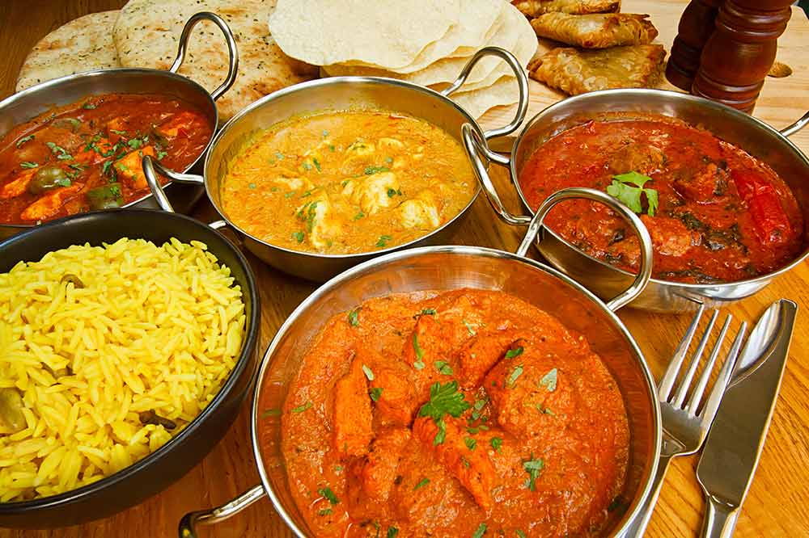

# BIR Curry Course

*Ever wondered how a curry house can knock out twenty different curries in twenty minutes? They prep four things ahead of service, then everything else is assembly. Once you set up those four components at home, you can run the same trick: a Saturday morning of prep, and curry on a Tuesday night in ten minutes flat.*

## Overview
Walk into a Birmingham balti house and order a chicken vindaloo, chicken korma and lamb madras for the same table. All three plates land within twelve minutes of the kitchen taking the order. They taste utterly different. They came from the same pot.

This is the British-Indian-Restaurant (BIR) method, refined in the curry houses of the 1960s and 70s. It is not how anyone cooks at home in India. It is how restaurants serve thirty different curries fast, consistently, and to specification, on a Saturday night with a queue out the door.

The method has four building blocks. Each is prepared in advance and lives in a large pan on the stove. When an order lands, the chef grabs a ladle of each, hits a hot pan with oil and spice, and the curry comes together in five minutes. That is the trick. None of the cooking happens during service. Service is just assembly.

Master the four components and you can make any BIR curry you have ever ordered.

## The Four Components

### 1. Base Gravy
The foundation of every BIR curry. A huge pot of onions slow-simmered with a small handful of spices, blended smooth, held warm. It is mildly sweet, lightly spiced and, on its own, not a curry. It is the canvas.

See [Curry Base Gravy](../../cuisine/indian/Base/curry-base.md) for the master recipe. Make a big batch (it scales easily). Portion it into containers and freeze what you do not use in the next three days.

### 2. Pre-Cooked Protein
The protein is cooked to just done in a separate spiced stock, then drained and held. By the time it hits the curry pan, it only needs to be warmed through. This is why your chicken vindaloo arrives in five minutes: the chicken is already cooked.

See:
- [Pre-Cooked Chicken](../../cuisine/indian/Base/pre-cooked-chicken.md): the standard.
- [Pre-Cooked Lamb](../../cuisine/indian/Base/pre-cooked-lamb.md): slow-cooked, falls apart in the sauce.
- [Red Masala Sauce](../../cuisine/indian/Base/red-masala-sauce.md): a marinade for tandoori-style proteins (chicken tikka, lamb chops).

### 3. Spice Mix
This is the curry-specific layer. Each named curry on the menu has its own spice mix, designed to push the base gravy in a particular direction. Madras is hot and tangy. Korma is mild and aromatic. Vindaloo is fierce and sour. Each is a different mix.

See:
- [Base Curry Powder](../../cuisine/indian/Spice-Mixes/base-curry-powder.md): the general-purpose backbone.
- [Madras Mix](../../cuisine/indian/Spice-Mixes/madrass-mix.md): medium heat, earthy.
- [Korma Mix](../../cuisine/indian/Spice-Mixes/korma-mix.md): mild, fragrant, no chilli.
- [Vindaloo Mix](../../cuisine/indian/Spice-Mixes/vindaloo-mix.md): hot, sharp, vinegar-friendly.
- [Dhansak Mix](../../cuisine/indian/Spice-Mixes/dhansak-mix.md): sweet, sour, lentil-friendly.
- [Garam Masala](../../cuisine/indian/Spice-Mixes/garam-masala.md): the universal finisher, added near the end.

### 4. Finishing Aromatics
The fresh elements: garlic-ginger paste, fresh tomato or pureed tomato, fresh chilli, fresh coriander, sometimes onion. These build the flavour of the specific curry on top of the base. They go in the pan first, with oil and a smoke of fenugreek, before anything else.

See [Tomato Puree](../../cuisine/indian/Base/tomato-puree.md) for the thin tomato base used in most BIR curries (not the same as concentrated tube tomato paste).

## The Assembly (How a Curry Plates in Five Minutes)

Every BIR curry follows the same five-step sequence. Only the spice mix and the protein change.

1. **Hot pan, oil, garlic-ginger paste.** Heat oil until shimmering. Add a teaspoon of garlic-ginger paste. Two seconds, no more, or it burns.
2. **Tomato puree, spice mix.** Add a ladle of thin tomato puree and the curry-specific spice mix (1-3 tsp depending on heat). Fry hard for 30 seconds. The colour deepens.
3. **Base gravy.** Add 250 ml of base gravy. It will hiss. Cook for 2-3 minutes on high, letting the sauce reduce and the flavours marry. The sauce should be glossy and slightly thick.
4. **Protein and any extras.** Add the pre-cooked chicken or lamb, plus any specific ingredients for the named curry (cream and almonds for korma, vinegar and extra chilli for vindaloo, fenugreek leaves for chicken methi).
5. **Garam masala and coriander.** Off the heat, stir in a small pinch of garam masala and a handful of chopped fresh coriander. Plate, serve.

Total time: 5 minutes from the order lands to the plate goes out. Same for every curry on the menu.

## Worked Example
See [Building a Curry](building-a-curry.md): a detailed walkthrough of one finished BIR curry from start to plate, showing how the four components combine in practice. Pick this up after you have one batch of base gravy and one batch of pre-cooked chicken in the fridge.

## The Finished Curries
With the four components in place, all of these are 5-10 minute builds:

### Mild
- [Chicken Korma](../../cuisine/indian/BIR-Chicken-Korma.md): cream, ground almond, gentle spice.
- [Chicken Pasanda](../../cuisine/indian/BIR-Chicken-Pasanda.md): cream, almonds, rose-water finish.
- [Butter Chicken](../../cuisine/indian/BIR-Butter-Chicken.md): the classic, mild and creamy.

### Medium
- [Chicken Tikka Masala](../../cuisine/indian/BIR-Chicken-Tikka-Masala.md): the famous one, marinated and grilled chicken in a tomato-cream sauce.
- [Chicken Balti](../../cuisine/indian/BIR-Chicken-Balti.md): the Birmingham original, served in a balti dish.
- [Chicken Dhansak](../../cuisine/indian/BIR-Chicken-Dhansak.md): with lentils, sweet and sour.
- [Chicken Curry](../../cuisine/indian/BIR-chicken-curry.md): the standard medium house curry.

### Hot
- [Chicken Madras](../../cuisine/indian/BIR-Lamb-madrass.md): medium-hot with deep curry notes.
- [Chicken Jalfrezi](../../cuisine/indian/BIR-Chicken-Jalfrezi.md): fried with peppers and chilli.
- [Vindaloo](../../cuisine/indian/BIR-Vindaloo.md): hot, sharp, vinegar-led.

### Very Hot
- [Lamb Naga Phaal](../../cuisine/indian/BIR_Lamb-Naga-Phaal.md): with naga chillies, one of the hottest on any menu.

## How to Approach the Course
The best way to learn BIR is to do the prep once, then cook five curries in one evening from the same base. Saturday morning: make a batch of base gravy and pre-cook 2 kg of chicken. Saturday night: serve korma, madras, vindaloo, dhansak and balti from the same pot to five different palates at the table. The base gravy keeps a week in the fridge and freezes well for a month.

Start with one named curry you already love (the [Worked Example](building-a-curry.md) takes you through chicken madras step by step), get the rhythm of the five-step assembly, then add a second and a third. Within a week you can run a curry-house menu out of your home kitchen.

## Where Next
- [Building a Curry](building-a-curry.md): the worked example.
- [Curry Base Gravy](../../cuisine/indian/Base/curry-base.md): start here on a Saturday morning.
- [Pre-Cooked Chicken](../../cuisine/indian/Base/pre-cooked-chicken.md): chicken thigh works too, and gives a richer flavour.
