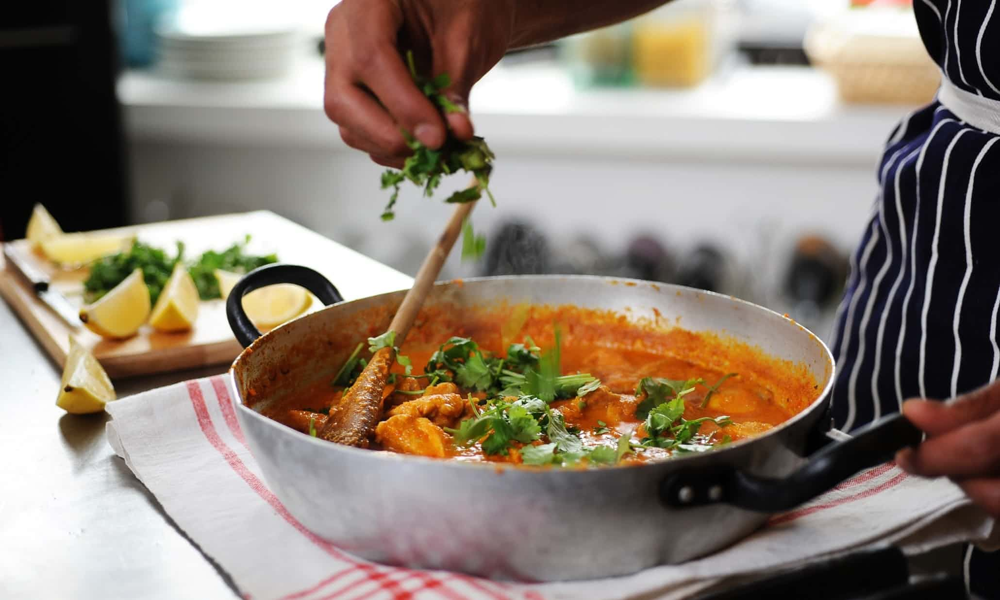

# Building a Curry: Worked Example

*Let's actually cook one. We'll build a chicken madras together, step by step, and you'll see how the four prep components come alive in the pan. The same five moves work for every curry on the menu; once you've done it once, the rest are variations.*

## Overview
Before you start, you need three things in the fridge or on the stove:

1. A pot of [base gravy](../../cuisine/indian/Base/curry-base.md), warm. About 250 ml per portion.
2. Portioned [pre-cooked chicken](../../cuisine/indian/Base/pre-cooked-chicken.md). About 150 g per portion.
3. A jar of [madras spice mix](../../base-ingredients/curry-powder/madras-mix.md). About 2 tsp per portion.

If you have all three, the rest takes 5-6 minutes. If you have none, allow a Saturday morning to prepare the base and the protein, then come back to this page in the evening.

We are cooking for two people. Scale the ingredient line by the number of plates.

## Ingredients (Per Two Portions)

### From the prep
- 500 ml [base gravy](../../cuisine/indian/Base/curry-base.md), warmed
- 300 g [pre-cooked chicken](../../cuisine/indian/Base/pre-cooked-chicken.md), in bite-sized pieces
- 4 tsp [madras spice mix](../../base-ingredients/curry-powder/madras-mix.md)
- 2 tsp [base curry powder](../../base-ingredients/curry-powder/bir-base-powder.md)

### Finishing aromatics
- 3 tbsp vegetable oil (or rapeseed)
- 2 tsp garlic-ginger paste
- 2 tbsp [tomato puree](../../cuisine/indian/Base/tomato-puree.md) (the thin one, not concentrated paste)
- 1 tsp white wine vinegar (madras is mildly sharp)
- 1 fresh green chilli, finely chopped
- ½ tsp salt

### Finish
- ¼ tsp [garam masala](../../cuisine/indian/Spice-Mixes/garam-masala.md)
- Handful fresh coriander, chopped
- Squeeze of lemon

## Method

### Stage 1 - Set Up the Mise en Place
1. Warm the base gravy in a small pan over low heat. Keep it covered. You want it hot when it hits the pan.
2. Portion the chicken into a small bowl, room temperature.
3. Pre-measure everything else into small dishes or piles on a tray. The cooking goes too fast to be reaching into cupboards mid-stream.

This is the single most important step for BIR cooking and the one home cooks usually skip. The pan moves from cold to plated in five minutes. You cannot pause to find the garam masala.

### Stage 2 - Hit the Pan
1. Place a heavy-based frying pan over a high heat. Let it get properly hot, about 1 minute.
2. Add the 3 tbsp oil. It should shimmer almost immediately.
3. Add the 2 tsp garlic-ginger paste. Stir for 5 seconds, no more, until aromatic. If you let it go to brown, start again.
4. Add the chopped fresh chilli. Stir for 5 seconds.

### Stage 3 - Tomato and Spice
1. Add the 2 tbsp tomato puree directly into the oil. It will hiss.
2. Immediately add the 4 tsp madras spice mix and the 2 tsp base curry powder. Stir hard for 30 seconds. The tomato will darken and the spices will fry into the oil. This step (the bhuna) is where most of the flavour comes from. The colour should go from bright red-orange to a deep brick.

### Stage 4 - Base Gravy
1. Pour in the 500 ml warm base gravy in one go. The pan will hiss and the sauce will bubble up immediately.
2. Turn the heat to high. Cook for 2-3 minutes, stirring occasionally, until the sauce has reduced by about a quarter and looks glossy. It should coat the back of a spoon but still be pourable.
3. Add the 1 tsp vinegar and the ½ tsp salt. Taste. Adjust if needed.

### Stage 5 - Protein
1. Add the 300 g pre-cooked chicken. Stir to coat in the sauce.
2. Cook on high for 1-2 minutes, just until the chicken is hot through. Do not over-cook; it is already cooked, you are only warming it.

### Stage 6 - Finish and Plate
1. Take the pan off the heat.
2. Stir in the ¼ tsp garam masala. The residual heat releases the aroma; cooking it in directly burns it.
3. Stir in the chopped coriander.
4. Squeeze in a little lemon, taste, adjust salt and acidity.
5. Plate immediately, with rice or naan and a small bowl of [raita](../../cuisine/indian/sauces-pickles/cucumber-raita.md) alongside.

Total time from oil hits the pan: about 5 minutes.

## Reading the Curry
A well-built madras has these characteristics:

- The sauce is glossy, not matte. Matte means it has not reduced enough.
- The sauce hugs the chicken. If it runs off the spoon in thin droplets, it needs another minute of reduction.
- The colour is deep brick-red. Bright orange means the tomato puree did not fry long enough at Stage 3.
- The heat is at the back of the throat, not the front. Madras heat is from chilli powder in the spice mix; front-of-mouth burn means too much fresh chilli.
- The aroma is layered. You should smell tomato, then spice, then chicken. If it smells flat, you missed the bhuna step.

## Changing the Curry

To turn this same plate into a different named curry, change only the spice mix and the finishing aromatics. The base gravy and pre-cooked chicken stay the same.

### Chicken Vindaloo
- Spice mix: [vindaloo mix](../../base-ingredients/curry-powder/vindaloo-mix.md) instead of madras.
- Aromatics: 2 tbsp vinegar (not 1 tsp), extra fresh chilli, a small spoon of sugar.
- Plate: hot, sharp, sweet-sour. Total time: 5 minutes.

### Chicken Korma
- Spice mix: [korma mix](../../base-ingredients/curry-powder/korma-mix.md) instead of madras.
- Aromatics: skip the chilli, skip the vinegar. Add 2 tbsp ground almond and 4 tbsp double cream at Stage 5.
- Plate: mild, fragrant, creamy. Total time: 5 minutes.

### Chicken Dhansak
- Spice mix: [dhansak mix](../../base-ingredients/curry-powder/dhansak-mix.md) instead of madras.
- Aromatics: add 100 g cooked red lentils and 2 tbsp pineapple chunks at Stage 4. Add the vinegar (1 tsp) but also 1 tsp sugar.
- Plate: sweet, sour, slightly thick from the lentils. Total time: 5 minutes.

### Chicken Jalfrezi
- Spice mix: madras (or the [jalfrezi-specific mix](../../cuisine/indian/BIR-Chicken-Jalfrezi.md)).
- Aromatics: add sliced green pepper and red onion at Stage 2 with the chilli. Cook a minute longer so they soften.
- Plate: thick, peppery, with visible vegetables. Total time: 6-7 minutes.

This is the BIR system. Once you have the four-component prep done, the curry house menu is at your disposal.

## Common Mistakes

**The curry tastes flat.** You skipped the bhuna at Stage 3. The spices need to fry in the oil with the tomato puree for 30 seconds before the gravy goes in. This is non-negotiable.

**The sauce is too thin.** The base gravy did not reduce enough. Take it up to high and let it bubble harder for another minute.

**The chicken is dry.** You over-cooked the pre-cooked chicken at Stage 5. It is already cooked. Two minutes on high is enough to warm it through; longer toughens it.

**The garam masala tastes burnt.** You added it earlier than Stage 6. Garam masala goes in off the heat, never directly into the pan.

**Everything turned brown.** The garlic-ginger paste burned at Stage 2. It needs 5 seconds, no more. If you smell anything bitter, throw it away and start again.

## Where Next
- [BIR Course landing](bir-curry.md): back to the main course page.
- Try a different finished curry: pick any [BIR recipe](../../cuisine/indian/) and run the same five-step assembly.
- [Curry Base Gravy](../../cuisine/indian/Base/curry-base.md): if your base is what is letting you down, this is the page to revisit.

## Storage
- The BIR base gravy keeps 4 days refrigerated and freezes 3 months in 250 ml portions
- Finished curries keep 2-3 days refrigerated and freeze up to 2 months
- Reheat gently with a splash of water if the gravy has thickened
- Pre-cooked proteins are best made fresh per curry; freeze on the day they're cooked
