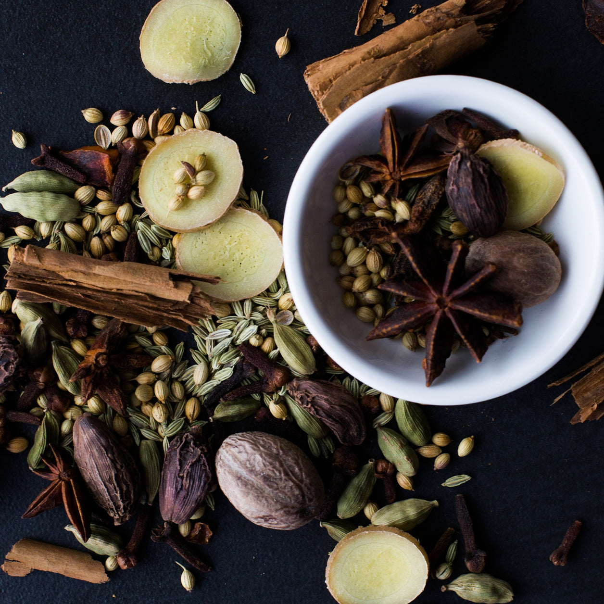

# Aromatic Bitters

*Angostura is the famous one. Here's how to make your own version — the Angostura-style "aromatic" bitters — with herbs, roots, spices, and high-proof spirit.*

## Overview

Aromatic bitters are the "default" cocktail bitter — the one you'd add to an Old Fashioned, Manhattan, Whisky Sour, or any cocktail that calls for "a dash of bitters" without specifying which.

The defining flavour is:
- **Gentian root** — the foundational bitter agent.
- **Cinchona bark** — the source of quinine; supports the bitterness.
- **Warm spices** — cardamom, clove, allspice, cinnamon, anise.
- **Citrus zest** — usually orange and/or lemon.
- **Herbal notes** — angelica, wormwood, hyssop, calamus.
- **Sometimes earthy notes** — gentian, calamus root.

Each commercial brand has its own blend; this recipe is a starting point that gives Angostura-style character.

## Recipe (100 ml bitters)

### Ingredients
- 250 ml high-proof neutral spirit (vodka, grain alcohol, or Everclear at 50-95% ABV)
- 1 teaspoon gentian root (dried, available at herbalists or online)
- ½ teaspoon cinchona bark (dried, available at herbalists)
- 1 cinnamon stick (4 cm, broken)
- 6 green cardamom pods (lightly crushed)
- 6 cloves
- 6 allspice berries
- 2 star anise pods
- 1 teaspoon dried orange peel (or zest of 1 orange, dried)
- 1 teaspoon dried bay leaf (1 small leaf, crumbled)
- ½ teaspoon dried wormwood (artemisia — available at herbalists)
- 1 teaspoon dried angelica root
- ¼ teaspoon caraway seeds (lightly crushed)
- 50 g demerara sugar (for sweetening at the end)

### Equipment
- 2 × 500 ml mason jars
- Cheesecloth
- Fine sieve
- 100 ml dropper bottle for finished bitters

## Method

### Step 1: Infuse (2 weeks)

1. Place all dry ingredients (everything except the sugar) in the mason jar.
2. Pour over the neutral spirit. Seal.
3. Shake the jar daily for the first week.
4. Let infuse for a total of 14 days at room temperature, away from direct sunlight.

The jar will gradually turn from clear to deep brown/red. The smell becomes increasingly complex as the days pass.

### Step 2: Strain

After 14 days:
1. Strain the liquid through a cheesecloth-lined sieve into a clean jar.
2. Press the solids in the cheesecloth to extract as much liquid as possible.
3. Discard the spent solids.
4. The strained liquid is the "bitters base". It's intensely bitter — a single drop on the tongue will pucker.

### Step 3: Sweeten

The bitters base is too bitter to use directly. Sweeten gently:

1. Heat the demerara sugar in a small pan with 60 ml of water, stirring until dissolved.
2. Cool the sugar syrup completely.
3. Stir the cooled sugar syrup into the bitters base.
4. Taste with a single drop on the tongue. If still too bitter, add another 25 g of sugar dissolved in 50 ml water. If correctly balanced, transfer to the dropper bottle.

### Step 4: Age (optional but recommended)

The bitters are usable immediately but improve dramatically with 2-4 weeks of additional resting in the bottle. The harsh edges round out; the herbal notes integrate; the cinnamon and cardamom soften.

## What to taste for

A finished aromatic bitter should be:

- **Intensely bitter** on the tongue (the bitterness should hit immediately and linger).
- **Aromatic** on the nose — the warm spices, citrus, and herbal notes should be present even from a tiny drop.
- **Slightly sweet** — the sugar provides balance, not full sweetness.
- **Complex** — multiple layers detectable: bitter, warm, citrus, herbal, slight savoury.

Use 2-3 dashes (about 0.5-1 ml) in a cocktail.

## Common variations

### Christmas bitters
Add: 1 teaspoon nutmeg, 1 cinnamon stick (double), 4 extra cloves, 1 tsp dried ginger.
Use in: hot toddies, mulled wines, dessert cocktails.

### Coffee bitters
Add: 2 tablespoons coarsely ground dark roast coffee beans, 2 cocoa nibs.
Use in: espresso martinis, old fashioneds with bourbon, after-dinner cocktails.

### Mole bitters
Add: 1 dried ancho chile, 2 tablespoons cacao nibs, 1 tablespoon cumin, pinch chilli flakes.
Use in: tequila and mezcal cocktails.

### Saffron bitters
Add: 0.5 g saffron, 1 vanilla pod (split), 1 cinnamon stick, zest of 2 oranges.
Use in: gin cocktails, champagne cocktails, dessert applications.

## Quality notes

- **The cinchona bark** is the trickiest ingredient to source. UK herbalists (Bald-Headed Herbs, Bodywise) carry it; online sellers (Cinchona officinalis dried) are reliable.
- **Wormwood** (artemisia absinthium) is legal in the UK in small amounts — herbalists stock it. Use sparingly; it's potent.
- **Gentian root** is the canonical bitter agent; available at any herbalist.
- **The spirit choice matters**: high-proof (60-95%) extracts more efficiently. 40% works but takes longer.

## Bottling

Pour the finished bitters into 30 ml dropper bottles. Label with date and "aromatic bitters". Stores indefinitely at room temperature (the high alcohol preserves).

A 100 ml batch makes about 3 × 30 ml dropper bottles — enough for 200+ cocktails. Total cost: about £1.50 (ingredients + bottles).

Commercial equivalent: a 30 ml bottle of Angostura is £8; a Fee Brothers Old Fashioned aromatic is £15. Your homemade version, at a third of the cost, with adjustable parameters, is a serious cocktail-cabinet upgrade.
