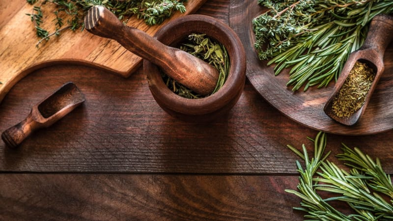

# What Bitters and Shrubs Are

*Bitters and shrubs are the two great "back-shelf" cocktail ingredients. Bitters add bitterness and aromatic complexity in tiny drops; shrubs add fruity sour-sweet brightness in larger pours. Both are cocktail bartender essentials and both are easy to make at home.*

## Overview

Bitters and shrubs are different things with similar roles: both are concentrated flavour-and-sour modifiers that go into drinks (cocktails, soft drinks, sparkling water) in small amounts and transform the result.

### Bitters

**What they are:** infusions of bitter herbs / spices / roots in high-proof alcohol (usually a high-grade vodka or grain-neutral spirit). Concentrated and used in dashes (a "dash" = about 1 ml; a 30 ml bottle of bitters lasts a serious cocktail drinker months).

**Origin:** medicinal tonics from the 17th-18th centuries. Sailors carried them as digestive aids; the Italians and the Brits both developed strong bitters traditions. Angostura (Trinidad, since 1824), Peychaud's (New Orleans, 1840s), and Fee Brothers (USA, 1860s) are the canonical commercial brands.

**Uses:**
- 2-3 dashes in an Old Fashioned (the iconic use).
- 2 dashes in a Manhattan.
- A dash or two in dozens of cocktails for "aromatic depth".
- A dash in sparkling water as a digestif before dinner.
- A few drops on whipped cream for a dessert garnish.
- Even in cooking: a few dashes in a sauce, marinade, or chocolate dessert.

### Shrubs

**What they are:** fruit infused in vinegar + sugar. The vinegar pulls the fruit's flavour out; the sugar balances; the result is a syrup-like vinegar-fruit concentrate.

**Origin:** 17th-19th-century method of preserving fresh fruit. Pre-refrigeration, vinegar acted as a preservative; the resulting shrub was used as a base for "shrub" (the drink — vinegar-fruit syrup mixed with water).

**Modern revival:** since ~2010, craft cocktail bars have rediscovered shrubs as alternatives to citrus in cocktails. A blackberry shrub gives a sour-sweet fruity hit that fresh blackberry juice can't match. They're shelf-stable, work in carbonated drinks, and add a layer that's distinct from citrus.

**Uses:**
- 30-50 ml in a Highball-style drink with soda water and gin (or vodka, or tequila).
- 15-30 ml in a cocktail in place of part of the citrus (a sour variation).
- Diluted with water as a "switchel" or "drinking vinegar" — a refreshing non-alcoholic drink.
- Drizzled over salad as a finishing vinegar.

## The pages

This course covers:

1. **[Aromatic bitters](aromatic-bitters.md)** — the canonical Angostura-style bitter. A recipe and the technique.
2. **[Citrus bitters](citrus-bitters.md)** — orange bitters + lemon bitters + grapefruit bitters. Each in detail.
3. **[Shrubs](shrubs.md)** — the cold-process method and the hot-process method. With 5 recipes.
4. **[Using bitters and shrubs](using-bitters-and-shrubs.md)** — practical applications in cocktails, soft drinks, and cooking.

## Why make your own

- **Variety** — commercial bitters cover ~20 flavours; you can make 100s.
- **Quality** — home-infused with good ingredients usually outperforms supermarket commercial.
- **Customisation** — adjust intensity, sweetness, herb profile.
- **Cost** — home-made aromatic bitters cost about £1.50 for a 100 ml batch; commercial Angostura is £8 for 100 ml.
- **Pride** — having "my homemade bitters" on the cocktail shelf is a thing.

## What you need

### Bitters
- A high-proof neutral spirit (vodka, grain alcohol). Higher proof = better extraction. 50% (100 US-proof) ideal; 40% works.
- Mason jars or sealed glass containers.
- Small dropper bottles (30 ml) for finished bitters. £1 per bottle.
- Cheesecloth and a fine sieve for straining.

### Shrubs
- Fresh fruit (in season is best).
- Granulated white sugar OR demerara sugar (for richer shrubs).
- Apple cider vinegar (the canonical), or rice vinegar (Asian-leaning), or white wine vinegar (cleaner taste).
- Mason jars for steeping.
- Bottles for finished shrubs.

## How long does it take?

- **Bitters**: 2-4 weeks of infusion + a few days for blending. Plan a month.
- **Shrubs**: 24 hours (hot process) or 2-7 days (cold process). Quick.

## How to use the course

1. Read all 4 content pages once, in order.
2. Make a basic aromatic bitter following [aromatic-bitters.md](aromatic-bitters.md) — 2 weeks of waiting, ~30 minutes total work.
3. Make a basic shrub from any seasonal fruit — same evening.
4. After a month, you have your own bitters AND your own shrubs.

Then experiment.
