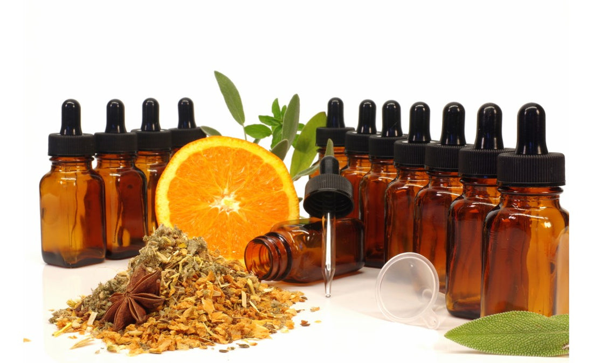

# Citrus Bitters

*Orange bitters, lemon bitters, grapefruit bitters. Each is a single-citrus infusion with supporting herbs. Lighter, fresher, more zest-forward than aromatic bitters. Used widely in gin cocktails, vermouth-heavy drinks, and any cocktail that wants a citrus aromatic top-note without adding citrus juice.*

## Overview

Citrus bitters work differently from aromatic bitters: where aromatic bitters use bitter roots (gentian, cinchona) as the main bitter element, citrus bitters use the citrus peel's essential oils PLUS the white pith (which is genuinely bitter on its own). The result is a bitter that smells distinctly of a specific citrus, with a clean bitter finish.

Three canonical variants:
- **Orange bitters** — the most common. Goes with gin (Martini, Negroni), bourbon (Manhattan variants), and any "citrus-forward" cocktail.
- **Lemon bitters** — fresher, brighter. Excellent in vodka cocktails, champagne cocktails, anywhere lemon is the supporting note.
- **Grapefruit bitters** — sharper, slightly herbal. Good with tequila, mezcal, and modern cocktails (Penicillin variants).

This page covers all three with one technique that varies only in the citrus.

## Orange Bitters

### Ingredients
- 250 ml high-proof neutral spirit
- Zest of 3 large oranges (use a vegetable peeler; avoid the white pith — sort of)
- 2 tablespoons of the white pith from the peeled oranges
- 1 teaspoon coriander seeds
- 1 teaspoon cardamom pods (lightly crushed)
- 4 cloves
- ½ teaspoon gentian root (dried)
- 1 cinnamon stick (3 cm)
- ¼ teaspoon caraway seeds
- 1 small bay leaf

### Method
1. In a mason jar, combine all ingredients. Cap; shake.
2. Infuse 10-14 days at room temperature, shaking daily for the first week.
3. Strain through cheesecloth.
4. Dissolve 30 g of demerara sugar in 50 ml of water; cool; stir into the strained liquid.
5. Bottle in 30 ml droppers.

### Use
- **Martini** — 1-2 dashes alongside the gin and vermouth. Brightens.
- **Negroni** — 1 dash. Lifts the bitter Campari into more citrus territory.
- **Manhattan** — substitute or add alongside aromatic bitters for a citrus-forward variant.
- **Old Fashioned** — pair with aromatic bitters for a more complex profile.

## Lemon Bitters

### Ingredients
- 250 ml high-proof neutral spirit
- Zest of 3 lemons (peeler; avoid pith)
- 1 tablespoon of the white pith
- 1 teaspoon coriander seeds
- ½ teaspoon angelica root
- ½ teaspoon dried lavender (just a touch — too much = soap)
- 4 green cardamom pods
- 1 teaspoon dried chamomile flowers
- 1 small piece of dried orange peel

### Method
Same as orange bitters: infuse 10-14 days; strain; sweeten with 25 g demerara dissolved in 50 ml water; bottle.

### Use
- **Vodka Martini** — 1 dash sharpens.
- **Champagne cocktail** — 1 dash with a sugar cube + champagne.
- **Tom Collins** — replace 1 dash of standard bitters.
- **Whisky Sour** — pair with aromatic bitters for a brighter sour.

## Grapefruit Bitters

### Ingredients
- 250 ml high-proof neutral spirit
- Zest of 2 large grapefruits (preferably pink for the colour)
- 1 tablespoon of the white pith
- 1 teaspoon coriander seeds
- 1 teaspoon cardamom pods
- 1 vanilla pod (split lengthwise)
- 1 teaspoon dried hibiscus flowers (for colour + tartness)
- 4 black peppercorns
- ½ teaspoon gentian root
- 1 small piece of dried orange peel

### Method
Same as before. Note: the grapefruit's pith is more bitter than orange or lemon's, so use SLIGHTLY less. Infuse 10-14 days.

### Use
- **Tequila cocktails** — Paloma (grapefruit soda + tequila), Mezcal Old Fashioned.
- **Penicillin** — 1-2 dashes in the smoky Scotch sour for grapefruit lift.
- **Hemingway Daiquiri** — 1 dash brings out the grapefruit-cherry flavour profile.

## Other citrus variants worth trying

- **Lime bitters** — limited shelf life because of lime oil oxidation. Use within 6 months.
- **Bergamot bitters** — for Earl Grey cocktails. Use bergamot peel + earl grey tea.
- **Yuzu bitters** — yuzu peel + sansho pepper + ginger. Modern Japanese cocktail style.
- **Blood orange bitters** — like orange bitters but with deeper colour and slightly bitter edge.
- **Kumquat bitters** — whole kumquats (sliced) + cardamom + clove. Sweeter, more floral.

## A worked example: making a 3-citrus blend

A bartender's secret is combining bitters. Make all three citrus variants (orange, lemon, grapefruit) at full strength, then combine in a fresh bottle:

- 50% orange bitters
- 30% lemon bitters
- 20% grapefruit bitters

The result is a "house citrus bitter" with the depth of orange, the brightness of lemon, and the edge of grapefruit. Adjust ratios to taste.

## Common mistakes

- **Including too much white pith** — bitter and slightly fibrous. The peel oils carry the flavour; the pith provides bitterness but a little goes a long way.
- **Not enough citrus** — citrus bitters should smell of the citrus IMMEDIATELY from the bottle. If you can't smell it from 20 cm away, the infusion needed more zest.
- **Too much sweetener** — citrus bitters work because they're tart-bitter. Adding too much sugar makes them taste like a watered-down liqueur.

## Storage

Citrus bitters keep 1-2 years in dropper bottles. The citrus oils gradually mellow over time; pre-1 year, the flavour is most vivid. Past 2 years, the cloves and cardamom can dominate.

A bottle of homemade citrus bitters in your cabinet is worth more than the £8 commercial bottle and will be subtly better.
