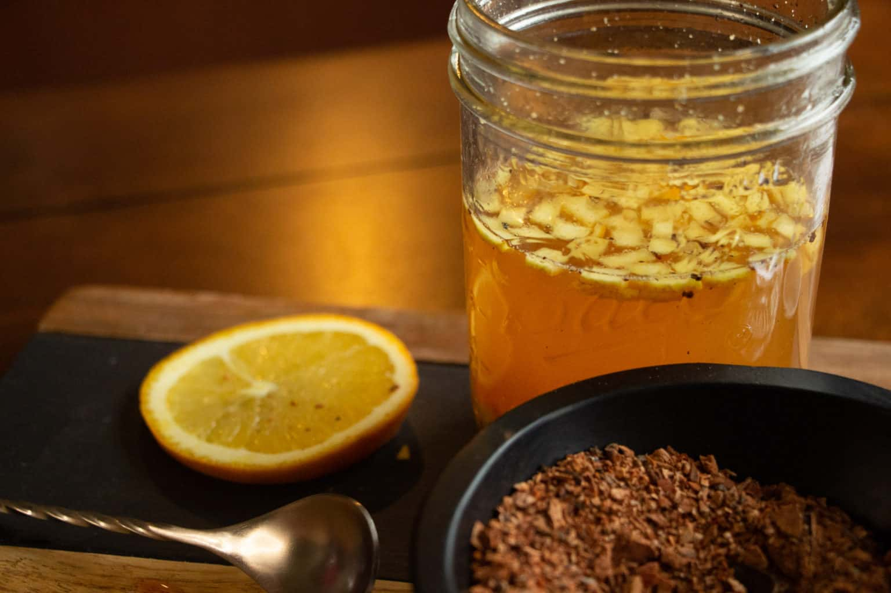

# Shrubs (Drinking Vinegars)

*Shrubs are fruit + vinegar + sugar, infused. The result is a syrup-like concentrate that goes in cocktails, in soft drinks, or diluted with sparkling water as a refreshing non-alcoholic drink. Origin: 17th-century preservation; modern revival: 2010s craft cocktail bars.*

## Overview

A shrub is essentially a fruit-flavoured vinegar syrup. The vinegar pulls the fruit's flavour out aggressively; the sugar balances; the resulting concentrate has 6-month shelf life and tastes of fruit-and-tang in a way that fresh juice can't replicate.

Two main techniques:

### Cold process (the traditional, gentler)
- Mix fruit + sugar in a jar; let sit 24-48 hours (the sugar pulls out the fruit's juices via osmosis).
- Strain off the resulting "fruit syrup".
- Add vinegar; let mature 1-7 days.
- Strain again; bottle.

### Hot process (faster, slightly less aromatic)
- Combine fruit + sugar + vinegar in a saucepan.
- Heat gently until sugar dissolves.
- Cool; strain; bottle.

The cold process gives a more aromatic, fresher shrub. The hot process is faster and works better for some fruits (apples, pears).

## Equipment
- Mason jars (500 ml) for steeping.
- Cheesecloth and a fine sieve for straining.
- Bottles (250-500 ml) for finished shrubs.
- A small wooden mallet or muddler (for cold-process berry shrubs).

## Recipe 1: Raspberry shrub (cold process)

### Ingredients
- 400 g fresh raspberries
- 300 g caster sugar
- 350 ml good apple cider vinegar (Aspall, Newman's, or any unfiltered cider vinegar)

### Method
1. In a mason jar, combine the raspberries and sugar. Crush gently with the back of a spoon to break the fruit slightly.
2. Cover loosely with cling film or a lid (don't seal tight, gases need to escape).
3. Let sit at room temperature for 24-48 hours. The sugar will draw out the raspberry juice; the mixture becomes a syrupy pink mass.
4. Strain through a cheesecloth-lined sieve into a clean jar. Press the fruit to extract as much as possible. Discard the spent berries.
5. Add the apple cider vinegar to the strained syrup. Stir thoroughly.
6. Seal the jar; refrigerate 3-7 days. The flavour will integrate and round.
7. After 1 week, taste; adjust if needed (more sugar if too sharp; more vinegar if too sweet).
8. Bottle in clean glass bottles. Refrigerate.

### Use
- **Raspberry-soda cooler:** 30 ml shrub + 150 ml soda water + ice. Garnish with a mint sprig.
- **Raspberry gin cocktail:** 30 ml shrub + 50 ml gin + 100 ml tonic + ice.
- **Raspberry shrub margarita:** 25 ml shrub + 50 ml tequila + 15 ml lime juice + 15 ml triple sec + ice. Shake. Coupe.

## Recipe 2: Strawberry-basil shrub (cold process)

### Ingredients
- 400 g fresh strawberries (hulled and chopped)
- 300 g caster sugar
- A handful of fresh basil leaves (about 10-12)
- 350 ml white wine vinegar (gentler than cider; lets the strawberry character through)

### Method
Same as raspberry shrub. The basil goes into the sugaring step; the herbal note infuses alongside the strawberry.

### Use
- **Strawberry-basil spritz:** 30 ml shrub + 100 ml prosecco + soda + lemon wedge.
- **Strawberry-basil gin lemonade:** 30 ml shrub + 50 ml gin + 100 ml soda + lemon wheel.

## Recipe 3: Spiced apple shrub (hot process)

### Ingredients
- 400 g apples (mixed varieties; Cox + Granny Smith works well)
- 250 g demerara sugar
- 350 ml apple cider vinegar
- 1 cinnamon stick
- 4 cloves
- 4 cardamom pods
- 1 star anise
- 1 small piece of fresh ginger (sliced)

### Method
1. Core and chop the apples (leave the skin on for colour and pectin). Don't peel.
2. In a heavy saucepan, combine apples, sugar, vinegar, spices, and ginger.
3. Bring to a gentle simmer over medium heat. Stir to dissolve the sugar.
4. Simmer 15 minutes, stirring occasionally. The apples should soften but not fall apart.
5. Off heat; let cool to room temperature.
6. Strain through cheesecloth, pressing gently. Discard solids (or use as compote).
7. Bottle in clean glass bottles. Refrigerate.

### Use
- **Apple shrub mocktail:** 30 ml shrub + 150 ml sparkling water + cinnamon stick.
- **Apple-bourbon old fashioned:** 20 ml shrub + 60 ml bourbon + a single ice cube. Stir.
- **Hot apple toddy:** 30 ml shrub + 50 ml bourbon + 100 ml hot water + cinnamon stick.

## Recipe 4: Blackberry-sage shrub (cold process)

### Ingredients
- 400 g fresh blackberries (or frozen-thawed)
- 300 g caster sugar
- 12 fresh sage leaves
- 350 ml apple cider vinegar

### Method
Same as raspberry shrub. The sage infuses overnight with the sugar; gives the shrub a herbal-earthy note that pairs beautifully with the blackberry.

### Use
- **Blackberry-sage smash:** muddle 1 sage leaf in a glass; add 30 ml shrub + 50 ml gin + crushed ice; top with soda.
- **Blackberry-sage spritz:** 30 ml shrub + 100 ml dry sparkling rosé + ice + a sage sprig.

## Recipe 5: Ginger-honey shrub / oxymel (hot process)

This is technically an oxymel (honey + vinegar + herbs) rather than a fruit shrub. Same shelf-and-use category.

### Ingredients
- 100 g fresh ginger (peeled and sliced thin)
- 200 g honey
- 200 ml apple cider vinegar (raw, unfiltered)
- Zest of 1 lemon (no pith)

### Method
1. In a mason jar, combine ginger, honey, vinegar, and lemon zest.
2. Seal; shake to combine.
3. Let sit at room temperature for 3-7 days, shaking daily.
4. Strain through cheesecloth.
5. Bottle in clean glass bottles. Refrigerate.

### Use
- **Switchel** (the traditional drink): 30 ml shrub + 200 ml cold water + a squeeze of lime. Refreshing summer drink.
- **Ginger-honey hot toddy:** 30 ml shrub + 50 ml whisky + 100 ml hot water.
- **Modern wellness shot:** 15 ml shrub + 15 ml fresh-pressed orange juice + a pinch of cayenne. Shot it.

## Vinegar choice

Different vinegars give different shrubs:

- **Apple cider vinegar** (raw, unfiltered): the traditional. Slightly sweet, mellow, fruit-friendly. Use 90% of the time.
- **White wine vinegar**: cleaner, lighter. Lets delicate fruits (strawberry, white peach) speak.
- **Rice vinegar**: gentle, slightly sweet. Good for Asian-leaning shrubs (lychee, ginger, kaffir lime).
- **Red wine vinegar**: assertive, bold. Use for stone-fruit shrubs (cherry, plum).
- **Sherry vinegar / balsamic**: too assertive for most shrubs but excellent in small amounts for fig shrub or specific applications.
- **Champagne vinegar**: delicate; for delicate fruit shrubs.

## Storage

- **Refrigerated shrubs**: 6 months (the high-acid + sugar makes them shelf-stable but flavours degrade past 6 months).
- **Room-temperature shrubs** (canned/sealed): 1 year (less aromatic over time).
- **Frozen shrubs** (in ice-cube trays): 1 year (good for batch-cocktail use).

## Common mistakes

- **Boiling the cold-process shrub**: drives off the fresh fruit aromatics. Cold process is cold.
- **Using too much vinegar**: overpowers the fruit. Stick to 1:1 vinegar-to-fruit-syrup ratio.
- **Not enough sugar**: the resulting shrub is too tart to use in drinks. Aim for 75 g sugar per 100 g fruit.
- **Using off-brand vinegar**: cheap vinegars taste of acetic acid only, not of fermented apple. Use decent vinegar.

## Shrub vs syrup

A simple syrup is sugar + water. A shrub is fruit + sugar + vinegar. The shrub has 3 elements where simple syrup has 1, and the vinegar gives both preservation and a tangy backbone that simple syrup can't match.

In cocktails: simple syrup gives sweetness; shrub gives sweetness + tartness + fruit + body. They serve different roles.

## A shrub bar setup

A working shrub shelf has:
- One berry shrub (raspberry, blackberry, or strawberry).
- One stone-fruit shrub (peach, cherry, or plum).
- One apple shrub (spiced or plain).
- One herb-and-honey shrub (the ginger-honey oxymel, or rosemary-honey).
- One citrus shrub (lime-mint or grapefruit-thyme).

Five bottles, each 250 ml. £15 in fruit + £5 in vinegar = £20 total for a working shrub kit that lasts 6 months.
