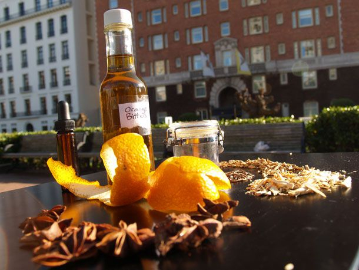

# Using Bitters and Shrubs

*Bitters and shrubs work differently in drinks: bitters are dashes (1 ml or less); shrubs are pours (15-50 ml). Knowing when to use which, and how, is what turns "I made bitters" into "I know how to use them".*

## Overview

This page covers the practical applications:

1. **In cocktails** — where the bartender uses each.
2. **In soft drinks** — non-alcoholic applications.
3. **In cooking** — yes, you can cook with bitters and shrubs.
4. **Pairing principles** — what flavour-combinations work.

## Bitters in cocktails

The "rule": 2-3 dashes of bitters in a 75-100 ml cocktail. A dash is approximately 0.5-1 ml — small. Too much bitters and the cocktail becomes bitter-dominant; too little and they contribute nothing.

### Where each bitter goes

**Aromatic bitters (Angostura-style):**
- Old Fashioned — 2-3 dashes. Essential.
- Manhattan — 2 dashes.
- Whisky Sour — 2 dashes on the foam (decorative + functional).
- Sazerac — 4 dashes Peychaud's (different style of aromatic).
- Champagne cocktail — 2 dashes onto a sugar cube.

**Citrus bitters:**
- Martini — 1-2 dashes orange bitters with gin + vermouth.
- Negroni — 1 dash orange bitters can brighten.
- Champagne cocktail — 1 dash orange bitters alongside Angostura.
- Aviation — 2 dashes orange bitters (some bartenders add).
- Gin and tonic — 1 dash orange bitters lifts the cocktail.

**Speciality bitters:**
- Mole bitters (with cacao + chilli) — in tequila cocktails (Mezcal Old Fashioned).
- Coffee bitters — in espresso martinis, bourbon cocktails, dessert drinks.
- Saffron / herbal bitters — in champagne cocktails, after-dinner drinks.

### The mixology principle

Bitters work because they're **bitter**: bitterness contrasts with sweet and sour, providing structure. A cocktail that's only sweet + sour is one-dimensional; adding 2-3 dashes of bitter gives the third dimension.

The rule of thumb:
- More sweet ingredients → more bitters needed (3 dashes).
- Mostly spirit-based → fewer bitters (1-2 dashes).
- Citrus-heavy → 1 dash for balance.

## Shrubs in cocktails

Shrubs are more substantial pours: typically 20-50 ml per drink. They replace or supplement other elements.

### Where shrubs go

**Highball / spritz style:**
- 30 ml shrub + 50 ml spirit + 100 ml soda water + ice.
- Examples: raspberry shrub + gin + soda; strawberry-basil shrub + vodka + soda; ginger-honey shrub + bourbon + soda.

**Cocktail-as-shrub:**
- 30 ml shrub + 60 ml spirit + 25 ml citrus + ice. Shaken.
- Examples: a raspberry-shrub-and-gin sour; a blackberry-sage-shrub-and-tequila variant.

**Modifier role:**
- 15 ml shrub + 60 ml whisky + 1 sugar cube + bitters. An Old-Fashioned variant where the shrub replaces the sugar element.

### Shrubs vs citrus

A shrub does the work of citrus (sourness) but with additional layers:
- Pure citrus (lemon/lime juice) — clean, bright, sharp.
- Shrub (e.g. blackberry) — fruity, tart, with body and depth.

Substituting shrub for citrus in a cocktail transforms it: a Margarita with raspberry shrub instead of half the lime juice becomes a raspberry-margarita. A Whisky Sour with apple shrub instead of half the lemon becomes an autumn-warming variant.

## Non-alcoholic applications

### Bitters in soft drinks
- **Sparkling water + 2 dashes aromatic bitters + lemon wedge** = a digestif before dinner.
- **Tonic water + 2 dashes orange bitters** = a non-alcoholic G&T-style drink.
- **Apple juice + 2 dashes coffee bitters + ice** = afternoon refresher.
- **Hot water + 2 dashes Christmas bitters + lemon + honey** = a non-alcoholic hot toddy.

### Shrubs in soft drinks
- **Switchel**: 30 ml ginger-honey shrub + 200 ml cold water + lime. The traditional summer farmers' drink.
- **Sparkling shrub**: 30 ml fruit shrub + 200 ml sparkling water + ice + fresh herb.
- **Shrub mocktail**: 30 ml shrub + 50 ml fruit juice + 100 ml soda + a citrus wedge.

## In cooking

Both bitters and shrubs work in food:

### Bitters in cooking
- **Marinades**: 2-3 dashes aromatic bitters in a beef marinade adds complexity.
- **Sauces**: a few dashes in a beurre blanc or a gravy lifts the flavour profile.
- **Desserts**: 1-2 dashes in chocolate ganache, mousse, or crème brûlée.
- **Coffee**: 1 dash coffee bitters in a flat white intensifies the coffee character.

### Shrubs in cooking
- **Vinaigrettes**: 2 tablespoons shrub + 3 tablespoons olive oil + a pinch of salt. Done.
- **Glaze for roast meats**: 4 tablespoons shrub + 2 tablespoons butter + reduce to a syrup; brush over roast pork or duck.
- **Pickling liquid**: a fruit shrub can be the base for quick pickles (sliced radish, onion).
- **Soda water marinade**: shrub + soda water + spices marinades fish quickly with a clean tart flavour.
- **Cocktail food**: drizzle a few drops of fruit shrub over fresh ricotta + crackers + cracked pepper.

## Pairing principles

When pairing bitters or shrubs with spirits, the traditional principles:

### Bitters
- **Aromatic** → whisky (any), bourbon, dark rum, brandy. Warm spirits.
- **Citrus (orange/lemon/grapefruit)** → gin, tequila, vodka, light rum, vermouth. Light spirits.
- **Specialty (mole / coffee / saffron)** → matched specifically. Mole + tequila; coffee + bourbon; saffron + gin.

### Shrubs
- **Berry shrubs (raspberry / blackberry / strawberry)** → gin, tequila, prosecco, vodka.
- **Apple shrubs** → bourbon, dark rum, brandy.
- **Stone-fruit shrubs (peach / cherry / plum)** → whisky, brandy, gin.
- **Herb-and-honey oxymels** → bourbon, gin, sparkling water.
- **Citrus-and-herb shrubs (lime-mint / grapefruit-thyme)** → vodka, gin, tequila.

## A worked example: building a shrub cocktail menu

Imagine a small home-bar menu with 4 cocktails, each demonstrating bitters + shrubs:

1. **Blackberry-Sage Bourbon Smash** — 60 ml bourbon + 30 ml blackberry-sage shrub + 1 dash aromatic bitters + crushed ice + sage sprig. Stirred in a rocks glass.

2. **Apple Shrub Old Fashioned** — 60 ml rye + 15 ml spiced apple shrub + 2 dashes aromatic bitters + 1 large ice cube + orange twist. Stirred in a rocks glass.

3. **Strawberry-Basil Spritz** — 30 ml strawberry-basil shrub + 100 ml prosecco + 50 ml soda water + lemon wedge + basil sprig. Built in a wine glass over ice.

4. **Ginger-Honey Switchel** (non-alcoholic) — 30 ml ginger-honey oxymel + 200 ml sparkling water + lime wedge + ice. Built in a tall glass.

Each cocktail demonstrates a different shrub style. Each is interesting and reproducible.

## Things to know

- **Bitters dose**: 1-3 dashes (0.5-1 ml per dash). Easy to overdo.
- **Shrub dose**: 15-50 ml. The 30 ml mark is the sweet spot for most cocktails.
- **Combining bitters**: 1 dash aromatic + 1 dash citrus is a classic move. Stack flavours.
- **Combining shrubs**: 20 ml of one + 10 ml of another in the same cocktail. Layered fruit.
- **Aging bitters**: improves over months. Aging shrubs: improves over weeks but loses freshness past 6 months.

## Common mistakes

- **Using bitters as a "main" ingredient** — they're a seasoning, not a base. 2-3 dashes is enough.
- **Using shrubs as a "subtle" ingredient** — they need to be pourable amounts (20-50 ml) to register. 5 ml of shrub does nothing.
- **Combining too many flavours** — a cocktail with aromatic bitters + orange bitters + a fruit shrub + bitter Campari is too busy. Pick two or three layers.
- **Skipping the citrus in a shrub-and-spirit cocktail** — the shrub provides some sourness but often not enough. Add a few drops of fresh citrus alongside.

## Where to go next

- Try making 2 bitters and 3 shrubs in one weekend. Use them across a month.
- Subscribe to a craft-bitter blog (Bitterly Speaking, Imbibe magazine).
- Build a small home-bar menu using only your homemade modifiers.
- Branch into making your own vermouth (a related infusion that uses similar techniques).

The cocktail world is small; learning bitters and shrubs unlocks a meaningful percentage of it.
