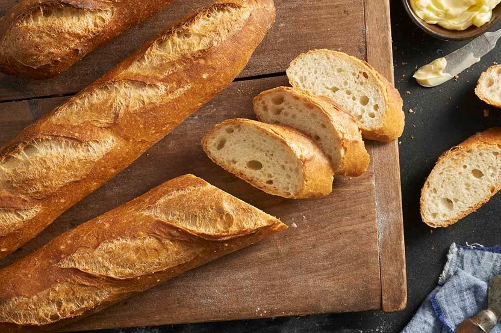
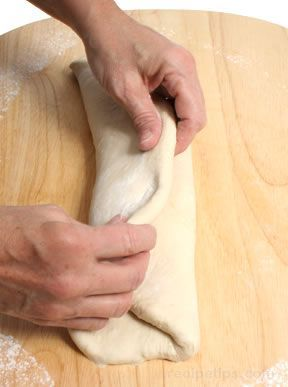
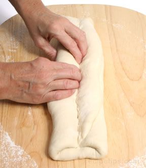
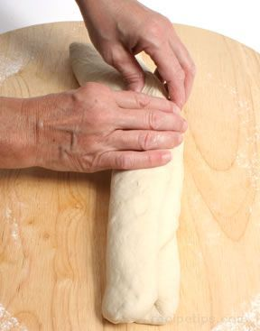
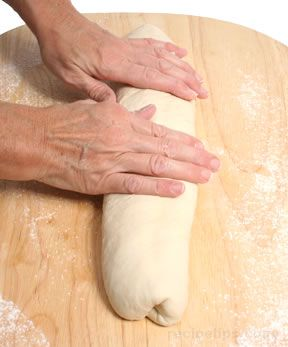
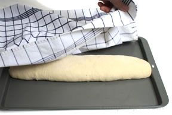
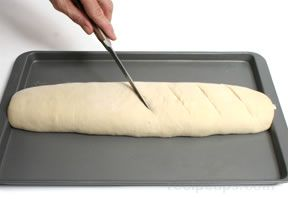

# Baguette

*The baguette is the long, thin, crusty French loaf with the dramatic ears down its top. It's the shape with the steepest learning curve in the course, the dough has to stay uniform-diameter across 60 cm, but the technique itself is teachable, and once you have the envelope-fold and the rolling motion, every other long-and-thin loaf becomes a variation.*

## Overview
The baguette is the long thin French loaf with dramatic ears running down its top. It has the steepest learning curve in the course because uniform diameter across 60 cm is non-negotiable: there's nowhere to hide a wobble. The technique is teachable though, and once the envelope-fold and the centre-out roll click, every other long-and-thin loaf becomes a variation.

## What you're aiming for
A slim cylinder around 60 cm long and 5 to 7 cm thick, with gently tapered ends and six or seven diagonal slashes across the top. After baking, those slashes should open into the crisp, slightly-lifted edges called "ears", the visual signature of a properly baked baguette. The interior should be open and irregular, the crust should crackle when squeezed.

A baguette is harder to get right than a bloomer because you cannot hide a wobbly cylinder behind a generous score. Uniform diameter from end to end is the whole game.

## Stage one: the envelope fold

Bulk-ferment your dough, knock it back gently and turn it onto a lightly floured surface. The envelope fold is what gives a baguette its layered, slightly chewy interior structure.

**Flatten into a rectangle.** Push or roll the dough out to a rough 30 cm × 18 cm rectangle, about 2 to 3 cm thick. You're not flattening it completely, you're just giving yourself a manageable shape to fold.

**Fold like a letter.** Fold one long side toward the centre by about a third, then fold the other long side over the top of it, overlapping by another three or four centimetres. You should now have a triple-layered strip running the long way. Press gently along the seam to seal it.

## Stage two: creating the seam

Now you build the seam that will sit underneath the finished baguette.

**Press a cavity, then seal.** Using the heel of your hand or your fingertips, push a long shallow trough (about 5 mm deep) down the middle of the strip, running end to end. Fold the front half up and over so its top edge meets the top edge of the back half. Press firmly all along the seam with the heel of your hand, multiple passes, until it's airtight. A poorly sealed seam will burst on the side during the bake instead of opening through your scores.

## Stage three: rolling to length

This is the move that decides whether you have a baguette or a slightly-baguette-shaped baton.

Flip the dough seam-side down. Place both hands in the centre and roll the dough back and forth gently while moving your hands outward toward the ends. The dough lengthens; you guide it.

A few things that matter:

- **Start in the centre, work outward.** Rolling end to end stretches some sections more than others.
- **Even, gentle pressure.** Don't lean into it. The dough should elongate under its own weight as you guide it.
- **Watch the diameter.** Pause every few rolls and look down the length. Any thick or thin spots will bake unevenly. Roll the thick spots a few more times.

Stop when you've reached about 60 cm and the diameter is consistent at 5 to 7 cm. Gently taper each end into a soft point (not a sharp one, sharp points scorch).

## Final prove

Transfer the baguette carefully to a baguette tray (the canvas-lined trough kind, seam-side up) or to a lined baking sheet (seam-side down). Cover with a damp tea towel and prove for 45 to 60 minutes in a warm spot. The poke test: a gentle finger-poke should spring back slowly over two to three seconds (see [Proving](proving.md)).

## Scoring

Preheat the oven to 220 to 240°C, a baguette wants a very hot oven.

With a very sharp blade or lame, make six or seven diagonal slashes down the top of the baguette, each about 5 cm apart, at a roughly 45-degree angle. Each slash should overlap the previous one by about a third, the scores run nearly parallel, not perpendicular to the length. Cut about 5 mm deep with a swift, confident motion.

See [Scoring](scoring.md) for why the angle matters and how to lift a clean ear.

## The bake

Slide the baguette onto the middle rack and immediately introduce steam, a tray of boiling water on the bottom rack, or a few spritzes of water from a spray bottle onto the oven walls just before the door shuts. Steam is essential for a baguette; without it the crust sets early, the loaf doesn't expand, and you get a pale, soft tube instead of a crackling baguette.

Bake for 15 to 20 minutes until deeply golden. The slashes should have opened dramatically and lifted into ears. The crust should sound thin and tap-crispy.

Cool on a wire rack for 30 minutes minimum before slicing. Eat the same day, a baguette is stale by tomorrow.

## Storage
- Eat the same day it's baked: a baguette is stale by tomorrow
- Re-crisp leftovers in a hot oven (200°C, 4-5 minutes) to revive the crust
- Freezes well within 2 hours of cooling; thaw at room temperature, then re-crisp before serving
- Never refrigerate: the cold accelerates staling

## Where Next
- [Épi](epi.md): the showstopper wheat-ear variant, built on the baguette shape.
- [Bloomer](bloomer.md): a wider, shorter cylinder. Same family of shaping but more forgiving.
- [Scoring](scoring.md): how the angle and depth of each cut lifts a crisp ear.
- [Shape Gallery](shapes.md): back to the full shape list.
