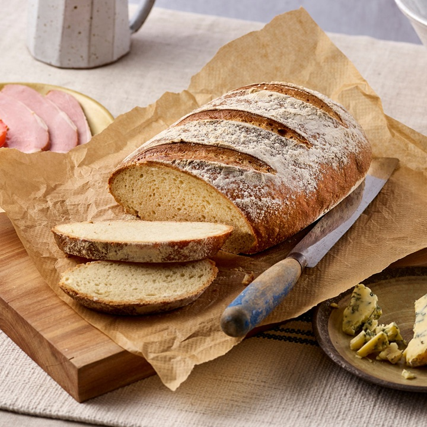
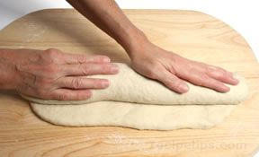
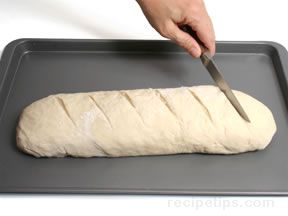
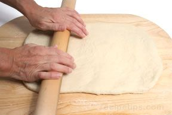

# Bloomer

*The bloomer is the long flat oval with diagonal slashes across the top that fans out into a wheat-stalk pattern as it bakes. Classic British artisan shape, very forgiving to make, and one of the most rewarding loaves to score: the slashes open up dramatically in the oven and the bread "blooms" through each one.*

## What you're aiming for
A long, slightly tapered cylinder of dough with a smooth, taut top, sitting flat on a baking sheet. Once scored across the top in six or eight diagonal cuts, the loaf opens up during the bake into a striking series of ridges and ears. The crumb is sliceable and even, the crust is generous - a bloomer is good for sandwiches and even better torn off in chunks for soup.

## The shaping

The technique is a flatten-and-roll. Start with bulk-fermented dough, knock the air out gently and let it rest two or three minutes if it springs back hard.

**Roll out a rectangle.** Using your hands or a rolling pin, flatten the dough into a rough rectangle about 35 cm long and 20 cm wide, roughly 2 to 3 cm thick. Even thickness is the goal - thick and thin patches bake unevenly.

**Roll into a cylinder.** Starting from one of the long sides, roll the dough away from you into a tight cylinder. Keep the firmness consistent: too loose and gaps form inside, too tight and the dough pops during the bake. The finished cylinder should be 10 to 12 cm across.

**Seal the seam, taper the ends.** Press along the seam underneath with the heel of your hand to weld it shut. Tuck the ends in gently so each end tapers slightly - gentle tapers, never sharp points (points burn in the oven).

## Onto the sheet

Place the bloomer seam-side down on a lined baking sheet, lying flat and straight with clearance on all sides for oven spring. Cover loosely with a damp tea towel and prove in a warm spot (20 to 25°C) for 45 to 60 minutes - until a gentle poke springs back slowly over two to three seconds (see [Proving](proving.md)).

## Scoring

This is the moment that defines a bloomer. Preheat the oven to 200 to 220°C.

Using a sharp knife or a bread lame, score the top with six to eight parallel diagonal slashes, about 4 cm apart and running at a 45-degree angle across the length of the loaf. Cut with one swift confident motion per slash - hesitating creates ragged edges. About 5 mm deep is the sweet spot: deep enough to guide where the bread expands, shallow enough that the loaf doesn't deflate.

See [Scoring](scoring.md) for the full theory of why scored loaves bloom, and how to read what a bake tells you about your cuts.

## The bake

Slide the scored bloomer straight into the oven on the middle rack. Bake 30 to 35 minutes until deeply golden. During the bake the slashes open up and the dough blooms through them into ridges - that's where the name comes from.

Cool on a wire rack for at least an hour before slicing. Cutting too early traps steam in the crumb and turns it gummy.

## Where Next
- [Standard Loaf](standard-loaf.md): the everyday rectangular tin loaf, easiest place to start if the bloomer feels ambitious.
- [Scoring](scoring.md): why the slashes bloom, how deep to cut, what each pattern tells you.
- [Proving](proving.md): the finger-poke test that says "ready to bake."
- [Shape Gallery](shapes.md): back to the full shape list.
