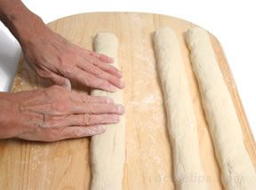
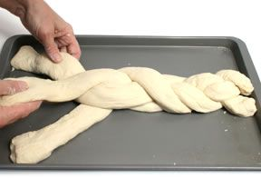
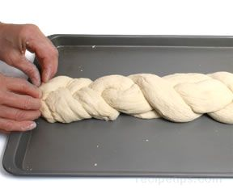
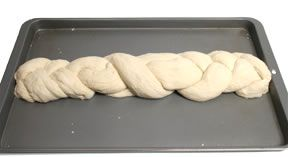

# Braided Loaf

*A braided loaf looks far more involved than it actually is. Once you can roll three even-length dough strands and have the patience to alternate "right over centre, left over centre" a few dozen times, you can produce something genuinely impressive. It's the loaf you'd bring to a dinner party.*

## What you're aiming for
Three (or four, or six) even strands of dough, woven into a long braid, proved gently and baked into a glossy plaited loaf. The weave should be neat but relaxed — too tight and the dough can't rise; too loose and the pattern falls apart in the oven. Done well, the strands separate slightly during the bake into a series of gentle waves down the surface.

We'll do the three-strand braid here. Four-strand and six-strand braids are variations on the same logic, just with more strands to keep track of.

## Dividing and rolling

Bulk-ferment your dough as usual. Weigh the dough and divide it into three exactly equal portions on a kitchen scale — equal weights are the whole reason an amateur braid can look professional. (For 500 g of dough, that's roughly 165 g per strand.)

Take one portion and roll it back and forth on a lightly floured surface using your palms. Start from the centre and gradually move your hands outward, elongating the dough to roughly 30 to 35 cm long and about 1.5 cm thick. Consistent diameter end-to-end — no tapering at the tips. Repeat with the other two.

Lay the three strands parallel on a parchment-lined baking sheet, with about 2 cm between them, centred.

## The braid (centre-outward)

The cleanest braid is woven from the middle outward to each end, not from one end to the other. It distributes the tension evenly.

Stand the strands so all three meet in the middle of the sheet. Working from that midpoint toward one end:

1. Lift the **right** strand and lay it over the centre. (The right strand is now the centre.)
2. Lift the **left** strand and lay it over the new centre. (The left strand is now the centre.)
3. Lift the **right** again. Over the centre.

Keep alternating — right over centre, left over centre, right over centre — until you reach the end. Pinch the three strand-tips together and tuck them gently under the loaf.

Go back to the midpoint and repeat in the other direction. (This time the alternation reverses depending on which side you started — just keep the same "outer over centre" logic.) Pinch and tuck that end too.

## The relaxed-not-tight rule

The single thing that ruins more home braids than anything else is over-tightening. The strands should stay round and plump under your fingers; if you can see the dough flatten where you're pinching, you're pulling too hard. A braid that's too tight cannot rise during proving, and bakes into something dense and lifeless.

A relaxed braid will look a bit lazy on the bench. That's fine — it tightens up visually as it proves and bakes.

## Final prove and bake

Cover the braided loaf loosely with a damp tea towel and prove for 45 to 60 minutes in a warm spot, until it springs back slowly when poked (see [Proving](proving.md)). For a glossy finish, brush very lightly with egg wash (one yolk whisked with a tablespoon of milk) just before baking. Don't over-brush — a thin film looks polished, a thick coat looks lacquered.

Bake at 200 to 220°C for 30 to 35 minutes until deeply golden. The braids should have separated slightly into visible waves; the bottom should sound hollow when tapped. Cool on a wire rack for at least an hour before slicing.

## Going further: four and six strands

A four-strand braid uses the same logic but worked end-to-end with two pairs alternating: 1-over-3, 4-over-2, 1-over-3 again. The pattern is tighter and more textured.

Six strands is genuinely advanced and worth learning only if you enjoy plaiting — but the results are extraordinary, the loaf looking almost like rope. Look up a six-strand challah video before attempting; you cannot remember the sequence from prose alone.

## Where Next
- [Enriched Doughs](enriched-doughs.md): challah is the classic braided enriched loaf — eggs, sugar, oil, soft crumb.
- [Standard Loaf](standard-loaf.md): if shaping skills are still developing, start here.
- [Shape Gallery](shapes.md): back to the full shape list.
