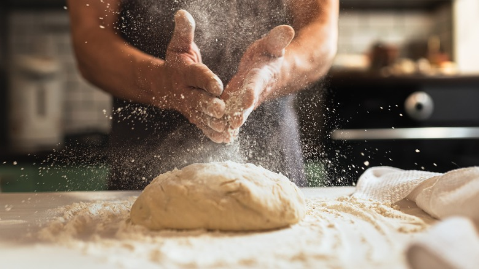

---
allergens:
  - gluten
tags:
  - vegetarian
  - vegan
  - dairy-free
mentions:
  - baking/pastry/brioche-dough
  - tutorials/bread/bloomer
  - tutorials/bread/cob
  - tutorials/bread/coburg
  - tutorials/bread/cottage
  - tutorials/bread/enriched-doughs
  - tutorials/bread/fougasse
  - tutorials/bread/gluten
  - tutorials/bread/hydration
  - tutorials/bread/proving
  - tutorials/bread/scoring
  - tutorials/bread/shapes
  - tutorials/bread/sourdough
  - tutorials/bread/standard-loaf
  - tutorials/pizza/dough
---

# Bread Course

*Bread is the kind of cooking that rewards a bit of patience and pays you back with a warm loaf. This course walks you through it from dough through to bake, with a stop at every place a home baker tends to come unstuck.*

## Overview
Bread is four ingredients (flour, water, salt, yeast) and an understanding of what happens to them over time. A loaf comes out well when you give the dough the conditions it wants at each stage: enough hydration to form gluten, enough kneading to develop it, enough time to ferment, enough heat to set the crumb. None of these steps is hard on its own. The trick is knowing which lever to pull when things go wrong, which is what the rest of this course teaches.

You can read this course in order, or jump straight to the technique you need. The links at the bottom of each page point to the next logical stop.

## Course Outline

### 1. Fundamentals
- [Hydration](hydration.md): why a wet dough is a better dough, how to handle it without adding flour, what hydration percentages mean and how to work with them.
- [Gluten](gluten.md): what gluten is, what kneading does to it, how to know when the dough has had enough.
- [Proving](proving.md): bulk fermentation, the finger-poke test, knocking back, second prove.

### 2. Dough Types
- [Sourdough Basics](sourdough.md): keeping a starter alive, building a levain, the longer schedule.
- [Enriched Doughs](enriched-doughs.md): butter, eggs and sugar, and what they do to the rise.
- [Poolish](../../bread-pasta/poolish.md): the long-fermented French pre-ferment for baguettes and rustic loaves.

### 3. Shaping and Baking
- [Scoring and Oven Spring](scoring.md): why scored loaves bloom, where to cut, how deep.
- [Shape Gallery](shapes.md): ten classic loaf shapes, each with its own technique and history.

## Master Doughs
These are the doughs the course refers back to. Have one of them on hand before starting any of the shaping pages.

- [White Bread](../../bread-pasta/white-bread.md): the everyday lean dough, the baseline loaf.
- [Pizza Dough](../../bread-pasta/pizza-dough.md): higher hydration, longer ferment.
- [Brioche Dough](../../baking/pastry/brioche-dough.md): the classic enriched dough with butter and egg.
- [Poolish](../../bread-pasta/poolish.md): a wet pre-ferment used for baguettes and rustic loaves.

## Bread Shapes
Each shape page describes a classic loaf, the technique to form it, and the photographic step-by-step. Use any master dough above.

- [Cob or Boule](cob.md): the foundational round dome.
- [Coburg](coburg.md): a cob with a deep cross-cut top.
- [Cottage](cottage.md): two rounds stacked, joined with a finger-hole.
- [Bloomer](bloomer.md): a long flat oval with diagonal slashes.
- [Tin](tin.md): a moulded tin loaf with a split top.
- [Standard Loaf](standard-loaf.md): the everyday rectangular sandwich loaf.
- [Braided](braided.md): three or four strands woven for presentation.
- [Baguette](baguette.md): the French classic, long and slender with ears.
- [Épi](epi.md): scissor-cut baguette that fans out like an ear of wheat.
- [Fougasse](fougasse.md): the slashed, leaf-shaped Provençal flatbread.

## Where to Start
If you are new to bread, start with [Hydration](hydration.md), then follow the links to gluten and proving. If you already bake regularly, jump straight to the technique you want to improve.

The single most common reason a home loaf fails is adding flour to a sticky dough during kneading. Hydration covers why, and what to do instead.
