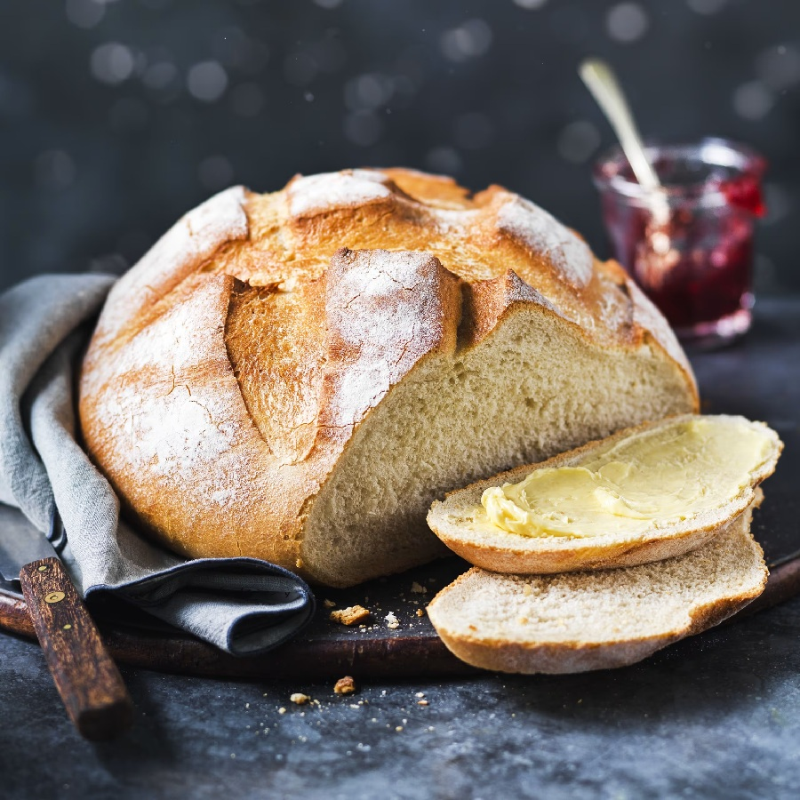
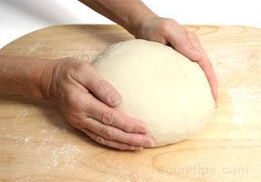

# Cob or Boule

*The cob is the round dome you picture when you think "loaf of bread." Master this one shape and a surprising amount of the bread repertoire opens up. The Coburg, the cottage, the sourdough boule, even the rustic country round on the cover of every baking book - all of them start with the same hand movement you'll learn here.*

## Overview
The cob is the round domed loaf you picture when you think "loaf of bread." Master this single shape and a surprising amount of the bread repertoire opens up: the Coburg, the cottage, the sourdough boule, and the rustic country round all start with the same hand movement. The skill behind every rounded loaf is the same - building surface tension by pulling the dough tight against itself.

## What you're aiming for
A tight, smooth ball of dough that holds a round dome shape on its own, with the seam tucked underneath and the surface taut enough to take a clean score. Done well, the loaf bakes into a high domed crust with even browning all the way around. Done loosely, it slumps sideways during proving and bakes into something more like a flat cake.

The skill behind every rounded shape is the same: creating surface tension on the top of the dough by pulling it tight against itself.

## The motion

Shaping is a two-step move that takes about twenty seconds once you find the rhythm.

**First, push and flip.** Push the dough gently into a rough rounded form on a lightly floured surface. With both hands, push down softly into the centre of the dough - you're not flattening it, just settling it. Flip the dough over so the smooth side is up and the rough side is down.

**Then cup and rotate.** Cup both hands around the dough and rotate it in small increments, pulling it gently against the work surface as you turn. Each rotation drags the underside of the dough downwards and inwards, stretching the top skin tighter. After eight to ten rotations the dough should look round, taut and shiny on top, with a small puckered seam underneath where everything has been pulled to.

That's it. The dough is shaped.

## How to tell it's right

A well-shaped cob:

- Holds its dome shape on the bench. If it spreads sideways into a puddle the moment you let go, the surface tension isn't there yet.
- Has a smooth, slightly shiny top with no large air pockets or wrinkles.
- Has a tight pucker on the underside where the seam was sealed.

If it slumps, scoop it gently up, place it seam-side down on the work surface again, and repeat the cupped rotation another eight or ten times. The skin tightens with practice - a baker doing this all day shapes a cob in five seconds without thinking; the first ten you do at home will feel awkward, and that's fine.

## Final prove and bake

Place the shaped cob seam-side down on a lined baking sheet or into a floured banneton. Cover with a damp tea towel and prove in a warm spot for 45 to 60 minutes, until it springs back slowly when poked (see [Proving](proving.md)).

Score the top just before baking - a single deep cross is the classic cob mark, but a straight slash across the dome or a curved arc both work just as well (see [Scoring](scoring.md)).

Bake at 220°C for 25 to 30 minutes until deeply golden, then cool on a wire rack for at least an hour before slicing.

## A note on the underside

When the cob goes into the oven, the seam goes on the bottom and the dome you shaped is the visible top. If you flip it the other way, the dough will burst from the seam during the bake - that hidden pucker is the weakest point in the surface tension, and oven heat will find it. Always seam-side down.

## Storage
- Keeps 2 days in a paper bag or bread bin; the crust softens but the dome holds its shape
- Freezes whole or sliced for up to 1 month; thaw at room temperature, or toast slices from frozen
- Re-crisp a whole loaf in a 180°C oven for 5-10 minutes to restore the crust
- Never refrigerate: cold accelerates staling

## Where Next
- [Coburg](coburg.md): same cob shape, finished with a deep cross-cut.
- [Cottage](cottage.md): a small cob stacked on a larger one, joined with a finger-hole.
- [Sourdough Basics](sourdough.md): the boule is the canonical sourdough shape.
- [Scoring](scoring.md): which marks work best on a domed loaf.
- [Shape Gallery](shapes.md): back to the full shape list.
