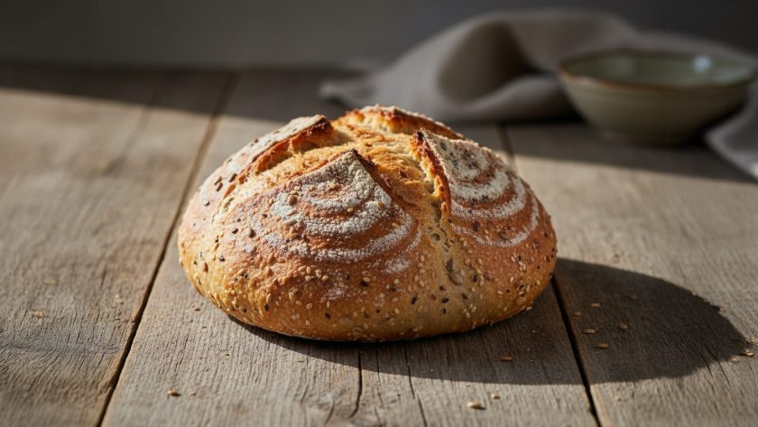
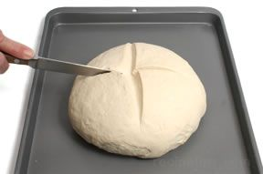

# Coburg

*The Coburg is a cob with a single, decisive piece of cutlery work: a deep cross slashed across the top before the bake. In the oven those four quarters lift apart and you get a striking blistered crown for the price of one extra step. Same dough, same shaping as a [cob](cob.md), genuinely impressive result.*

## What you're aiming for
A tight, smooth, round loaf with a deep cross cut through the dome. The cross opens into four "petals" during the bake, each picking up its own pattern of blistering and char along the cut edges. Inside, the crumb is the same as a cob - close, sliceable, generous. The whole thing reads as a more confident bake than a plain round, and the technique is almost identical.

## The shaping

Use the same [cob](cob.md) shaping you already know: push, flip, then cup-and-rotate eight to ten times to build surface tension on top. The pucker goes underneath, the smooth dome up. Place the shaped cob seam-side down on a lined baking sheet, cover with a damp tea towel, and prove in a warm spot for 45 to 60 minutes until it springs back slowly when poked.

If you can already shape a clean cob, you're 90% of the way to a Coburg.

## The cross-cut

This is where the Coburg becomes a Coburg.

Preheat the oven to 220°C. With the loaf sitting on its sheet, take a very sharp knife or a bread lame and make one decisive cut straight across the top - corner to corner, running through the centre. About 1 cm deep. Then turn the loaf 90 degrees and make a second cut perpendicular to the first. You should have a deep + shape across the dome.

A few things that make a clean cross:

- **Sharp blade, swift motion.** Hesitation drags the dough; a clean slash leaves crisp edges.
- **Cut deep.** A shallow Coburg cross looks unimpressive - the four quarters won't lift apart enough to show off. About 1 cm is right.
- **Through the centre.** The cross should meet at the highest point of the dome. If it's off-centre the quarters bake unevenly.

## The bake

Slide the scored loaf straight into the hot oven on the middle rack. Bake for 25 to 30 minutes until deeply golden. As it rises, the cross opens dramatically and the four quarters lift away from each other - that's the Coburg's signature.

Cool on a wire rack for at least an hour before slicing. The cross-cut top makes for natural tearing into quarters at the table.

## Where Next
- [Cob or Boule](cob.md): the foundational round, before you add the cross.
- [Cottage](cottage.md): same round-loaf family, stacked into two tiers.
- [Scoring](scoring.md): why a deep cross gives the four-quarter lift, and how other scoring patterns behave.
- [Shape Gallery](shapes.md): back to the full shape list.
