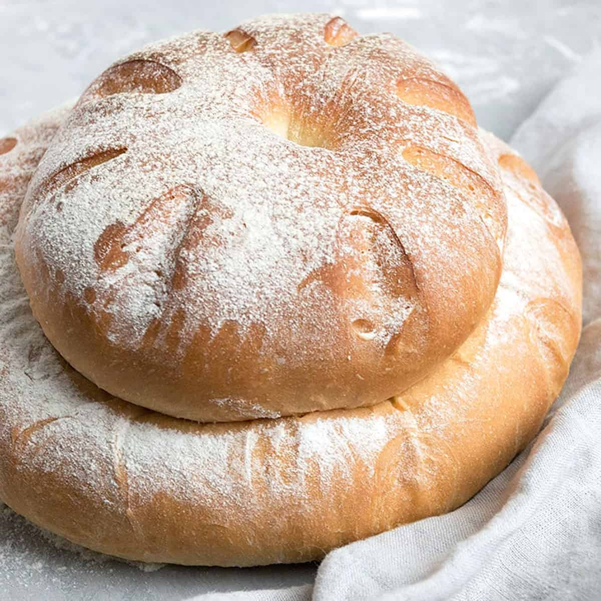
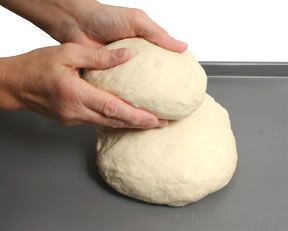
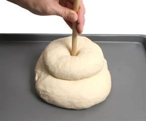
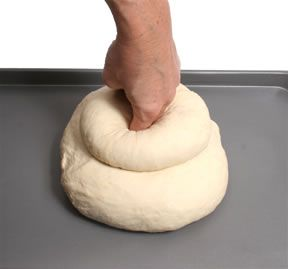

# Cottage

*The cottage loaf is two rounds stacked, joined by a finger-hole pushed straight down through both. It looks like nothing else and originated for a practical reason, small wood-fired ovens couldn't fit a single big loaf, so bakers stacked a smaller one on top of a larger one to make the most of the heat. The shape stuck. It's a charming, instantly-recognisable English loaf and surprisingly easy to make.*

## Overview
The cottage loaf is two rounds stacked, joined by a finger-hole pushed cleanly down through both. The shape originated for a practical reason: small wood-fired ovens couldn't fit a single large loaf, so bakers stacked a smaller round on top of a larger one to make the most of the heat. It bakes into a uniquely recognisable English shape with the upper round picking up a crustier finish than the lower.

## What you're aiming for
A large round of dough on the bottom, a smaller round of dough on top, joined by a hole pushed cleanly through the centre of both. The two rounds bake into one fused loaf with the smaller one sitting like a beret on the larger one. The upper portion gets a crustier finish than the lower because more of its surface is exposed to the oven heat, a feature, not a flaw.

## Dividing the dough

After bulk fermentation, weigh your dough and divide it into two unequal pieces in roughly a 2:1 ratio. For 600 g of dough, that's 400 g for the base and 200 g for the top. Don't worry if you're a bit off, eyeball it generously, the ratio just needs to look right.

Shape each piece into a round using the cup-and-rotate technique from the [cob](cob.md) page: push, flip, then rotate between your cupped hands while pulling the dough tight against the work surface. Two clean rounds, taut on top, pucker underneath.

## Stacking and joining

Place the larger round on a lightly greased baking sheet. Lift the smaller round and place it gently in the centre on top of the larger one.

This is the moment where the cottage becomes a cottage.

Take two fingers (index and middle) or the floured handle of a wooden spoon, and push straight down through the centre of the top round, continuing all the way through into the bottom round. Push firmly and confidently, you want to feel your fingers reach the baking sheet, or near to it. The dough from the top round gets pressed down into the bottom round, and this is what welds the two pieces together during the bake. A timid finger-hole pulls apart in the oven; a confident one fuses cleanly.

Withdraw your fingers slowly and the dough closes slightly around the hole. That's fine, the visual finger-mark is a feature.

## Prove and bake

Cover loosely with a damp tea towel and prove in a warm spot for 45 to 60 minutes, until the dough springs back slowly when poked (see [Proving](proving.md)).

Bake at 220°C for 30 to 35 minutes until both rounds are deeply golden, the smaller upper round will brown faster, which is correct. The two pieces should look fused into a single sculptural loaf.

Cool on a wire rack for at least an hour. To slice, halve the whole loaf vertically through the middle; you'll see the cross-section of the join.

## Storage
- Keeps 2 days in a paper bag or bread bin; the upper round goes a touch drier than the base
- Freezes whole or sliced for up to 1 month; thaw at room temperature, or toast slices from frozen
- Re-crisp a whole loaf in a 180°C oven for 5-10 minutes to restore the crust
- Never refrigerate: cold accelerates staling

## Where Next
- [Cob or Boule](cob.md): the foundational round you stack two of for a cottage.
- [Coburg](coburg.md): a single round, finished with a deep cross-cut.
- [Shape Gallery](shapes.md): back to the full shape list.
