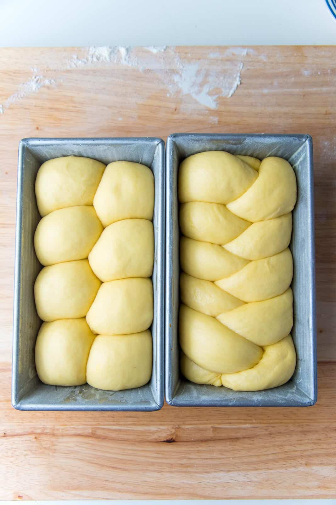

# Enriched Doughs

*Butter, eggs, sugar, sometimes milk: enrich a plain bread dough with these and it becomes brioche, challah, hot cross buns, panettone. The dough is a bit fussier, the rise a bit slower, but the reward is a soft tender crumb that lasts for days. We'll cover what each addition does and how to keep it all behaving.*

## Overview
A lean dough is just flour, water, salt and yeast. An enriched dough adds some combination of butter, eggs, milk, sugar and sometimes extras like dried fruit, citrus zest or chocolate. The result is a softer, richer, sweeter bread (brioche, challah, hot cross buns, panettone). The trade is a slower rise (sugar and fat both inhibit yeast) and a more demanding bake (sugar burns).

The classic enriched doughs:

- [Brioche Dough](../../baking/pastry/brioche-dough.md): the French standard, equal weight butter to flour, almost pastry.
- [Challah](../../cuisine/israel/side-dishes/challah.md): the Jewish Sabbath bread, eggs but no butter, braided.
- [Hot Cross Buns](../../cuisine/british/desserts/hot-cross-buns.md): spiced, fruited, fragrant.
- [Pistachio Babka Buns](../../cuisine/israel/desserts/pistachio-babka-buns.md): a filled, twisted, sweet enriched dough.

## What Each Enrichment Does

### Butter

The classic fat. Adds richness, browns the crust, tenderises the crumb. Coats the gluten strands, which means less elastic dough and a softer texture.

Effect on the rise: slows yeast somewhat (yeast prefers low-fat environments). The more butter, the slower the rise. A 50% butter brioche takes 4-5 hours to bulk-ferment where a lean dough takes 90 minutes.

When to add: most enriched recipes add butter AFTER the initial gluten is developed. The order is: mix flour, water, eggs, sugar, yeast. Knead 5 minutes until gluten starts forming. Then add butter in small pieces, knead another 10-15 minutes until fully incorporated. Adding all the butter at the start coats the flour proteins and prevents gluten from developing.

### Eggs

Add fat, richness, colour (yolks) and structure (whites). The yolk fat tenderises like butter; the white protein adds extra gluten-like support and gives the crumb a slight sponginess.

Egg-rich doughs (challah, brioche) bake to a deep golden colour and stay tender for days because the egg fat retards staling.

Effect on the rise: minimal direct effect, but the added solids slow the dough by about 15-20%.

### Sugar

Tenderises (sugar molecules interfere with gluten cross-linking), browns (Maillard and caramelisation reactions), sweetens, feeds the yeast.

Effect on the rise: small amounts (5% of flour weight) actually speed the rise by feeding the yeast. Large amounts (15%+ of flour weight) slow it dramatically: the high osmotic pressure dehydrates the yeast cells.

The trade: more sugar makes the bread taste sweeter and brown more, but the rise takes longer and you need more yeast. Hot cross buns at 12% sugar use double the yeast of a lean dough.

### Milk

Replaces some or all of the water. Adds fat (full-fat milk only), lactose (a slow-fermenting sugar), and proteins that soften the crumb.

A milk dough has a tighter, more cake-like crumb than a water dough and stays soft longer. Hokkaido milk bread and Japanese white milk bread are the traditional examples.

### Other Enrichments

- **Honey:** browns more aggressively than sugar, adds floral note, hygroscopic (keeps bread moist).
- **Dried fruit:** soaked first (otherwise pulls moisture from the dough), folded in at the end of bulk fermentation.
- **Citrus zest:** added with the flour at the mix stage; oils mingle through the dough.
- **Cinnamon, cardamom, saffron:** classic spice enrichments. Powdered spices go in with the flour; whole spices go in steeped milk or syrup.

## Handling the Slower Rise

Enriched doughs need more yeast and more time than lean doughs. Two adjustments:

1. **Double the yeast.** A lean dough uses 1% of flour weight in instant yeast (5 g per 500 g flour). Brioche uses 2-3% (10-15 g per 500 g).

2. **Bulk-ferment longer.** Plan for 2-3 hours at room temperature for a typical enriched dough, sometimes 4-5 for the richest. Cold-proving overnight is helpful for both flavour development and timing flexibility.

The finger-poke test still works. The dough should spring back slowly when ready, just like a lean dough. See [Proving](proving.md).

## Mixing Enriched Doughs

The order matters more than for lean doughs.

**Standard enriched method:**
1. Warm the milk (if using) gently. Whisk in the yeast and a pinch of the sugar. Wait 5 minutes for the yeast to activate (small bubbles on top).
2. In a large bowl: flour, remaining sugar, salt, eggs.
3. Pour in the milk-yeast mixture. Mix with a wooden spoon until a rough dough comes together.
4. Knead 5 minutes on the bench, or 3 minutes in a stand mixer with a dough hook. The gluten is starting to develop.
5. Add the butter in small pieces, kneading or mixing until each piece is fully incorporated before adding the next.
6. Continue kneading until the dough passes the window-pane test (see [Gluten](gluten.md)). For brioche-level enrichment, this takes 15-20 minutes by hand.
7. The finished dough is soft, slightly tacky, and very smooth. It will slap audibly on the bench as you work it. This is correct.

If the dough is breaking apart and butter is leaking out, the room is too warm or the kneading is too aggressive. Move to a cool spot, work more gently, and finish in the fridge if needed.

## Baking Enriched Doughs

Bake at a moderate oven temperature, lower than for lean doughs.

- Lean dough: 220-240°C
- Light enrichment (challah, dinner rolls): 180-200°C
- Heavy enrichment (brioche): 170-180°C

The reason: sugar burns. At lean-bread temperatures, the surface of a brioche turns black before the interior cooks. Lower heat lets the inside come up while the outside browns gently.

Egg wash before baking gives the classic deep-bronze sheen. Whisk 1 egg yolk with 1 tablespoon of milk or cream, brush lightly. Apply just before baking.

Internal temperature at the end should be at least 88°C for an enriched dough (lower than 95°C for lean because the egg and fat slow the moisture loss).

## Where the Line Sits

Enriched dough becomes "cake" somewhere between 25% and 50% butter (relative to flour weight).

| Recipe          | Butter % | Eggs | Sugar % | Yeast % | Category |
|-----------------|----------|------|---------|---------|----------|
| Lean white bread | 0       | 0    | 0-2     | 1.0     | Bread    |
| Dinner rolls    | 5-10     | 1    | 5-8     | 1.5     | Bread    |
| Challah         | 0        | 4    | 7-10    | 2.0     | Bread (egg-rich) |
| Hot cross buns  | 10       | 1    | 12      | 2.5     | Sweet bread |
| Classic brioche | 30-50    | 4    | 8-12    | 2.5     | Brioche  |
| Brioche de Nanterre | 50+ | 6    | 10      | 3.0     | Almost cake |
| Stollen / Panettone | 25-35 | 3 | 15-20   | 3.0     | Sweet bread |

Brioche at 50% butter is the upper edge of what is recognisably bread. Past that, the dough is more pastry than loaf.

## Common Mistakes

**The dough is greasy and breaking up.**
Butter was added too quickly, or the room is too warm. Chill the dough 30 minutes, then resume gentle kneading.

**The crust burned but the inside is raw.**
Oven temperature too high. Drop to 170°C and bake longer.

**The crumb is dense and tight.**
Under-fermented. Enriched doughs are slow; double the bulk-ferment time and check the finger-poke test before shaping.

**The bread tastes flat for the richness.**
Under-salted. Enriched doughs need a slightly higher salt percentage (2.5% of flour) to balance the sugar and richness.

**The dough is impossible to shape because it is too soft.**
Cold-prove it overnight first. Cold enriched dough handles much better than warm.

## Where Next
- [Hydration](hydration.md): enriched doughs run lower hydration because eggs and butter add liquid fat.
- [Gluten](gluten.md): the window-pane test is even more important here.
- [Proving](proving.md): doubling the yeast and lengthening the prove is the standard adjustment.
- [Scoring](scoring.md): some enriched loaves are scored (brioche) and some are braided (challah) instead.
- [Brioche Dough](../../baking/pastry/brioche-dough.md): the traditional heavy-enrichment recipe.
- [Pistachio Babka Buns](../../cuisine/israel/desserts/pistachio-babka-buns.md): a filled, twisted enriched dough.

## Storage
- Crusty breads (baguette, fougasse, sourdough) are best eaten the day they're baked
- Tin loaves and enriched doughs keep 2-3 days in a bread bin or paper bag
- All bread freezes well within hours of cooling; thaw at room temperature and re-crisp in a 180°C oven
- Never refrigerate baked bread: cold accelerates staling
