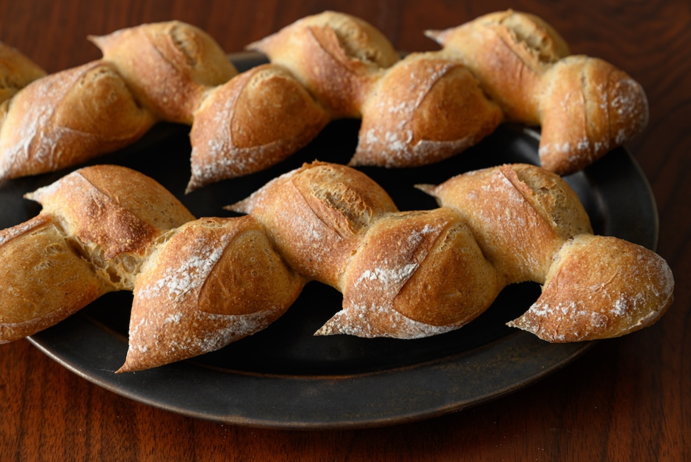
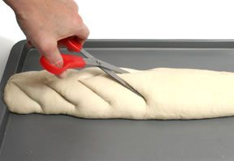

# Épi

*Épi means "ear" in French, as in ear of wheat - and that's exactly what this bread looks like. It's a baguette that's been snipped with scissors before baking so the dough folds out into a fan of pull-apart segments. Quite possibly the easiest visual showstopper in the bread course: if you can shape a baguette, you can épi.*

## What you're aiming for
A baguette-length loaf with seven or eight scissor-cut segments lifting alternately to one side and the other along its length. Once baked, each segment becomes its own little pull-apart roll - you can tear them off at the table without a knife. The crust-to-crumb ratio is enormous because every cut exposes more surface to the oven, giving the épi an exceptional crust character.

This is built on top of the [baguette](baguette.md) shape, so master the baguette first.

## Start with a baguette

Shape a baguette using the technique on the [baguette](baguette.md) page: envelope-fold, seal the seam, roll out to length. Lay it on a parchment-lined baking sheet seam-side down.

The only departure from a normal baguette: **don't score the top** the way you would a regular baguette. The scissor cuts replace the score entirely.

## The scissor cuts

Take a pair of clean, sharp kitchen scissors. Hold them at a shallow angle - roughly 30 degrees from horizontal, almost flat to the loaf - and snip down into the dough.

Each cut should go about three-quarters of the way through the dough from top to bottom (deep, but not all the way through). Space the cuts every 6 to 7 cm along the length of the baguette. You'll end up with seven or eight segments depending on the length of your loaf.

The cuts open up immediately into hinged flaps of dough.

After each cut, gently push that flap to the side - first one to the left, the next to the right, the next to the left again, and so on. Alternate consistently. This is what gives the finished bread its wheat-ear silhouette: the segments fan out symmetrically in a zigzag down the loaf.

## Prove and bake

Cover loosely with a damp tea towel and prove for 30 to 45 minutes - épi typically wants a slightly shorter final prove than a plain baguette because the cuts are already exposing the dough to air. A finger poke should spring back slowly (see [Proving](proving.md)).

Bake at 220 to 240°C for 15 to 20 minutes until deeply golden. Add steam at the start (a tray of boiling water on the bottom rack, or a few spritzes onto the oven walls before the door shuts) - same as a baguette.

The segments will puff dramatically during the bake into individual rolls joined at the spine. The flaps you pushed to one side will lift further as the dough rises.

Cool on a wire rack. Tear off segments by hand at the table; the loaf is built for it.

## Where Next
- [Baguette](baguette.md): the foundational long-and-thin shape épi is built on.
- [Fougasse](fougasse.md): the other Provençal slashed shape, but flat and broad rather than long and thin.
- [Scoring](scoring.md): the broader theory of how cuts shape the bake - épi's scissor work is a specialised version of the same idea.
- [Shape Gallery](shapes.md): back to the full shape list.
