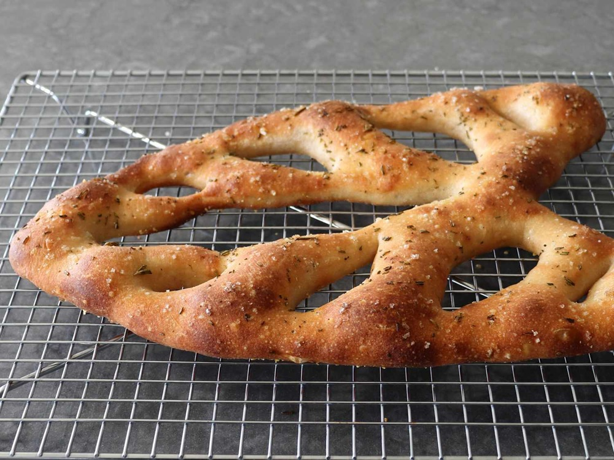
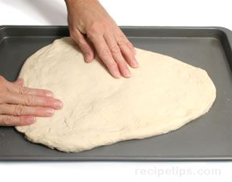
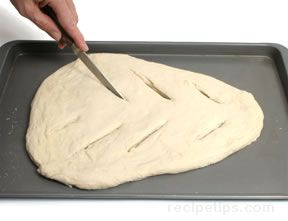
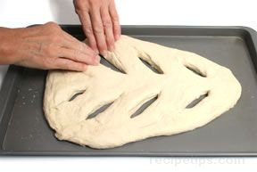

# Fougasse

*Fougasse is Provence's slashed flatbread: dough stretched out into a leaf or ladder shape with deep cuts pulled open into elongated holes. The holes do something clever - they expose so much surface area to the oven heat that the whole loaf becomes mostly crust. Tear-and-dip is the only way to eat it.*

## What you're aiming for
A flattish piece of dough, roughly the shape of an elongated leaf or a flat triangle with rounded corners, with several long diagonal slits cut down each side and pulled open into oval gaps. After baking, those gaps stay open and the whole loaf reads as a stylised leaf or ladder. The crust is everywhere; the crumb is sparse. Brilliant for olive oil, brilliant for sopping up the juice of a stew.

The technique you'll learn here is **shaping by stretching**, not rolling. A fougasse wants to be loose and uneven, not tight and uniform.

## Flatten and shape

Bulk-ferment your dough as usual. Tip it onto a lightly floured surface and don't worry about precise shapes - fougasse is meant to look hand-made.

**Flatten to about 2 cm.** Using your palms or the back of your hand, push the dough out flat. You're aiming for a slab roughly 2 cm thick. The exact dimensions don't matter much; an elongated oval or a rough triangle both work.

Lift the dough onto a lightly greased or parchment-lined baking sheet. Once it's there, push and stretch it gently into a long triangle with rounded corners - the classic Provençal "leaf" shape. The point at one end, the broader curve at the other.

## The slits

This is the move that defines a fougasse.

Using a sharp knife or a pizza wheel, cut diagonal slits straight through the dough on both sides:

- Each slit runs at a roughly 45-degree angle from the central spine of the leaf outward toward the edge.
- The slits should stop about 1 cm short of the perimeter and about 1 cm short of the central spine, so the bread holds together as one piece.
- Three to four slits per side, alternating, like the veins of a leaf.

The slits will look like cuts at this stage, not holes.

**Open them up.** This is the crucial bit: use your fingers to gently pull each slit apart until it becomes an elongated oval gap. The dough wants to close back on itself; you're stretching it open and persuading it to stay that way. Don't be timid - if you don't open the slits widely enough now, they'll close completely during the bake and the loaf will look like an under-decorated flatbread instead of a fougasse.

Keep pushing and smoothing the dough between the slits as you go so the overall shape stays neat. The whole thing should sit roughly leaf-shaped with clearly defined open holes.

## Prove and bake

Cover loosely with a damp tea towel and prove for 30 to 45 minutes - a fougasse wants a slightly shorter prove than a typical loaf because all that exposed surface dries out quickly. The cuts should remain open through the prove.

Just before baking, brush the top with olive oil and scatter a generous pinch of flaky sea salt over the whole loaf. Rosemary needles, finely chopped, are the classic addition.

Bake at 220°C for 15 to 20 minutes until deeply golden and crisp at every edge. Fougasse is mostly crust, so it cooks fast. Cool just briefly on a wire rack - fougasse is best torn apart and eaten warm.

## Where Next
- [Hydration](hydration.md): fougasse works well at higher hydration (70%+) - the open crumb the wet dough produces suits the stretched-flat technique.
- [Épi](epi.md): the other Provençal slashed shape, but long and thin instead of broad and leaf-like.
- [Shape Gallery](shapes.md): back to the full shape list.
