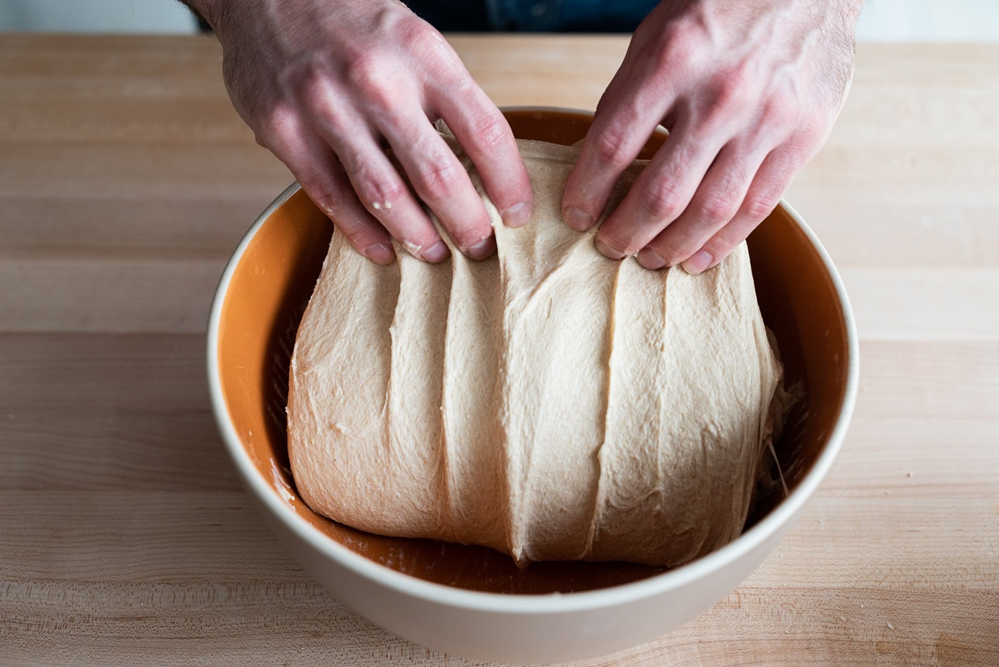

# Gluten

*Gluten gets blamed for a lot, but in bread it's the thing holding everything together. This page is about what it actually is, what kneading is really doing in there, and the easy little test that tells you when to stop.*

## Overview
Gluten is the protein scaffold that holds a loaf of bread together. Without it, dough is just wet flour. Develop it well and the dough becomes elastic, stretchy and strong enough to trap the gas the yeast produces. Develop it poorly and the gas escapes, the rise collapses and you end up with a flat, dense loaf.

The whole point of kneading is to develop gluten. Once you understand what is happening at the protein level, the question of how long to knead answers itself: long enough to pass the window-pane test, and not a minute longer.

## What Gluten Actually Is

Wheat flour contains two storage proteins: glutenin and gliadin. On their own, they do not do much. Add water, and they hydrate. Apply mechanical action (kneading, stretch-and-fold, stand-mixer hook), and they cross-link with each other to form long elastic strands called gluten.

Two properties matter:
- **Glutenin** brings elasticity. The dough wants to return to its original shape after being stretched. This is what gives bread its chew.
- **Gliadin** brings extensibility. The dough wants to stretch without tearing. This is what lets bubbles inflate without bursting.

A well-developed dough has both in balance. Too much glutenin (under-kneaded, or low-protein flour) gives a stringy, tight crumb. Too much gliadin (over-kneaded, or very wet) gives a slack, runny dough that will not hold its shape.

The protein content of the flour caps how much gluten you can develop. Bread flour at 12-14% protein has more raw material than plain flour at 9-10%, which is why bread flour produces a chewier, more open loaf.

## What Kneading Does

When you knead, you are doing three things at once:

1. **Aligning the proteins.** Random strands get pulled into parallel sheets that can slide past each other under tension.
2. **Hydrating the flour.** Water continues to soak into the flour particles as the dough is worked, well past the initial mix.
3. **Incorporating air.** Tiny pockets of air get folded into the dough. Yeast uses these as seed sites for the larger bubbles that develop during proving.

A stand mixer with a dough hook does all of this faster than hands. Hands give better feedback (you can tell when the dough has changed) but take longer.

## The Window-Pane Test

The cleanest way to tell if gluten is developed enough.

1. Pull off a piece of dough about the size of a walnut.
2. Roll it gently between your palms into a ball.
3. Holding it between your thumbs and forefingers, stretch it slowly outward into a thin sheet.
4. Hold the sheet up to a light.

**Pass:** The dough stretches into a translucent membrane without tearing. You can see light through it, and the colour goes slightly grey-yellow. This is the window-pane.

**Fail (under-developed):** The dough tears almost immediately, before it gets thin enough to see through. Knead another 2-3 minutes and try again.

**Fail (over-developed):** The dough is so loose it falls apart in your fingers. This is rare with hand-kneading, easy in a stand mixer. There is no fix; over-developed dough makes a slack, pancake-like loaf.

For most home doughs, the window-pane appears at 10-15 minutes of hand-kneading, or 6-8 minutes in a stand mixer at low-medium speed.

## How Long to Knead

Numbers are a starting point. The window-pane test is the truth.

| Method               | Time             | Notes                                |
|----------------------|------------------|--------------------------------------|
| Hand-knead, 60-65% hydration | 10-15 min  | The standard everyday lean dough     |
| Hand-knead, 70%+     | 8-10 min (with rests) | Wetter doughs develop faster |
| Stand mixer, hook, low | 4-6 min        | Watch the dough climb the hook       |
| Stand mixer, hook, medium | 6-8 min     | Faster but harder to catch the moment|
| Stretch and fold (no knead) | 4 sessions over 2 hours | The wet-dough alternative |
| No-knead (overnight) | 0 active        | Time replaces mechanical work        |

The no-knead approach works because gluten will develop on its own given enough hours. A 12-18 hour bulk ferment at room temperature produces a window-pane-passable dough with no kneading at all. The cost is the wait.

## Kneading Without Adding Flour

The biggest cause of poor gluten development is adding flour to the bench during kneading. Each tablespoon of bench flour reduces hydration, increases tightness and limits how far the gluten can develop. The dough ends up at maybe 60% hydration instead of the 70% the recipe specified.

The fix:
- Dust the bench LIGHTLY at the start (a fingertip-thin coating).
- If the dough sticks, oil your hands rather than adding more flour to the bench.
- For wet doughs (70%+), switch to stretch-and-fold in the bowl instead of bench-kneading. See [Hydration](hydration.md).

## What Kneading Looks Like at the End

A well-kneaded dough has obvious tells:

- **Surface gloss.** A satin sheen rather than a matte surface.
- **Springs back when poked.** A gentle press leaves an impression that lifts back out in a few seconds. A flat impression that stays put means the dough is under-developed.
- **Holds its shape.** Lifted off the bench, it stays in a rough ball rather than slumping into a puddle.
- **Comes off the bench cleanly.** Stuck dough is usually under-developed (or far over-hydrated for the kneading method).

If the dough still feels rough, lumpy or has visible streaks of dry flour after 15 minutes, it needed more water at the start, not more kneading. Stop, rest the dough 20 minutes (autolyse), then knead another 5 minutes.

## Troubleshooting

**The dough tears when I window-pane test.**
Under-kneaded. Continue kneading. Each minute makes a visible difference.

**The dough is too slack to hold a ball after 10 minutes of kneading.**
Either over-hydrated (try less water next time, or use stretch-and-fold instead of kneading) or over-kneaded (rare with hands, common with mixers).

**The dough feels tight and refuses to stretch even after 20 minutes.**
Under-hydrated. Add 1-2 tablespoons of water and knead another 5 minutes. Or rest the dough covered for 30 minutes and try again; sometimes the flour just needs time to absorb.

**The finished loaf has a tight crumb with no open holes.**
Under-kneaded, under-fermented, or low-protein flour. Try a higher-protein flour (bread flour rather than plain) and confirm you are passing the window-pane test before shaping.

**The finished loaf has a slack, pancake-like crumb.**
Over-developed or over-fermented. Reduce knead time by 5 minutes, or watch the rise more carefully.

**The dough is rough and lumpy after kneading.**
Insufficient hydration, or skipped autolyse. Autolyse (rest covered for 30 minutes after the initial mix) before kneading next time.

## Where Next
- [Hydration](hydration.md): the input that determines how much you can develop.
- [Proving](proving.md): what happens after the gluten is developed.
- [Sourdough Basics](sourdough.md): how gluten develops differently with a long, cold ferment.
- [White Bread](../../bread-pasta/white-bread.md): a 65% hydration master recipe to practise window-pane on.

## Storage
- Crusty breads (baguette, fougasse, sourdough) are best eaten the day they're baked
- Tin loaves and enriched doughs keep 2-3 days in a bread bin or paper bag
- All bread freezes well within hours of cooling; thaw at room temperature and re-crisp in a 180°C oven
- Never refrigerate baked bread: cold accelerates staling
