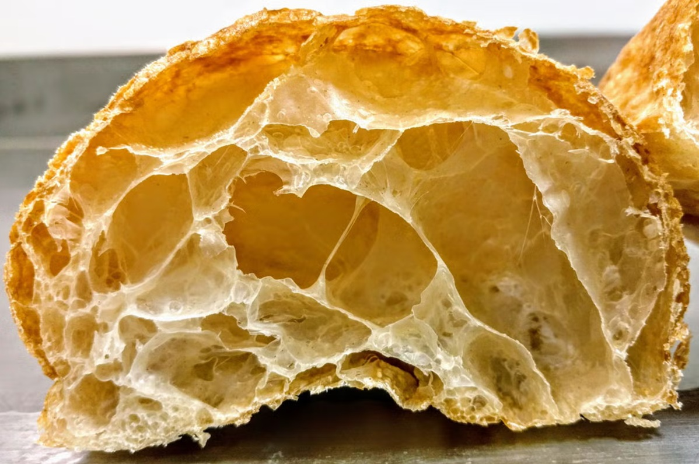

# Hydration

*The single biggest variable in bread-making. Higher hydration means a more open crumb, a chewier crust, a more difficult dough to handle. This page explains the trade-offs and how to handle a sticky dough without adding flour.*

## Overview
Hydration is the weight of water in a dough expressed as a percentage of the weight of flour. A dough made with 350 g flour and 245 g water is 70% hydration. A baguette dough at 75% is wetter and harder to handle than a sandwich loaf at 60%. The hydration you choose shapes the finished crumb: low hydration gives a tight, sliceable, sandwich-style crumb; high hydration gives the airy, irregular holes of a ciabatta or sourdough.

The most common home-baker mistake is starting with a target hydration that produces a sticky dough, panicking, and adding flour to the work surface until the dough is comfortable to handle. The dough ends up at 60% instead of the 72% the recipe specified, and the finished loaf is dense and tight rather than open and airy. Once you understand that wet doughs are supposed to feel wet, the rest of bread-making gets easier.

## Common Hydration Ranges

| Bread Type           | Hydration  | Feel of the Dough                          |
|----------------------|------------|--------------------------------------------|
| Bagel                | 50-57%     | Stiff, almost like pasta dough             |
| Sandwich tin loaf    | 60-65%     | Smooth, supple, holds shape easily         |
| Standard white       | 65-70%     | Slightly tacky, comes off the hand cleanly |
| Sourdough boule      | 72-78%     | Sticky, requires confidence to handle      |
| Baguette / ciabatta  | 75-82%     | Very wet, almost batter-like at the start  |
| Focaccia             | 80-90%     | Pourable. Shaped by stretching in the tin  |

The percentages overlap. A skilled baker can take a 75% dough through the same workflow as a 65% dough, but the bake will be different. The water is what creates steam during the bake; the steam is what blows open the crumb.

## Why Wet Doughs Are Better

Three reasons a higher hydration improves the loaf:

1. **More steam in the oven.** Water trapped in the dough turns to steam in the first ten minutes of the bake. Steam pushes the loaf up before the crust sets, creating the high oven spring and open crumb that define a good loaf.
2. **Better gluten development.** Gluten needs water to form. A drier dough has less gluten to work with, no matter how long you knead it.
3. **Longer shelf life.** A wetter dough holds more water in the finished crumb, so the bread stays fresh longer before staling.

The cost is that wet doughs are harder to shape. The technique is to work with them, not against them.

## Handling a Sticky Dough Without Adding Flour

When a recipe calls for 350 g flour and 245 g water, that is the dough. Adding flour to the bench or to your hands changes the recipe and ruins the finished bread. The right approach:

### Use Oil, Not Flour
If your hands stick to the dough, rub a thin film of olive oil on your palms before kneading. Oil prevents sticking without changing the hydration. Most professional bakers oil the bowl before bulk fermentation for the same reason.

### Let the Dough Rest
A freshly mixed dough is always stickier than the same dough thirty minutes later. The flour has not yet absorbed its water. If you give the rough-mixed dough a 30-minute autolyse (rest, no kneading, covered), the flour fully hydrates and the dough becomes much more manageable. This is the single biggest trick in working with wet doughs.

### Use the Stretch-and-Fold Method
Instead of kneading a wet dough on a floured bench (where you cannot help adding flour), leave it in the bowl. Every 30 minutes for the first two hours, wet your hand, reach under one side, lift and fold over the top. Rotate the bowl a quarter turn and repeat. Four folds per session. Three or four sessions over the bulk ferment.

Stretch and fold develops gluten with a fraction of the effort of kneading, and it does not require any extra flour. This is the technique used for nearly all sourdoughs, ciabattas and high-hydration loaves.

### Wet Your Tools
A wet bench scraper, a wet spatula and wet hands handle wet dough cleanly. Keep a small bowl of water nearby and dip in between movements.

## Calculating Hydration

If a recipe specifies hydration but not weights, work backwards. For a 70% dough using 500 g flour:

- Flour: 500 g
- Water: 500 × 0.70 = 350 g
- Salt: 500 × 0.02 = 10 g (the standard 2%)
- Yeast: depends on schedule (0.5% to 1.5%)

If a recipe specifies weights but not hydration, calculate it:

- 500 g flour, 375 g water = 375 / 500 = 75% hydration

Bakers express almost everything as a percentage of the flour weight. This is called baker's percentage, and it makes scaling and substituting trivial. Doubling the recipe is doubling every gram. Halving it is the same.

## Adjusting for Flour Type

Not all flours absorb the same amount of water. Strong bread flour (12-14% protein) absorbs more than plain flour (9-10%). Wholemeal absorbs more than white. Rye absorbs the most.

If you swap flours, you may need to adjust the water:

- **White to wholemeal**: add 5-10% more water for the same handling feel.
- **Plain to strong bread**: add 2-3% more water.
- **Any flour to rye**: add 8-12% more water (rye soaks up an enormous amount).

Adjust by 5% at a time and watch the dough. You are aiming for the handling feel the recipe describes, not a fixed weight on the scale.

## Troubleshooting

**The dough is too wet to handle.** Give it a 30-minute autolyse. If still too wet, do a stretch-and-fold in the bowl. Almost no recipe needs the dough to leave the bowl in the first hour.

**The dough is too dry and tearing during knead.** It needs more water. Wet your hands and work the moisture in. A dough that tears rather than stretches has not developed proper gluten and probably never will at this hydration.

**The dough was fine but is now sticky an hour later.** That is normal during bulk fermentation. The yeast is producing CO2 and slightly breaking down the gluten structure. Continue with stretch-and-fold; the dough firms up by the end of the ferment.

**The finished loaf has a tight, dense crumb.** Most likely the dough was under-hydrated, under-fermented, or both. Try the same recipe with 5% more water next time.

## Where Next
- [Gluten](gluten.md) *(coming soon)*: what kneading actually does to a dough.
- [Proving](proving.md) *(coming soon)*: bulk fermentation, the finger-poke test, knocking back.
- [White Bread](../../bread-pasta/white-bread.md): a 65% hydration master recipe to practise on.
- [Pizza Dough](../../bread-pasta/pizza-dough.md): a higher-hydration dough where the lessons here matter most.
