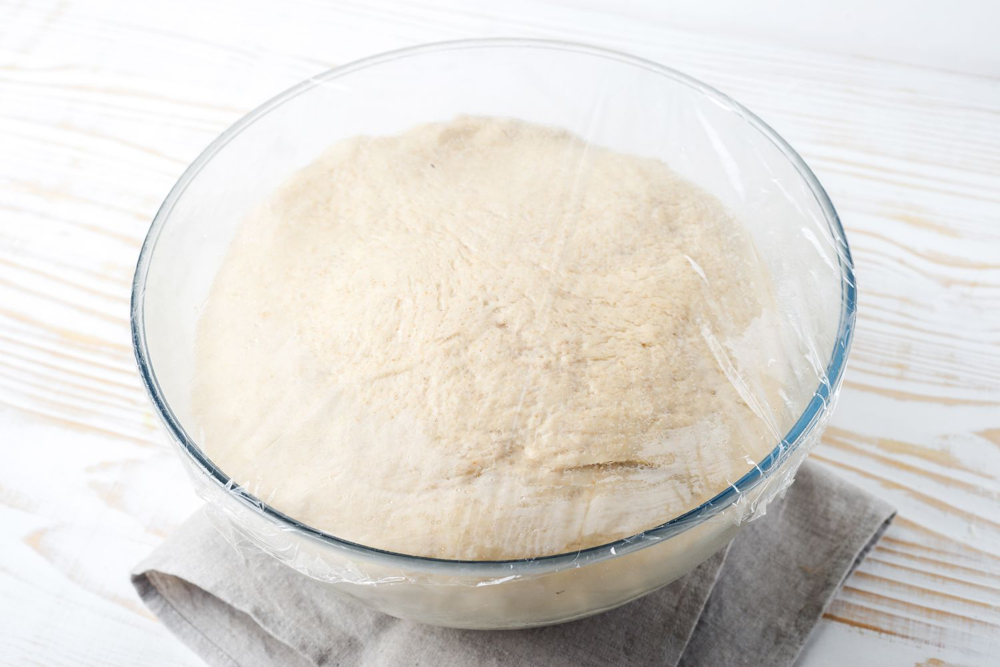

# Proving

*The slow rise that transforms kneaded dough into bread-ready dough. Bulk fermentation, the finger-poke test, knocking back and the final prove. Get the timing right and the loaf opens up in the oven; get it wrong and it falls flat or splits across the side.*

## Overview
After kneading, the dough has the gluten scaffold. It does not yet have flavour, structure or the gas pockets that make bread bread. Proving (also called fermentation) is what builds those. Yeast eats the sugars in the flour, releases carbon dioxide as a by-product, and the gluten scaffold traps the gas as expanding bubbles. The flour also breaks down enzymatically over time, developing the deeper flavours.

Two proves matter:
- **Bulk fermentation** (first prove): the dough as a whole, after kneading.
- **Final prove** (second prove): the shaped loaf, right before baking.

Each has its own purpose and its own tells.

## Bulk Fermentation

What happens:
1. Yeast starts feeding on flour sugars, releasing CO2.
2. The dough doubles in volume as gas accumulates.
3. The gluten relaxes, becoming easier to shape.
4. Flavour compounds (lactic acid, acetic acid, ester aromatics) develop. The longer the prove, the deeper the flavour.

How long: 60-90 minutes at room temperature (about 20-22°C) for a standard yeasted dough. Longer if your kitchen is cool, shorter if it is warm. Sourdoughs and naturally-leavened doughs take 4-8 hours.

How to tell when it is done: the dough has roughly doubled in size, feels light and airy, and (the most reliable test) springs back slowly when poked. Use the finger-poke test.

### The Finger-Poke Test

1. Flour the tip of your index finger lightly.
2. Press the finger about 1 cm into the surface of the dough.
3. Lift it out and watch what happens.

**Ready:** The indentation springs back slowly, taking 1-2 seconds to fill in, but does not fully disappear. There is a slight visible dimple left when you walk away.

**Under-proved:** The indentation springs back fast and disappears completely. The dough is still tight and has not finished fermenting. Give it another 20-30 minutes.

**Over-proved:** The indentation stays put, deflates the surrounding dough, or causes the dough to collapse. The gluten has weakened past the point of recovery. The loaf will likely be flat. You can knock it back and let it ferment a third time, but the structure is compromised.

## Knocking Back

After bulk fermentation, you have a dough full of large irregular gas bubbles. If you bake it now, the bubbles cause an uneven crumb and the loaf will collapse in the oven.

Knocking back is a controlled deflation. The goal is to release the largest bubbles and redistribute the yeast, without flattening the dough into a pancake.

How:
1. Turn the dough out onto a lightly floured surface.
2. Press down gently with the heel of your hand, pushing the gas out.
3. Fold the dough back onto itself (one side over to the centre, then the other side over).
4. Turn over, dust off any excess flour.
5. The dough is now ready to shape.

Some traditions skip the knock-back entirely (rustic country breads, focaccia) because the large bubbles are wanted in the final crumb. Most everyday loaves benefit from a gentle knock-back.

## Shaping

Between bulk and final prove. The dough is divided (if making more than one loaf), each portion is shaped, and the shapes go onto the baking surface (banneton, baking sheet, loaf tin) for the final prove.

Shaping technique matters because it sets the surface tension. A well-shaped loaf has a tight outer skin that holds the dough together as it rises. A poorly-shaped loaf bursts unevenly in the oven.

See the [shape gallery](shapes.md) for ten classic loaf shapes and the technique for each.

## Final Prove

The shaped loaf rises a second time before baking. Shorter than the bulk ferment (typically 30-60 minutes) because the dough is closer to fully fermented and the yeast has less time before the bake.

What happens:
- The dough relaxes from the shaping (which always tightens it).
- The yeast produces more CO2, lifting the dough slightly.
- The skin develops further, holding the shape during the bake.

How to tell when it is done: the loaf has visibly puffed (perhaps 50% bigger, not necessarily doubled), springs back slowly when poked, and looks ready to go in the oven.

### The Final-Prove Finger-Poke

Same test as bulk, with slightly different interpretation:

- **Springs back fast:** under-proved. Wait another 15-20 minutes.
- **Springs back slowly, leaves a small dimple:** ready. Score and bake immediately.
- **Stays put, surface slightly slack:** over-proved. Bake now anyway; the loaf will be flatter but not ruined. Better than waiting longer.

The window between under-proved and over-proved for the final prove is narrower than for bulk. About 15 minutes for a standard loaf. Set a timer.

## Cold Proving (Retarding)

A longer, colder version of the bulk ferment. Often used for sourdoughs and the better bread-machine recipes.

After kneading, the dough goes into the fridge (4-6°C) for 8-24 hours. The cold slows the yeast to a crawl, but the flour enzymes keep working at the same rate. The result is a dough that has developed deep flavour without over-rising.

How to use:
1. After kneading, place the dough in an oiled bowl, cover, refrigerate 8-24 hours.
2. Remove from fridge 2-3 hours before baking. Let warm to room temperature.
3. Shape, give a 30-60 minute final prove, bake.

The cold prove is the secret to most artisan-quality home loaves. Almost any standard yeasted recipe improves with it.

## Common Mistakes

**The dough rose but the loaf came out flat.**
Over-proved during the final prove. The gluten ran out of strength. Reduce the final prove by 10 minutes next time.

**The loaf cracked along the side or burst unevenly.**
Under-proved during the final prove. The dough still had spring left and pushed itself open along the weakest point. Give the final prove another 10-15 minutes.

**The loaf collapsed when scored.**
Severely over-proved. The gluten was too weak to hold the cut. Bake straight from bulk-ferment next time, skip the long final prove.

**The loaf is dense with a tight crumb.**
Under-proved during bulk. Give the next bulk-ferment another 30-45 minutes.

**The crust is pale and the crumb is gummy.**
Under-baked, not an under-prove issue. Leave in the oven another 5-10 minutes, even if it looks done from the outside. Internal temperature should be at least 95°C.

**The loaf has a strong sour or alcohol smell raw.**
Over-fermented (usually during a long cold prove). The yeast has consumed most of the sugars and is now producing ethanol and lactic/acetic acid. Bake it anyway, but reduce the prove time next batch.

## Where Next
- [Gluten](gluten.md): the structure that holds the gas in.
- [Hydration](hydration.md): wetter doughs prove faster and rise higher.
- [Sourdough Basics](sourdough.md): how proving changes when you swap commercial yeast for a starter.
- [Shape Gallery](shapes.md): how each shape behaves during the prove and the bake.
