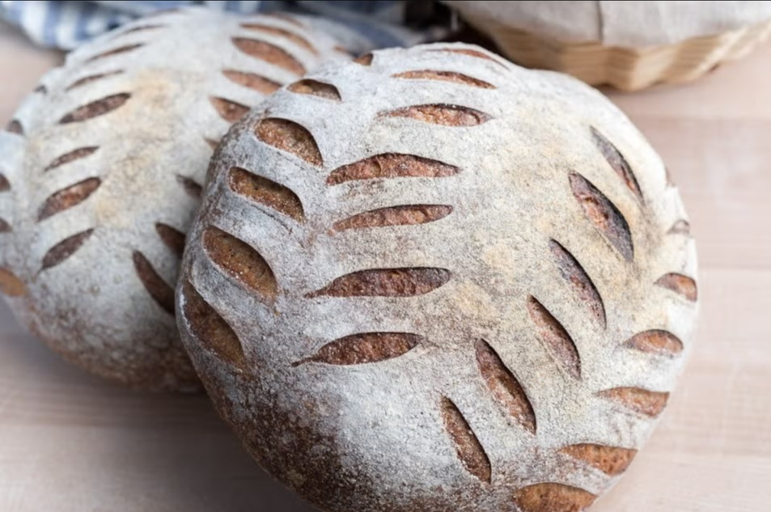

# Scoring and Oven Spring

*Scoring looks decorative but it's actually doing real work: telling the loaf where to open up as it bakes. Get the cuts right and you get those handsome blistered ears. Skip it and the loaf finds its own way out, usually somewhere unflattering. We'll cover where to cut, how deep, and the moment to do it.*

## Overview
In the first 8-12 minutes of a hot bake, two things happen at once. The dough heats up and the trapped CO2 expands; the crust starts to set as the surface dries. If the gas expands faster than the crust can stretch, the loaf will tear open somewhere. The score gives that tearing a planned location and shape.

Score well, and the loaf rises smoothly, blooms along the cuts, and develops the open "ears" that mark a properly baked loaf. Score badly (or not at all), and the loaf either splits unpredictably along its side, or rises into an asymmetric mushroom shape.

## What Oven Spring Is

Oven spring is the rapid rise of dough in the first phase of the bake. It is caused by:

1. **Thermal expansion of gas.** The CO2 in the dough doubles in volume between room temperature and 100°C.
2. **Yeast metabolism.** Yeast keeps producing gas right up until it dies at 60°C, which takes 5-7 minutes inside the loaf.
3. **Steam formation.** Water in the dough turns to steam. Each gram of water becomes about 1.7 litres of steam (at sea level), most of which stays trapped in the gluten scaffold.

All three forces push outward. The score lets the dough release the pressure where you choose.

## Why Steam Matters

Steam in the oven (in addition to the steam inside the dough) keeps the crust soft for the first 8-10 minutes. A soft crust can stretch and expand; a set crust cannot. The longer you can delay crust set, the more oven spring you get.

Three ways to add steam:
1. **Dutch oven:** trap the steam from the dough itself by covering the loaf with a heavy lid. Easiest and most effective method.
2. **Tray of boiling water:** place a metal tray on the bottom rack while the oven preheats. Just before loading the loaf, pour 250 ml of boiling water into the tray. Slam the door.
3. **Ice cubes:** drop a handful of ice cubes onto a hot lower-rack pan just after loading the loaf. The dramatic cold-into-hot creates a burst of steam.

After 15 minutes, vent the steam (open the oven briefly, or take the Dutch oven lid off). The crust needs dry heat for the rest of the bake to crisp properly.

## What to Score With

The cut needs to be fast and decisive. Hesitation drags the blade, tears the dough surface and produces a ragged opening.

- **Bread lame (best):** a curved razor blade on a handle. Designed for the job. The curve helps you cut at a shallow angle.
- **Razor blade:** a straight razor or single-edge razor blade works fine. Hold it with two fingers, not a handle.
- **Very sharp knife (acceptable):** a serrated tomato knife is the home-kitchen substitute. Watch the angle; it is easier to drag the blade than with a razor.
- **Anything dull (avoid):** a butter knife, a paring knife, a chef's knife straight off the magnetic rack. The drag pulls the dough open before the cut completes.

Wet the blade with water before each cut. The water keeps the blade from sticking and lets it slice cleanly.

## Score Depth

Standard scoring is about 5 mm deep, equivalent to the first knuckle of your finger.

- **Too shallow (1-2 mm):** the score does not penetrate the skin. The loaf bursts elsewhere because the score did not give it a release.
- **Too deep (10 mm+):** the score cuts through too much structure. The loaf deflates around the cut. The crumb collapses inward.

The right depth is "just past the crust line" — through the surface skin, into the dough proper, but no deeper.

## Score Angle

The angle of the blade to the loaf surface matters.

- **45 degrees (the classic ear):** the blade goes in at a shallow angle, creating a flap of dough above the cut. As the loaf rises, the flap lifts and curls into the trademark "ear" of a well-scored loaf.
- **90 degrees (vertical):** the blade goes straight down. The cut opens but does not lift. Used for sourdough boules where you want a clean bloom without a pronounced ear.

For most loaves, 45 degrees is the right choice. The ear is the visual signature of a good bake.

## Score Patterns

Different loaves want different patterns.

### Single Diagonal Slash
The simplest score, used on baguettes, batards and ovals. One long cut from end to end at a 45-degree angle.

### Multiple Diagonals
Used on baguettes and bloomers. Three to seven parallel diagonal cuts down the length of the loaf, each overlapping the previous by a third.

See: [Bloomer](bloomer.md), [Baguette](baguette.md).

### Cross / Square
Two perpendicular cuts forming a + or × across the top. Classic for round country loaves and the Coburg.

See: [Coburg](coburg.md).

### Wheat-Ear (Épi)
Scissor cuts rather than blade scores. The dough is snipped diagonally and the flaps folded outward to mimic an ear of wheat.

See: [Épi](epi.md).

### Geometric Patterns
For sourdough and country loaves, scoring can be decorative as well as functional. A wheat-stalk, a leaf pattern, a star: as long as one of the cuts is deep enough to act as the structural release, the rest can be shallow and decorative.

The rule: one structural cut (5 mm, the release valve) plus any number of decorative cuts (1-2 mm, for the look).

## When to Score

Score the loaf at the last possible moment before it goes in the oven. Two minutes before the bake is plenty.

If you score and then wait 30 minutes, the cuts will start to close back up as the dough continues to prove. If you score and immediately load, the cuts will be at their sharpest and the bloom is most dramatic.

If the loaf is cold-proven (overnight in the fridge), score it cold and load it cold. Cold dough scores cleaner than warm. The bake will recover the temperature in the first 10 minutes.

## Reading a Scored Loaf

After the bake, the loaf should tell you what worked.

- **Wide-open ear, blistered crust:** correct score, plenty of oven spring. Best outcome.
- **Closed score, side-burst:** under-scored. The release was not adequate; the loaf burst somewhere else.
- **Score visible but pale, side-burst:** the loaf was under-proven (too much gas left to release through the small cuts).
- **Score opens but no ear lift, no blooming:** the loaf was over-proven (the gluten had nothing left to spring with).
- **Score opens to a deep canyon, crumb compressed below:** scored too deeply. Less force next time.

## Where Next
- [Proving](proving.md): an over-proved loaf scores poorly because there is no spring left.
- [Sourdough Basics](sourdough.md): sourdoughs are scored more dramatically than yeasted loaves.
- [Shape Gallery](shapes.md): each shape has its own canonical score.
- [Bloomer](bloomer.md): six diagonals are the classic bloomer score.
- [Coburg](coburg.md): the cross-cut round.
