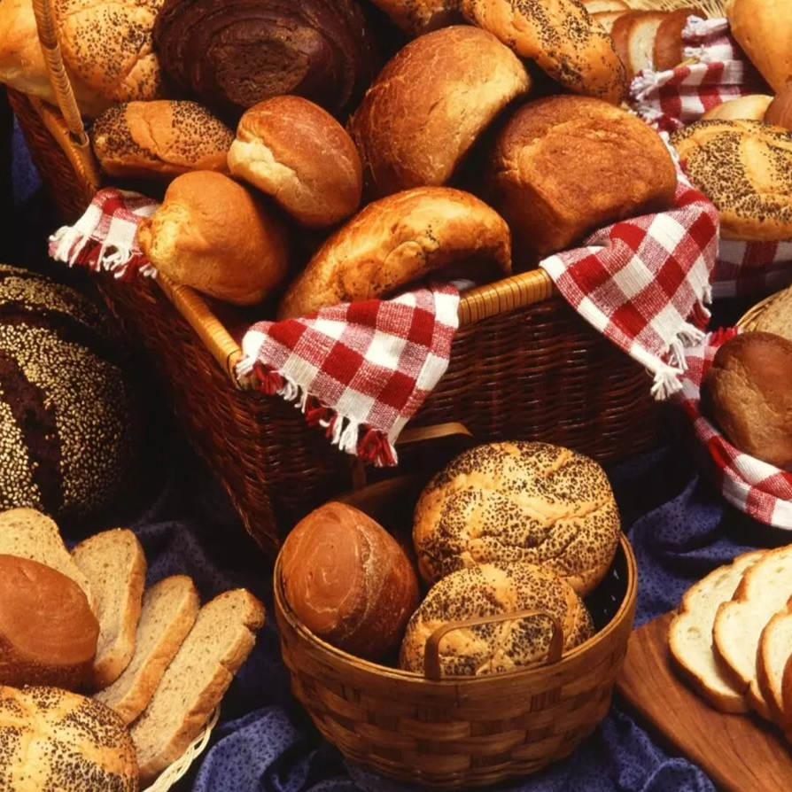

# Shape Gallery

*Ten classic loaf shapes, all built from the same dough. Once you can tighten a ball of dough properly, every other shape becomes a variation on that one move. This page sorts them by what they teach so you can work through them in an order that builds on itself.*

## Overview
Bread shape is not just decorative. The shape determines how the dough proves (rounds rise upward, batards rise outward), how the crust browns (more surface area means more crust), how the loaf eats (slices vs torn pieces) and how the score behaves in the oven. Once you have made a couple of loaves to a single shape, picking up new shapes is just learning new hand movements; the underlying dough is the same.

This page groups the shapes by the technique they teach. Work through each group once and you have the home-baker's repertoire.

## The Master Shapes (Start Here)

### Round (Cob, Boule)
The foundational shape. Almost every domed loaf is a variation on this technique. The skill it teaches is creating surface tension: rotating the dough between cupped hands while pulling it tight against itself.

If you can shape a clean cob, every other rounded shape (Coburg, cottage, sourdough boule) becomes easy.

See: [Cob or Boule](cob.md).

### Tin Loaf (Standard Loaf, Bloomer)
The everyday sandwich loaf. Dough rolled into an oval cylinder, dropped into a tin or onto a sheet. The technique to learn is rolling tightly and sealing the seam.

See: [Standard Loaf](standard-loaf.md), [Tin Loaf](tin.md).

## The Variation Shapes

### Coburg
A round with a cross-cut on top. Same shaping as a cob, but with a confident scoring pattern. The cross opens during the bake into four "petals", a striking presentation for next to no extra work.

See: [Coburg](coburg.md).

### Cottage
A large round with a smaller round on top, joined by a finger-hole through both. Originally a bakery efficiency trick (small oven, two-tier loaf). Distinctive and easy.

See: [Cottage](cottage.md).

### Bloomer
A long flat oval with diagonal slashes. Rolls out of a rectangle into a thick cylinder, ends tapered, top scored. The classic British artisan shape.

See: [Bloomer](bloomer.md).

## The French Shapes

### Baguette
Long, thin, crusty, with the trademark ears. The technique to learn is the envelope-fold (a stretched rectangle folded in thirds to layer the gluten) and the controlled roll-to-length. Requires confidence with shaping; the dough has to stay uniform-diameter across 60 cm.

See: [Baguette](baguette.md).

### Épi (Wheat-Ear)
A baguette cut with scissors into a fan of wheat-stalk segments. The most decorative French shape, and probably the easiest visual showstopper. Built on top of the baguette shape, so master the baguette first.

See: [Épi](epi.md).

### Fougasse
Provence's slashed flatbread. The dough is flattened into a leaf or ladder shape and cut with elongated openings that expose dough surface for an exceptional crust-to-crumb ratio. The technique to learn is shaping by stretching rather than rolling.

See: [Fougasse](fougasse.md).

## The Presentation Shapes

### Braided
Three or four strands woven over and under. Looks elaborate, is mostly geometry. The technique to learn is rolling even-length dough strands and weaving in consistent over-and-under pattern.

Classic uses: challah, brioche braids, fancy dinner loaves.

See: [Braided Loaf](braided.md), [Challah](../../cuisine/israel/side-dishes/challah.md).

## Technique by Shape

| Shape       | Surface Tension Goal | Scoring     | Best Crumb For      |
|-------------|----------------------|-------------|---------------------|
| Cob / Boule | Tight, smooth round  | Cross or none | Tearing, dipping  |
| Coburg      | Tight round          | Deep cross  | Tearing, dipping    |
| Cottage     | Two rounds, joined   | Light       | Tearing, dipping    |
| Bloomer     | Smooth cylinder      | 6-8 diagonals | Slicing           |
| Tin / Standard | Tight cylinder    | One length, or none | Sandwich slicing |
| Baguette    | Even diameter, tapered ends | 5-7 diagonals | Tearing, dipping |
| Épi         | Same as baguette + scissor cuts | Cuts replace score | Pull-apart |
| Fougasse    | Stretched, slashed   | Built into the shape | Flatbread     |
| Braided     | Even strand thickness | None        | Slicing, presentation |

## Picking a Shape

If you are baking for the first time, work in this order:
1. **Standard Loaf** - easiest, hardest to mess up.
2. **Cob** - first round shape, foundation for others.
3. **Bloomer** - first scoring practice with multiple cuts.

Then branch out to whichever appeals: French (baguette → épi → fougasse), presentation (braided), variations on round (Coburg, cottage).

If you are baking for an event or as a gift, the presentation hierarchy is roughly:
- **Most striking:** épi, fougasse, braided.
- **Classic artisan:** bloomer, sourdough boule.
- **Quietly elegant:** Coburg, cottage.
- **Everyday excellent:** tin loaf, standard loaf.

## Which Master Dough for Which Shape

| Master Dough | Best Shapes |
|--------------|-------------|
| [White Bread](../../bread-pasta/white-bread.md) | Anything; the all-rounder |
| [Pizza Dough](../../bread-pasta/pizza-dough.md) | Fougasse, focaccia (high hydration shapes) |
| Sourdough (see [Sourdough Basics](sourdough.md)) | Cob, boule, bloomer (rustic, deeply-scored) |
| [Brioche Dough](../../baking/pastry/brioche-dough.md) | Braided, tin (enriched + presentation) |
| [Poolish](../../bread-pasta/poolish.md) | Baguette, bloomer (long-fermented French) |

## Where Next
- [Proving](proving.md): each shape behaves differently during the second prove.
- [Scoring](scoring.md): the structural cut for each shape.
- [Gluten](gluten.md): all shapes need the same window-pane test before shaping starts.
- [Bread Course landing](bread.md): back to the main course page.
