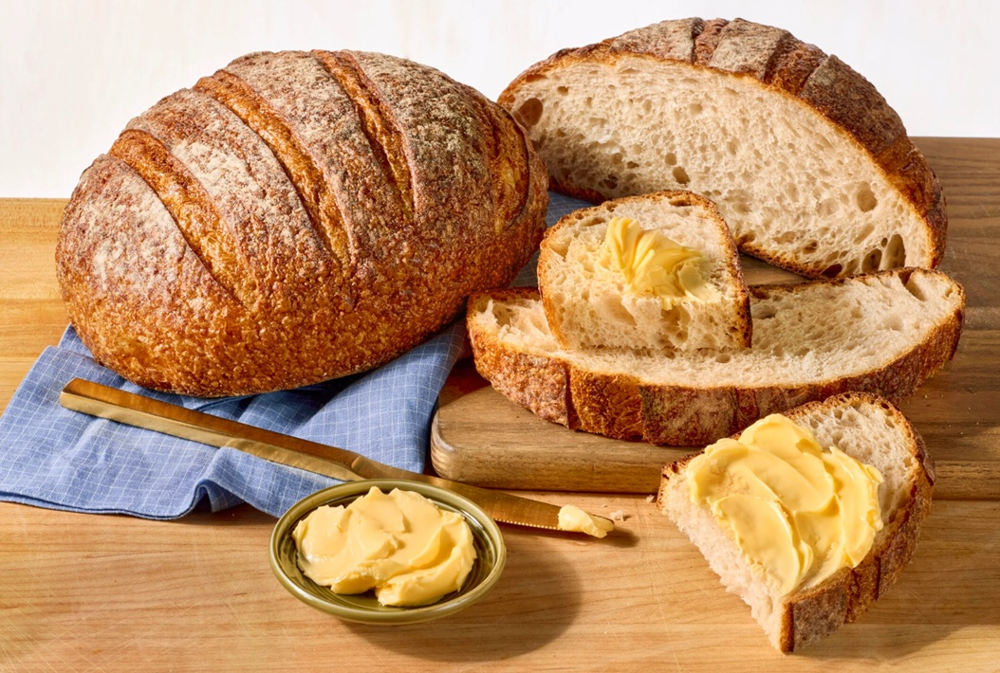

# Sourdough Basics

*Sourdough has a reputation for being complicated, and honestly it's more about patience than skill. You're keeping a tiny ecosystem alive in a jar, feeding it once or twice a week, and letting it do most of the work for you. This page covers how to start one, how to keep it happy, and how to fit a sourdough bake around the rest of your life.*

## Overview
A sourdough loaf has the same four ingredients as any other bread (flour, water, salt, leaven), but the leaven is different. Instead of a teaspoon of dried yeast, you build it from a wild-yeast starter that you maintain in a jar on your counter. The starter contains its own wild yeasts and lactic-acid bacteria. The yeasts make the dough rise; the bacteria produce the acids that give sourdough its characteristic tang.

Sourdough is slower than yeasted bread (a 24-36 hour timeline, mostly hands-off), more flavourful, longer-keeping, and easier on digestion for some people. The trade is that you need to keep the starter alive.

## The Starter

A sourdough starter is a living colony of wild yeast and bacteria. Once established, it lives in a jar in your kitchen, eats roughly equal weights of flour and water at each feeding, and doubles in size between feeds when it is healthy.

### Building a Starter from Scratch

Takes 7-14 days. Most starters fail in the first week, not in execution but in patience.

**Day 1:** In a clean jar, combine 50 g wholemeal flour and 50 g water (room temperature, non-chlorinated). Stir to a thick paste. Cover loosely (a lid resting on top, not screwed down) so gases can escape. Leave at room temperature.

**Day 2:** Look for any sign of bubbles. There may be none. Add another 25 g flour and 25 g water, stir.

**Day 3:** More bubbles, sometimes a foul smell. This is normal. The first colony of bacteria to bloom is not the one you want, but it dies off in a few days as conditions become more acidic. Add 25 g flour and 25 g water.

**Day 4-6:** Discard half the starter, add 50 g flour and 50 g water. Repeat once a day. The smell shifts from unpleasant to yogurty to bready.

**Day 7-10:** The starter should double in size between feeds and smell pleasantly tangy. When it doubles consistently in 4-6 hours after a feed, it is ready to bake with.

If it never doubles, the temperature is probably too cold. Move to a warmer spot (top of the fridge, on a stand mixer that has been on briefly). If it smells like nail polish remover, it is hungry; feed more often or use less starter per feed.

### Keeping a Mature Starter

Once established, the starter is robust. Two options for maintenance:

**Counter (active):** Feed once or twice a day. The starter is always ready to bake. Use this if you bake more than twice a week.

**Fridge (dormant):** Feed once a week. The starter is slow but alive. Wake it up 24-48 hours before baking with 2-3 feeds at room temperature. Use this if you bake less often.

A typical fridge-stored starter recovery:
- Morning of day -2: take starter out, discard most, feed 50 g flour + 50 g water. Leave on counter.
- Evening of day -2: discard most, feed again.
- Morning of day -1: discard most, feed again. By evening it should be doubling and ready.
- Evening of day -1: build the levain (see below).
- Morning of day 0: mix the dough. Bake the same day or the next.

## The Levain

The levain (also called the starter dough or pre-ferment) is a portion of refreshed starter used to leaven the final dough. You build a levain from your maintenance starter rather than dumping the whole jar into the bread, because:
- The maintenance starter is a small amount; you need more to leaven a loaf.
- The levain is timed to peak (double in volume) right when you mix the dough.
- The maintenance starter is preserved (you only used a spoonful).

**Standard levain build:**
- 20 g active starter
- 80 g flour (white, or 50/50 white/wholemeal for more flavour)
- 80 g water (lukewarm)

Mix, cover, leave at room temperature. Ready in 4-8 hours depending on temperature. The levain is ready when it has doubled, the surface is domed and bubbly, and a small piece floats in a glass of water.

## The Dough

A basic sourdough loaf:
- 500 g strong bread flour
- 350 g water (70% hydration)
- 10 g salt
- 100 g active levain

The schedule:

**Hour 0, Mix (5 minutes).** Combine flour and water in a bowl. Mix briefly, no kneading. Cover. Rest 1 hour. This is the autolyse.

**Hour 1, Add levain and salt (5 minutes).** Pour the levain over the dough, sprinkle the salt, work them in with wet hands. The dough comes together quickly.

**Hour 1-5, Bulk ferment with folds.** Leave the dough covered at room temperature. Every 30 minutes for the first 2 hours, do one round of stretch-and-fold in the bowl (see [Hydration](hydration.md)). After the first 2 hours, leave it alone. Bulk is done at hour 4-5 (or when the dough has visibly risen 50-75%).

**Hour 5, Shape (5 minutes).** Turn dough onto a lightly floured bench. Pre-shape into a loose round, rest 30 minutes uncovered. Final-shape into a tighter ball or oval, place seam-side up in a floured banneton.

**Hour 5.5, Cold prove (12-18 hours).** Cover the banneton with cling film, refrigerate overnight. The cold prove is what develops the deep sourdough flavour.

**Hour 18+ - Bake.** See the Bake section below.

The total time from mix to oven is about 18-24 hours. Active time is maybe 90 minutes.

## The Bake

Sourdough loaves are baked at very high heat with steam for the first 15-20 minutes, then dry heat to finish. The traditional home approach is a Dutch oven (a cast-iron pot with a lid), which traps the steam released by the dough itself.

1. Preheat the oven to 240°C with a Dutch oven inside for 45 minutes.
2. Remove the cold loaf from the banneton, invert onto a piece of baking paper.
3. Score the top with a sharp blade (see [Scoring](scoring.md)).
4. Carefully drop the loaf (on the paper) into the hot Dutch oven, cover with the lid.
5. Bake 20 minutes covered.
6. Remove lid, reduce heat to 220°C, bake another 20-25 minutes until deeply golden.
7. Cool completely on a wire rack (at least 1 hour) before slicing.

Internal temperature at the end should be at least 95°C. The crust should crackle audibly as it cools.

## Common Mistakes

**The starter never doubles.**
Too cold. Move somewhere warmer (24-26°C is ideal). Use bottled or filtered water if your tap water is chlorinated.

**The dough is dense and gummy.**
Under-fermented. Either the levain was not active enough, or the bulk-ferment was too short. The dough should have visibly risen and look airy before shaping.

**The loaf is flat and pancake-shaped.**
Over-fermented. The gluten broke down before the bake. Reduce bulk-ferment time, or reduce cold-prove time.

**The crust is pale.**
Oven temperature too low, or not enough steam in the first 20 minutes. The Dutch oven approach is the most reliable.

**The crumb has tunnels and giant holes around a dense base.**
Under-shaped. The pre-shape did not build enough surface tension. Practise the shaping technique on the [shape gallery](shapes.md).

**The bread is too sour.**
Over-fermented or too acidic starter. Shorten the cold-prove (8-12 hours instead of 18-24), or feed the starter twice a day for a few days before baking.

**The bread is not sour enough.**
Under-fermented or too cold a cold-prove. Lengthen the cold-prove, or do a longer bulk at room temperature.

## Where Next
- [Hydration](hydration.md): sourdoughs are wetter than yeasted bread.
- [Gluten](gluten.md): how stretch-and-fold develops gluten in wet doughs.
- [Proving](proving.md): the cold prove is the sourdough secret.
- [Scoring](scoring.md): sourdoughs are scored deeply, more dramatically than yeasted loaves.
- [Shape Gallery](shapes.md): the boule and the oval batard are the classic sourdough shapes.

## Storage
- Crusty breads (baguette, fougasse, sourdough) are best eaten the day they're baked
- Tin loaves and enriched doughs keep 2-3 days in a bread bin or paper bag
- All bread freezes well within hours of cooling; thaw at room temperature and re-crisp in a 180°C oven
- Never refrigerate baked bread: cold accelerates staling
