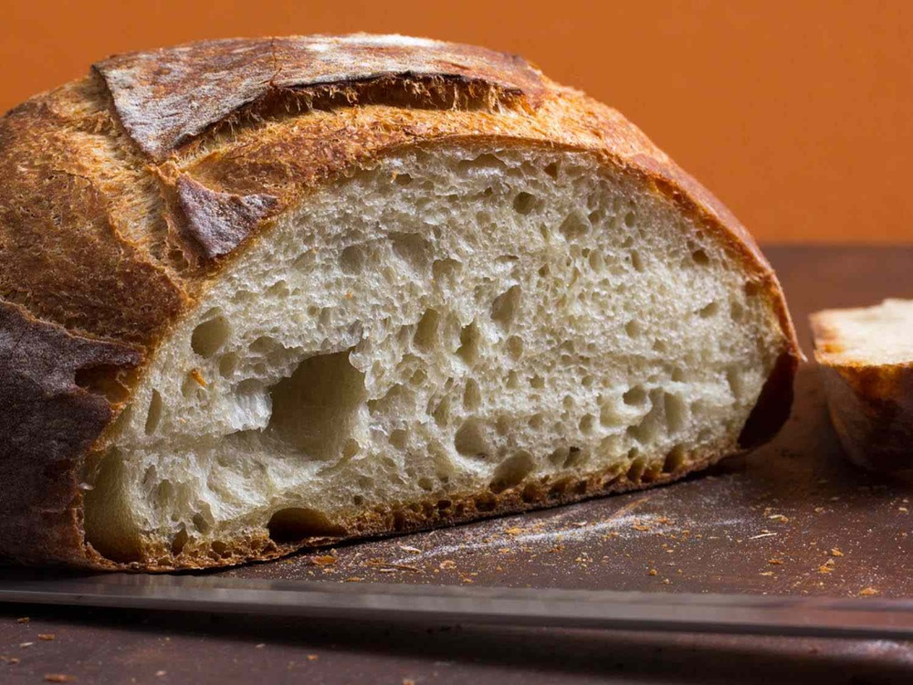

# Standard Loaf

*The standard loaf is the everyday rectangular sandwich loaf — dough shaped into a soft oval and dropped into a buttered tin to rise. It's the easiest shape in the whole course and the place to start if you've never baked bread before. The tin does most of the work; you just need to put dough in it.*

## What you're aiming for
A rectangular loaf with flat sides (from the tin walls) and a gently domed top (where the dough rose above the rim and had room to expand). Even crumb, slightly soft crust, sliceable for sandwiches or toast. Nothing flashy — and that's the point. Every other shape in the course assumes you can shape a tight ball or a tight cylinder; the standard loaf bypasses both requirements by relying on the tin.

## What you need
A 900 g loaf tin (roughly 25 × 12 × 8 cm) — the standard British size. A bit of butter or oil for greasing. That's it.

## The shaping

This barely qualifies as shaping. After bulk fermentation, turn the dough onto a lightly floured surface. Push and stretch it gently into a rough oval, roughly the length of the tin (20 to 25 cm) and about two-thirds the width. The dough will feel loose and a bit floppy — that's correct. You're not building surface tension here the way you would for a cob or a bloomer; you're just getting the dough into a shape that fits the tin.

Lightly grease the tin all over the interior with a fingertip-smear of butter or oil. Drop the oval-shaped dough into the centre. It should sit there relaxed, with about 1 to 2 cm of clearance on each side. Don't press it down or stretch it to the corners — it'll find its own shape during the prove.

If the dough has gone strange and irregular as you transferred it, push it gently back into an oval with your hand. The dough is generous and forgiving here.

## Prove

Cover the tin with a damp tea towel and prove in a warm spot (20 to 25°C) for 45 to 60 minutes. The dough gradually rises and conforms to the tin. A gentle finger-poke should leave a slight indent that springs back slowly over a couple of seconds (see [Proving](proving.md)).

The dough should be visibly puffy and have risen to roughly the top edge of the tin. If it's still flat in the bottom of the tin, give it another 15 minutes.

## The bake

Preheat the oven to 200 to 220°C (lean doughs at 220, enriched doughs at 190 to 200). Place the tin on the middle rack and bake for 30 to 35 minutes until deeply golden on top.

To test doneness, lift the loaf out of the tin (using oven gloves — the tin is screaming hot) and tap the bottom with your knuckles. A hollow drum-like sound means it's done. A dull thud means another two or three minutes in the oven.

Cool the loaf on a wire rack — not in the tin, where trapped steam would make the crust soggy. Wait at least an hour before slicing. The crumb continues to set as it cools, and cutting too early traps steam in the slice and turns it gummy.

## When you're ready for more

The standard loaf is the right place to start. Once you've baked a couple, the next steps in order of difficulty:

- **[Tin loaf](tin.md)** — a variation that splits the loaf down the centre, either by joining two pieces side-by-side or with a single deep score. Same tin, slightly more presentation.
- **[Cob](cob.md)** — your first round shape. Teaches the cup-and-rotate that underpins every domed bread.
- **[Bloomer](bloomer.md)** — your first multi-cut scoring practice on a free-form loaf.

## Where Next
- [Tin Loaf](tin.md): the moulded tin variant with a split top.
- [Cob or Boule](cob.md): the foundational round, the next shape up.
- [Proving](proving.md): the finger-poke test that says "bake now."
- [Shape Gallery](shapes.md): back to the full shape list.
