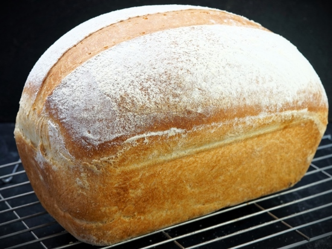

# Tin Loaf

*A tin loaf is a rectangular pan loaf with a deep split running down the centre, like the [standard loaf](standard-loaf.md), but with an extra bit of presentation. You can make it two ways: by joining two pieces of dough side-by-side in the tin (they fuse during baking), or by scoring a single round of dough deeply down its length. Both produce that distinctive striped top.*

## Overview
A tin loaf is a rectangular pan loaf with a deep split running down its length. Two methods get you there: joining two pieces of dough side-by-side in the tin so they fuse during baking, or scoring a single round of dough deeply down the centre. Both produce that distinctive striped top and add presentation to what would otherwise be a plain pan loaf.

## What you're aiming for
A neat rectangular loaf with flat sides (from the tin) and a deep split running the full length down the top, which widens dramatically during the bake. The split adds visual rhythm to what would otherwise be a plain tin loaf and tells anyone looking at it that someone was thinking about presentation.

Two methods get you there. Both work. Pick whichever appeals.

## What you need
A 900 g loaf tin (roughly 25 × 12 × 8 cm). Butter or oil for greasing. Optionally, a sharp knife or bread lame for the single-piece scoring method.

## Method one: two pieces, joined

This method gives the cleanest split because the seam between the two pieces is the split, there's no hoping a score will open in the right place.

After bulk fermentation, weigh the dough and divide it into two exactly equal pieces. Working one at a time, gently flatten each into a rough rectangle roughly half the width of your tin (about 10 to 12 cm wide). Then round the top of each into a gentle dome, this gives each half a bit of upward thrust during the bake.

Grease the tin lightly. Place one piece on the left side, the other directly next to it on the right. They should sit snugly side-by-side with minimal gap; the gap is the split. Don't press them together, let them touch but not merge.

During the prove and bake the two pieces will rise into each other and fuse along their bottom and sides, but stay slightly separated along the top, and that gap becomes the split.

## Method two: one piece, scored deeply

Simpler shaping, slightly more theatrical split.

Shape the bulk-fermented dough into a single oval (same as the [standard loaf](standard-loaf.md)). Drop it into the greased tin, centred lengthwise. The dough should fill most of the tin width without being compressed.

Take a very sharp knife or a bread lame and score a single deep cut straight down the centre of the dough, end to end. About 1 cm deep is the right depth, shallow enough that the dough doesn't deflate, deep enough that the cut opens properly during the bake. Cut with one swift confident motion; hesitation creates a ragged edge.

The two halves of the score should sit slightly separated immediately. They'll continue to part during the bake.

## Prove and bake (either method)

Cover with a damp tea towel and prove in a warm spot for 45 to 60 minutes. The dough should rise to just above the rim of the tin and spring back slowly when poked (see [Proving](proving.md)).

For the two-piece method, the two domes should look puffy and have started to merge along their adjacent sides. For the single-piece method, the score should be visibly wider than when you first cut it, that's the dough rising and pulling the edges apart on its own.

Bake at 200 to 220°C for 30 to 35 minutes until deeply golden. The split widens dramatically during oven spring, what was a 1 cm score becomes a 2 to 3 cm chasm. The loaf should sound hollow when tapped on the bottom.

Cool on a wire rack for at least an hour before slicing.

## Two pieces vs one: which to pick

- **Two-piece method:** Cleaner, more predictable split. Marginally fiddlier shaping (you have to weigh and shape twice). Best when the loaf is going somewhere and needs to look polished.
- **Single-piece method:** Simpler shaping, one scoring move at the end. Slightly more dramatic visual because the split widens unpredictably along its length. Best for daily baking.

Most home bakers settle on one or the other after a few tries.

## Storage
- Keeps 3-4 days in a bread bin or wrapped in a tea towel; the split top dries first but the crumb stays soft
- Best sliced and frozen on day one; toast slices straight from the freezer
- Re-crisp the crust in a 180°C oven for 5 minutes if needed
- Avoid the fridge: it stales bread faster than the counter

## Where Next
- [Standard Loaf](standard-loaf.md): the unsplit pan-loaf this is built on. Start here first if you're new to bread.
- [Scoring](scoring.md): why a deeply-scored bake bursts cleanly along the cut.
- [Bloomer](bloomer.md): a free-form cousin of the tin loaf, scored across the top in a fan rather than a single line.
- [Shape Gallery](shapes.md): back to the full shape list.
