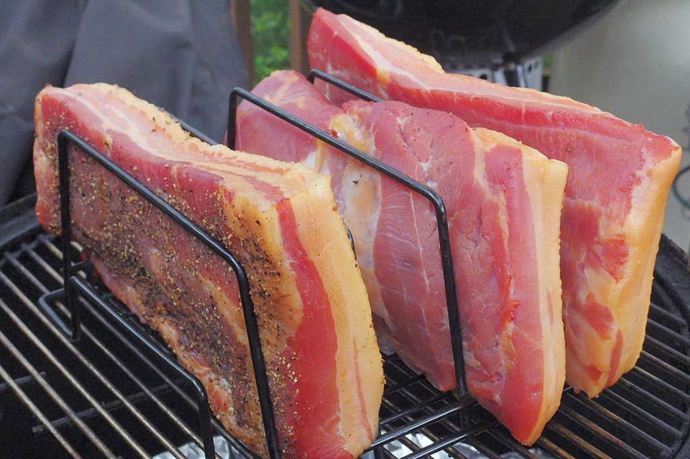

# Bacon

*The easiest cured meat to make at home, the most rewarding for the effort, and the most dramatic difference in quality versus what you can buy. One pork belly, seven ingredients, a week in the fridge, then a low oven (with or without smoke). You will not buy bacon again.*

## Overview
Home bacon is the gateway to charcuterie. It uses the simplest cure (salt + cure #1 + sugar + pepper), the shortest time (a week in the fridge), the most accessible ingredient (a pork belly from a butcher), and produces a result so much better than commercial bacon that the project sells itself.

The technique is straightforward: weigh the pork belly, calculate the cure as a percentage of the weight, rub it on, vacuum-seal or bag, refrigerate for a week flipping daily, rinse, dry, then either smoke for flavour or skip the smoke and bake. Slice and store.

The same technique with no smoke and slightly different aromatics is pancetta. With a heavier sugar load and a slow apple-wood smoke is American maple bacon. With a long thyme-and-juniper rub and oak-smoke is British dry-cured streaky. The variations are all small adjustments to the same backbone.

## What You Need

**Pork belly.** Skin on or off; both work. A piece weighing 1.5-2 kg gives plenty to slice and freeze. Buy from a butcher if possible; supermarket pork belly works but is often water-injected (the salt cure pulls the water back out, so the result is the same eventually). The belly should be fresh, refrigerated, not previously frozen.

**Cure #1.** Sold as pink curing salt, Prague powder #1, Insta Cure #1. Read the bag - it must be specifically cure #1 (6.25% sodium nitrite). Cure #2 is wrong for this product.

**Salt and sugar.** Any non-iodised salt (kosher, sea, pickling); any sugar (white, brown, maple, honey). Brown sugar is the most common in American bacon; maple is the second most common.

**Black pepper, optional flavourings.** Coarsely cracked. Plus optional bay leaves, juniper berries, garlic, thyme, smoked paprika - any aromatics you like. The cure ratios are fixed; the seasonings are free.

**Vacuum bag or heavy-duty resealable bag.** Vacuum is best (the cure stays in contact with the meat); resealable bag is acceptable for a 1-week cure.

**Digital scale to 0.1 g precision.** For the cure #1.

**Digital scale to grams.** For the meat.

## The Cure (per kg of pork belly)

| Ingredient | Percentage | Per kg of pork |
|------------|------------|----------------|
| Salt       | 2.5%       | 25 g           |
| Cure #1    | 0.25%      | 2.5 g          |
| Sugar      | 2%         | 20 g           |
| Black pepper, cracked | 1% | 10 g         |
| Bay leaves, crumbled  | a few | a few        |
| Juniper berries, crushed | optional | 6-8 berries |

Scale to whatever weight your belly actually is. A 1.8 kg belly: 45 g salt, 4.5 g cure #1, 36 g sugar, 18 g black pepper, etc. Use a 0.1 g scale for the cure #1.

## The Method

### Day 0 - Apply the cure

1. Weigh the belly. Note the weight.
2. Calculate the cure for that weight using the percentages above.
3. Mix the cure thoroughly in a bowl - the cure #1 must be evenly distributed through the salt, sugar and pepper.
4. Rub the cure all over the belly. Get every surface; the cure works by contact.
5. Place the belly in a vacuum bag (or a heavy-duty resealable bag with as much air pressed out as possible). If using a resealable bag, double-bag in case of leaks.
6. Refrigerate.

### Days 1-7 - Cure and equilibrate

Flip the bag every day. Why: the cure releases liquid from the belly into the bag (osmosis), and the flip keeps the liquid in contact with every surface.

After 7 days, the cure has penetrated evenly. A 5-6 cm thick belly is reliably cured at 7 days. Thicker pieces need an extra day or two; thinner pieces can stop at 5-6 days. The cure does not over-do itself in a few extra days; a 10-day cure is fine. After 14 days it gets noticeably salty.

### Day 7 - Rinse and dry

1. Open the bag. The belly will be firmer than when it went in, slightly dehydrated, smelling clearly of bacon already.
2. Rinse the belly under cold running water to remove the surface cure.
3. Pat very dry with paper towels.
4. Place on a wire rack over a tray, uncovered, in the fridge for 12-24 hours. This step (pellicle formation) dries the surface to a slightly sticky, slightly leathery skin. The pellicle is what holds the smoke onto the meat; even if you do not smoke, the dried surface is what slices cleanly.

### Day 8 - Smoke or bake

**Option A: Smoked bacon.**

Cold-smoke at 25 C or below for 4-6 hours using apple, hickory or oak wood. Then refrigerate overnight and either bake at 90 C until 65 C internal (about 60-90 minutes for a 1.5-2 kg belly) or eat as-is (cold-smoked but not cooked, like commercial cold-smoked salmon - safe because the cure #1 has done its work but the meat must be sliced and cooked before eating).

Most home bacons split the difference: cold-smoke 2-4 hours then continue in the same chamber at warming heat (60-80 C) until 65 C internal. The result is smoked, partially cooked, ready to slice and pan-fry the rest.

**Option B: Baked, not smoked.**

Place the cured belly on a wire rack over a tray. Bake at 90 C until the internal temperature reaches 65 C - about 60-90 minutes for a 1.5-2 kg piece. The slow low oven sets the texture and removes a bit more moisture; the result is not smoked but is still dramatically bacon-y.

**Option C: Pancetta (cured, not smoked, not cooked).**

Use the same cure but with extra herbs (rosemary, fennel seed, bay, more juniper). After the cure-and-pellicle stage, hang the belly to dry in a cool place (5-12 C, 70-75% humidity) for 3-4 weeks until firm. The result is Italian pancetta, eaten raw thinly sliced. This crosses into salumi-style aging and needs a curing chamber; for first attempts, stick with bacon.

### After cooking - rest, slice, store

1. Let the bacon cool to room temperature.
2. Wrap and refrigerate at least overnight. The flavour settles and the meat firms up for cleaner slicing.
3. Slice on a sharp knife or with a deli slicer. Thickness is personal; 3-5 mm for American breakfast bacon, 1-2 mm for Italian pancetta-style use.
4. Store sliced bacon in the fridge wrapped in greaseproof paper inside a sealed container, 7-10 days.
5. For longer storage, freeze in 200-300 g portions. Frozen, 3 months easy.

## Variations

**Maple bacon:** Replace sugar with maple syrup (same percentage, but stir into the cure as a paste; the wetness affects the cure slightly but not enough to matter). The maple flavour comes through clearly.

**Black pepper bacon:** Double the pepper. Crack coarsely and roll the whole belly in extra pepper before bagging.

**Garlic bacon:** Add 8-10 cloves crushed garlic to the cure, plus a tablespoon of garlic powder. Reads strongly garlic against the bacon backbone.

**Coffee bacon:** Add 30 g coarse ground coffee to the cure. Strange-sounding; surprisingly good.

**British-style streaky:** Lower the sugar to 1%, add a tablespoon of crushed juniper and a few sprigs of thyme. No smoke or a very light beech smoke. Slices thin, fries quickly.

## The Time-vs-Salt Tradeoff

If you forget to flip the bag for a couple of days, no real harm done; the cure is forgiving over the short term. If you forget to take it out for two weeks beyond schedule, the bacon will be very salty - you can rescue it by soaking the sliced bacon in cold water for an hour before cooking, but it is easier to set a phone reminder for day 7.

## Where Next
- [Gravlax](gravlax.md): the same logic applied to salmon. Faster (48 hours) and no nitrite.
- [Smoking](smoking.md): the technique that turns this bacon into the bacon you remember from a great breakfast.
- [Confit and Rillettes](confit-and-rillettes.md): the slow-fat preservation tradition. Different from curing but adjacent.
- [Salumi](salumi.md): the next step up. Bresaola is a logical second project.
