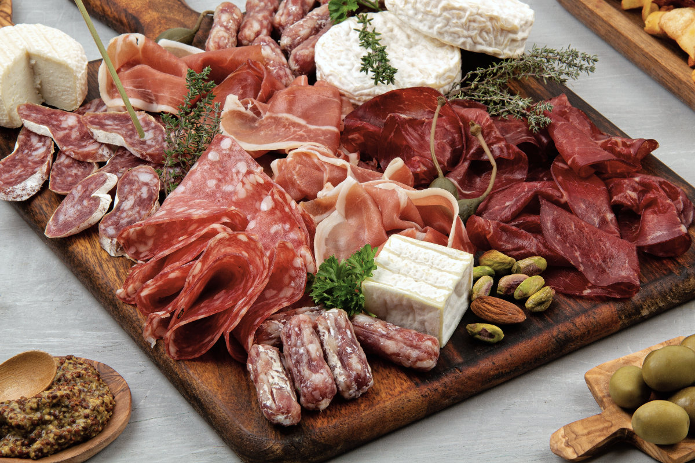

# Charcuterie & Curing Course

*A course on curing meat at home: the salt-and-nitrite science that makes it safe, the dry cures that produce bacon and bresaola, the wet cures behind brined pork, the slow-fat preservation of confit and rillettes, and the cold-smoke and hot-smoke techniques that complete the tradition.*

## Overview
Charcuterie is the oldest cooking discipline that still works. Long before refrigeration, salt drew water out of meat, lowered the water activity to a point where pathogens could not grow, and bought a kitchen weeks or months of stored protein from a single autumn slaughter. The modern equivalents, your home bacon, your bowl of rillettes, your dry-cured coppa, are doing the same chemistry. Salt does the work, time does the rest, and a small set of accessory ingredients (nitrites, pepper, herbs, smoke) shape the final flavour.

This course covers what is achievable at home with a kitchen, a fridge, a thermometer and a small amount of patience. The two endpoints are bacon (a weekend cure) and proper dry-cured salumi (six to twelve weeks at temperature-and-humidity-controlled aging). Most home charcuterie sits in between.

A note on safety: this is the one cooking discipline where bad practice causes real harm. Cured meats sit at temperatures that pathogens love (above fridge cold, below cooking hot) for days or weeks. The chemistry has to do the protecting; you have to get the chemistry right. The [Safety](safety.md) lesson is not optional reading.

## Course Outline

### 1. Foundations
- [Salt and Cure](salt-and-cure.md): how salt preserves, what nitrites and nitrates do, the difference between cure #1 (pink salt, for short cures) and cure #2 (slow nitrate, for long-aged dry cures), and the percentage-by-weight method that replaces guesswork.
- [Safety](safety.md): water activity, pH, the temperature-and-time window pathogens need, the role of nitrite in blocking botulism, the safe handling rules. Read before anything else.

### 2. Short Cures (Days)
- [Bacon](bacon.md): the entry-level dry cure. A pork belly, salt, sugar, cure #1, pepper, a week in the fridge, a slow oven smoke or just a hot oven roast, and you have bacon that is dramatically better than anything you can buy. The technique transfers directly to pancetta (no smoke).
- [Gravlax](gravlax.md): cured salmon. Salt, sugar, dill, 48 hours, slice thin. Faster than any meat cure and the easiest entry point in the course.

### 3. Slow-Fat Preservation
- [Confit and Rillettes](confit-and-rillettes.md): the French technique of slow-cooking in fat, either eaten whole (confit duck leg) or shredded into a fat-set preserve (pork or duck rillettes). Not a cure in the strict sense but in the same tradition.

### 4. Long Dry Cures (Weeks)
- [Salumi](salumi.md): whole-muscle dry-cured pork, bresaola (beef), lonza (pork loin), coppa (pork collar), pancetta arrotolata (rolled belly). The home-achievable end of dry curing; needs a fridge or wine cooler at controlled humidity for 4-12 weeks.
- [Sausages](sausages.md): fresh sausages (no cure, cook fresh, freeze for keeping); semi-dry; dry-cured salami (the harder version, same equipment as salumi but with ground meat, fat, and a fermentation step).

### 5. Smoke
- [Smoking](smoking.md): cold smoke (under 30 C, adds flavour, does not cook) versus hot smoke (60-120 C, cooks the meat). The kit options: home-made cold smoker, kettle-grill hot smoker, an actual smoker. What woods to use, how long, what to smoke.

## The Three Things That Matter

Most of the course collapses into three principles.

1. **Percent by weight.** Every cure recipe in this course is expressed as a percentage of the meat's raw weight: 3% salt, 0.25% cure #1, 2% sugar. The recipe gives ratios; you weigh the meat and calculate. Volume measures (tablespoons of salt) are unreliable because salt crystals vary; weight is the only reliable measure.

2. **Time at temperature.** Cured meat needs to sit. Bacon needs a week to fully equilibrate; bresaola needs eight weeks; a salami needs three months. The time is not optional; the salt has to penetrate, the moisture has to leave, the flavour has to develop. Refrigerator cures (4 C) take longer than meat-cellar cures (12-14 C) but are safer for the home cook with no dedicated aging space.

3. **Water activity is the goal.** Pathogens need water to grow. Curing dries the meat, sometimes a little (bacon: minimal water loss; cooked off in the pan), sometimes a lot (bresaola: 30-40% weight loss; the meat firms into a shelf-stable piece you can slice thin). The water activity (Aw) target for shelf-stable dry-cured meat is 0.85 or below; above 0.91 and bacteria multiply. You do not need to measure this directly; the weight-loss percentage is a proxy.

## Where to Start

- New to curing: [Gravlax](gravlax.md). 48 hours, no nitrites, no equipment beyond a fridge and a piece of cling film. Builds confidence.
- Then: [Bacon](bacon.md). A week, the small additional risk of cure #1 (handled in the [Salt and Cure](salt-and-cure.md) lesson), and the most rewarding home charcuterie project for the time invested.
- Curious about the science: [Salt and Cure](salt-and-cure.md). The chemistry behind everything else.
- Want a project: [Salumi](salumi.md). A bresaola or lonza is the entry-level whole-muscle dry cure; needs 6-8 weeks of patience and a fridge or wine cooler you can dedicate.
- Want to understand smoke: [Smoking](smoking.md). The technique behind bacon's flavour, behind smoked salmon, behind every cold-smoked salumi.

## Where Next
- [Stocks and Sauces](../stocks-sauces/stocks-sauces.md): the bones of a cured meat go into the stockpot. Charcuterie production and stock production are the same project run in parallel.
- [Bread](../bread/bread.md): a pavé of cured meat needs bread under it; the bread course teaches the loaf to serve it on.
- [Cuisine: Italian](../../cuisine/italian/): the home of most salumi traditions.
- [Cuisine: French](../../cuisine/french/): confit, rillettes, saucisson sec, jambon.

## A Note on Equipment

The minimum for the short cures (bacon, gravlax, pancetta, rillettes, confit) is:

- A digital scale that weighs to 0.1 g (for the cure ingredients)
- A separate scale that weighs to grams (for the meat)
- A thermometer
- A fridge
- Vacuum bags and a vacuum sealer (helpful but not strictly required; cling film works for short cures)

For long dry cures (salumi, dry-cured salami), add:

- A dedicated curing chamber. Options are: a converted fridge with a temperature controller and a humidifier; a wine cooler with a humidifier; a basement or pantry that happens to sit at 12-14 C and 70-75% humidity year-round. The chamber is the real barrier to home dry curing.
- Casings for sausages (natural hog casing for fresh; collagen or beef middles for dry).
- A meat grinder and stuffer for sausage-making.

Bacon and gravlax need almost nothing. Bresaola and salami need a chamber. Pick a project that matches your equipment.
