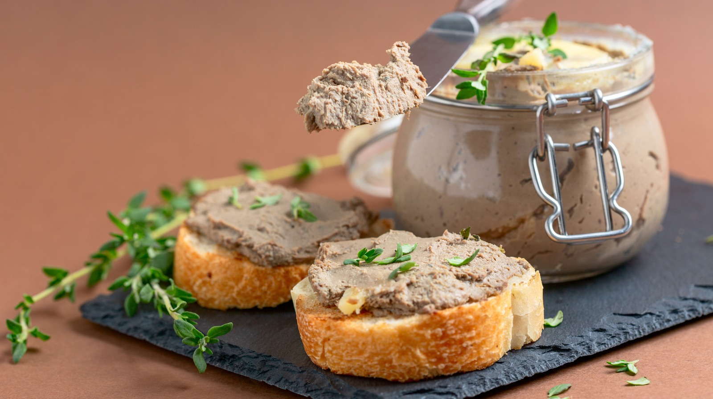

# Confit and Rillettes

*The fat-based preservation tradition. Slow-cook the meat in its own (or a relative's) fat at low temperature for hours; eat it whole as confit, or shred and pot it for rillettes. The fat seals the meat from oxygen, the salt rub stops most pathogens, and the result keeps for months.*

## Overview
Confit and rillettes are siblings. Both use the same starting move - meat salted, then slow-cooked submerged in fat at very low temperatures. Confit is the whole-meat preservation (duck legs are the famous version, but pork shoulder, goose, rabbit and pork belly all work). Rillettes is the shredded, fat-set, spread-on-toast version, usually made by cooking the meat the same way then pulling it apart and packing into a terrine under a sealing layer of its own fat.

This is the second pillar of French rural charcuterie alongside the salt-cured products. Where bacon and salumi rely on salt and time, confit and rillettes rely on slow heat and a fat seal. The principle is the same: keep oxygen, water and warmth away from the meat for long enough that it stays edible. Refrigerated and submerged in its set fat, confit duck keeps six months easily. Rillettes under a clean fat seal keep three.

## Confit

### The Technique

1. **Salt-cure the meat.** Duck legs are the standard. Salt at 2-3% by weight of the legs, rubbed with a herb-and-spice mix (thyme, bay, black pepper, garlic, sometimes juniper) and refrigerated for 12-24 hours. The salt cure firms the flesh and adds initial seasoning.
2. **Rinse and dry.** The salt is washed off; the legs are patted dry. The salt that has penetrated stays; the surface salt would over-season the final dish.
3. **Submerge in fat.** Place the legs in a heavy pot. Cover completely with melted duck fat (sometimes a mix of duck fat and lard for cost). 1.5-2 kg of fat for 4-6 duck legs.
4. **Slow cook.** Heat very gently to 80-95 C. Maintain there for 2-4 hours. The meat goes from raw to meltingly tender; the fat infuses with duck and aromatics.
5. **Cool and store.** Lift the legs gently out of the fat (they fall off the bone if mishandled). Place in a clean container, strain the fat over them to fully submerge. The set fat seals out oxygen. Refrigerate.

### Per-leg Cure

For 4-6 duck legs (roughly 1.2-1.8 kg total):
- 30-40 g sea salt
- 2 sprigs fresh thyme, leaves only
- 2 bay leaves, crumbled
- 4 cloves garlic, smashed
- 1 tsp black peppercorns, crushed
- 6 juniper berries, crushed (optional)

Rub onto every surface of the legs. Refrigerate covered for 12-24 hours.

### Eating Confit

The whole point is the slow second-cooking that crisps the skin and reheats the flesh. Method:

1. Lift a confit leg out of the set fat (it will be solid in the fridge; let the container come to room temperature briefly so the leg releases without tearing).
2. Place skin-side down in a dry, cold non-stick frying pan.
3. Heat slowly over medium-low. The skin renders its remaining fat over 8-10 minutes, going golden-brown and crisp; the flesh heats through gradually.
4. Flip briefly to warm the flesh side; serve.

Confit duck is classically served on a bed of garlicky potatoes (pommes Sarladaises - sliced potato cooked in some of the confit fat), with a green salad. Or shredded into a cassoulet. Or sliced over a lentil-and-bacon stew.

### Variations

- **Confit pork belly.** Cubed pork belly, same cure, slower cook (3-4 hours at 80 C). Eat as small crisp cubes over salads; use in cassoulet.
- **Confit garlic.** Whole peeled cloves submerged in olive oil at 80 C for 90 minutes. Spreads on bread; the oil takes on the garlic for cooking.
- **Confit cherry tomato.** Whole cherry tomatoes in olive oil at 95 C for 1 hour. Eat over burrata, in pasta, on toast.

## Rillettes

### The Technique

Rillettes is what you make when you want the confit method but the shreds-on-toast result rather than the whole-piece result. Pork shoulder is the most common; duck, rabbit and goose all work.

1. **Cut to chunks.** Pork shoulder cut into 4-5 cm pieces. Bone in is fine - the bones go in the pot.
2. **Salt and aromatics.** 2% salt by weight, plus thyme, bay, peppercorns, garlic, optionally a small amount of allspice.
3. **Long slow cook.** In a heavy pot, just covered with rendered lard (or some pork fat plus water; the water cooks off slowly). Lid on, very low oven (110 C) for 4 hours. The meat falls apart; the fat infuses; the connective tissue dissolves into gelatin.
4. **Pick out bones and herbs.** Discard. Mash the meat with two forks. Do not blend; rillettes should be shreddy, not smooth.
5. **Adjust salt and texture.** Taste; salt is usually correct, occasionally needs more. Add fat back if the mass is too dry - rillettes is supposed to be rich, not lean.
6. **Pack into a terrine or jars.** Pack tight; smooth the top.
7. **Seal with clean fat.** Pour a 5 mm layer of clean strained fat (from the cooking) over the top. This sets to a solid layer that excludes air. Refrigerate.

### Per-kg Recipe

For 1 kg pork shoulder, bone-in:
- 20 g sea salt
- 3-4 sprigs fresh thyme, leaves only
- 3 bay leaves
- 4 cloves garlic, smashed
- 1 tsp black peppercorns, crushed
- 1/4 tsp ground allspice (optional)
- 200 g lard (or use the rendered fat from the pork shoulder itself, topped up if short)
- 100 ml water (helps the slow cook; mostly evaporates)

Cook covered at 110 C for 4 hours, then proceed as above.

### Eating Rillettes

Rillettes is a spread, not a slice. Lift out of the jar with a spoon, smear thickly on a slice of bread - sourdough, baguette, brown rye - with a few cornichons on the side and a glass of light red wine. The flavour is intensely pork, slightly herbaceous, very rich. A small portion goes a long way.

### Variations

- **Duck rillettes.** Same technique, duck legs and the rendered duck fat. Slightly leaner than pork; classic with cornichons and grain mustard.
- **Rabbit rillettes.** Same technique, rabbit (whole, jointed). The flavour is delicate; lighter aromatics suit (thyme and bay, skip the allspice).
- **Pork-and-duck rillettes.** Half-and-half. Common in French country charcuteries; richer than either alone.
- **Salmon rillettes.** A modern variation. Hot-poached salmon shredded with smoked salmon, butter and creme fraiche. Not a true preservation; a salad-spread. Refrigerate 5 days.

## Storage

**Confit (whole legs in set fat).** Refrigerate at 1-4 C. The fat must completely cover the meat. 6 months reliably. As soon as you lift a leg out and break the seal, the remaining legs are still safe for as long as the surface fat re-sets; just put the container back in the fridge.

**Rillettes under fat seal.** Refrigerate 3 months. Once opened (the fat seal broken), 2 weeks.

**Without the fat seal.** Either: 7-10 days in the fridge tightly covered.

The fat seal is doing real safety work; do not skip it for long-term storage.

## Why Confit Works

Three things make confit safe at room-or-fridge temperatures for months:

1. **Salt cure pre-cooks the protection.** The salt rub before the fat cook has lowered the water activity at the surface and started the cure.
2. **Long slow cook above 80 C.** Most pathogens are killed; spores survive but cannot germinate while the temperature is held above 60 C for hours.
3. **Fat seal excludes oxygen.** After cooling, the set fat means no air contact. Aerobic bacteria cannot grow. The submerged meat sits in an environment essentially identical to a vacuum.

The one risk is botulism. Clostridium botulinum is anaerobic; the fat seal is a favourable environment. The mitigations are:

- **Refrigerate.** Botulism is slow to grow below 4 C. Fridge storage keeps the risk negligible.
- **Hot serve.** Reheat to above 70 C for 10+ minutes before serving. This destroys any toxin if present (botulinum toxin is heat-labile; the spore is not, but the toxin is what causes illness).
- **Do not store at room temperature.** Confit was traditionally stored in cool cellars (10-12 C), not on the counter. The home fridge is the right place; the pantry is not.

## Where Next
- [Bacon](bacon.md): the salt-cure tradition adjacent to this fat-cook tradition.
- [Gravlax](gravlax.md): the salt-cure for fish; pairs with the salmon-rillettes variation above.
- [Salumi](salumi.md): the next step up in salt-and-time charcuterie.
