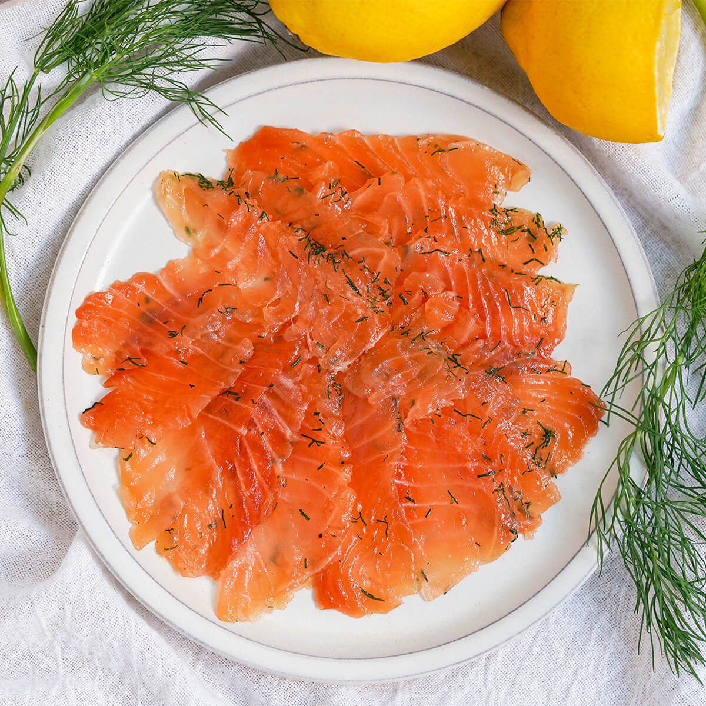

# Gravlax

*Cured salmon. Salt, sugar, dill, 48 hours, slice thin. The fastest, easiest, lowest-risk cured product in the course, and the most likely to disappear off the plate in a single sitting.*

## Overview
Gravlax is the Scandinavian dry-cure for salmon. The technique is ancient and direct: pack a salmon fillet in a salt-and-sugar mixture, weight it lightly, refrigerate for two to three days, rinse, slice thinly, eat. No heat, no smoke, no nitrites required. The salt draws water out, firms the flesh, and concentrates the flavour; the sugar balances and softens; dill is the traditional aromatic; black pepper and crushed juniper are common additions.

A 48-hour cure is the most common home version. Faster cures (12-24 hours, sometimes called "graved" salmon) produce a softer, almost-raw texture. Longer cures (72+ hours) produce a denser, more cured texture closer to lox. The same pattern, dialled to taste.

This is the safest cured product in the course because salmon is eaten cold-cured commonly (sashimi, sushi, lox, gravlax all sit in the same category) and because the 2-3 day cure with sufficient salt is sufficient on its own without nitrite, provided you use sushi-grade salmon.

## What You Need

**Salmon fillet.** Skin on. 600-1000 g for a manageable home cure. Buy from a fishmonger or fish counter, asking for sushi-grade (parasite-and-pathogen treated by freezing at -20 C for 24+ hours). Most supermarket farmed salmon sold for gravlax has been pre-frozen for exactly this reason. Wild salmon is acceptable if previously frozen at this temperature. Do not use never-frozen wild salmon unless you have separately confirmed the safety; gravlax curing does not kill parasites.

**Salt.** Non-iodised. Sea salt, kosher salt, pickling salt. Fine salt distributes more evenly than coarse, but coarse works.

**Sugar.** White or brown. Brown sugar gives a slightly more rounded flavour.

**Fresh dill.** A large bunch. The single defining flavouring of gravlax.

**Optional:** Black pepper, crushed juniper berries, lemon zest, white pepper, fennel pollen, aquavit or vodka (a small splash for some versions).

**No cure #1.** Unlike bacon, this short refrigerated cure does not need nitrite protection. Salt at 5-6% by weight (the gravlax level is higher than meat-cure salt percentages because the salt is the only safety mechanism) plus refrigeration is sufficient.

## The Cure

The classic ratio is **1:1 salt to sugar by weight**. The total cure weight is about 6-8% of the salmon weight.

Per 500 g salmon fillet:
- 20 g sea salt
- 20 g sugar
- A large bunch of fresh dill, chopped (about 30 g)
- 1 tsp coarsely cracked black pepper (optional)
- 1 tsp crushed juniper berries (optional)
- Zest of 1 lemon (optional)
- 1 tbsp vodka or aquavit (optional)

## The Method

### Day 0 - Pack and weight

1. Pat the salmon fillet dry. Run your fingers along the centre line; pull out any pin bones with tweezers (a moment of effort that prevents a moment of unpleasantness later).
2. Place a sheet of cling film on a tray. Sprinkle half the dill mixture down the centre, in a strip the size of the fillet.
3. Lay the salmon, skin-side down, on the dill.
4. Mix the salt, sugar, pepper, juniper and any zest together.
5. Pack the salt-sugar mix evenly over the flesh side of the salmon. Cover the surface; press gently to adhere.
6. Cover with the remaining dill.
7. Wrap tightly in cling film. Place skin-side up on a tray. Place a second tray on top, and weight it with a kilogram or two (a bag of rice, a brick, several cans). The weight presses liquid out and ensures the cure makes good contact.
8. Refrigerate.

### Days 1-2 - Cure and turn

After 12-24 hours, drain the liquid that has pooled in the tray. Turn the fillet over (so it cures evenly), re-cover, re-weight, return to fridge.

A second drain at 24-36 hours is helpful.

### Day 2 (48 hours) - Done

After 48 hours total, the salmon is cured. The flesh has gone from soft and bright orange to firm and slightly darker, with a translucent, cured quality. Squeeze gently, it should feel firm and bouncy, no longer raw-soft.

### Rinse, dry, slice

1. Unwrap. Rinse the cure off under cold running water, scraping off the dill and any clinging salt.
2. Pat dry with paper towels.
3. Slice thinly on the bias. Hold the knife almost parallel to the board, slice toward the tail end, lifting the slices away from the skin. Thickness: as thin as you can manage without it falling apart, usually 2-3 mm.

### Serve

Classic accompaniments:
- Sweet mustard sauce (dill, mustard, sugar, vinegar, oil emulsion)
- Rye bread or pumpernickel
- Capers, sliced red onion, sour cream
- Lemon wedges

The bread-sour-cream-onion-capers-gravlax open sandwich is the entire point.

## Storage

Sliced gravlax: refrigerate in an airtight container, ideally with a sheet of greaseproof paper between layers. 4-5 days.

Unsliced gravlax: refrigerate wrapped in cling film. 7-10 days from initial cure.

To freeze: vacuum-seal the unsliced piece, freeze up to 3 months. Thaw in the fridge overnight, slice when fully thawed. The texture is slightly softer post-freeze but still good.

## Variations

**Beetroot-cured salmon.** Add 200 g grated raw beetroot to the cure mix. The salmon picks up a dramatic magenta-red colour on the outer 1-2 mm of flesh. Same cure time. Add an extra layer to the dill packing.

**Vodka-cured.** Replace the optional vodka splash with 50 ml; the flavour comes through subtly. Aquavit (the Scandinavian caraway-spiced grain spirit) is the traditional choice in Scandinavia.

**Citrus-pepper gravlax.** Replace half the dill with finely chopped tarragon. Add 1 tsp coriander seed (toasted, crushed) and the zest of 2 oranges. Faster-cure variation (36 hours instead of 48) for a brighter, less traditional result.

**Maple-soy.** Mix 2 tbsp maple syrup, 2 tbsp light soy and 1 tbsp grated ginger into the salt-sugar cure. Eastern-Canadian / Nordic crossover; the soy reads as savoury rather than ethnic-specific.

**Mackerel gravlax.** Same technique, oily mackerel fillets, 24 hours only (smaller fish). The dill-and-juniper version is classic; the citrus-pepper version works well too.

## Why Gravlax Works Without Nitrite

Two conditions make this safe:

1. **High salt percentage.** 5-6% salt by weight of salmon, concentrated in a small piece. This is significantly above the bacterial growth threshold; combined with refrigeration, growth is suppressed.
2. **Short cure at fridge temperature.** Two to three days at 1-4 C does not give pathogens time to grow even at the high water activity of fresh-cured salmon. The cure proceeds before pathogen growth can establish.

This is why the cure is short and the salt is heavier than in meat cures. If you wanted to age the salmon longer (a week or more), you would need either nitrite, smoke, or a much heavier salt percentage. The 48-hour cure is calibrated for what is achievable safely without intervention.

A note: gravlax is still a "raw" cured product. The cure does not kill pathogens; it inhibits growth. The sushi-grade source quality (parasite-treated, refrigerated, fresh) is what underwrites the safety. If you can't get sushi-grade salmon, do not make gravlax; bake it instead.

## Where Next
- [Bacon](bacon.md): the same logic with a meat cure. Different timeline (a week instead of 2 days), needs nitrite, but the principle is the same.
- [Smoking](smoking.md): cold-smoke gravlax to make smoked salmon. The cure stays the same; a 4-6 hour cold smoke adds the smoky note.
- [Confit and Rillettes](confit-and-rillettes.md): the next preservation tradition, this one fat-based rather than salt-based.
