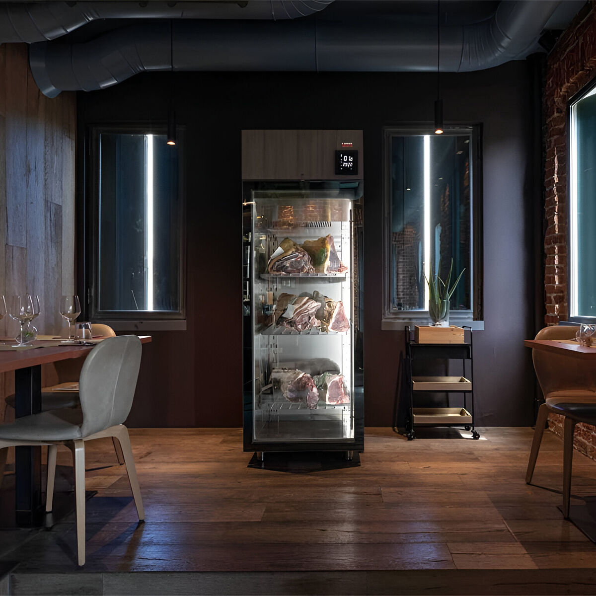

# Safety

*Curing meat sits at temperatures pathogens love for days or weeks. The chemistry has to do the protecting, and the chemistry has to be right. This lesson covers what can go wrong and the rules that prevent it.*

## Overview
Cured meat is the one cooking discipline where bad practice causes serious harm. Botulism, listeriosis and severe gastrointestinal illness are real risks if a cure goes wrong; one of those (botulism) can kill. Commercial charcuterie producers operate under regulatory inspection precisely because the margins are tight. Home cooks need the same rigour; the saving grace is that the rules are short.

This lesson covers the chemistry of safety: what pathogens need to grow, what your cure does to deny them what they need, and the temperature, time and ingredient discipline that keeps things on the right side of the line.

## The Four Things Pathogens Need

For a bacterium to grow in cured meat, four conditions have to be met simultaneously. Charcuterie is the art of denying at least one of them at all times.

1. **Water.** Pathogens cannot replicate without water. Water activity (Aw) is the technical measure - effectively the proportion of unbound water in the meat. Fresh meat has Aw around 0.99; bacteria thrive. Cured products drop the Aw via salt (which binds water) and drying (which removes it). At Aw 0.91 most pathogens stop; at 0.85 nearly all stop. Most bacterial growth ceases at 0.85.

2. **Warmth.** Pathogens grow fastest at 20-40 C - the temperature of room and the human body. Below 4 C most stop (though Listeria monocytogenes is the dangerous exception; it grows slowly at fridge temperatures). Above 60 C most are killed within minutes.

3. **Oxygen (for some).** Many pathogens need oxygen (aerobic). Some thrive without (anaerobic - including Clostridium botulinum, the cause of botulism). This matters: a cured meat inside a sausage casing or under a fat seal is an anaerobic environment, which is exactly where botulism grows.

4. **A favourable pH.** Most bacteria want neutral pH (around 7). Acidic environments (pH below 5) stop most growth; lactic-acid fermentation in salami drops the pH and is part of the safety system.

A cured product is safe when it has dropped one or more of those four below the growth threshold. Bacon is safe because cure #1 has neutralised any botulism risk before the water activity matters. Salami is safe because the pH dropped (lactic fermentation) plus the water activity dropped (drying) plus the cure #2 covered the early days. Bresaola is safe because the water activity dropped to 0.85 over 6-8 weeks of drying.

## The Botulism Question

**Clostridium botulinum** is the pathogen that justifies cure #1 and cure #2. It is rare in the environment but lethal when present. Its spores are everywhere (soil, dust, untreated water). At room temperature, in low-oxygen environments, with neutral pH and moisture, the spores germinate, multiply, and produce botulinum toxin - the most lethal naturally-occurring substance known.

The conditions inside a curing sausage are perfect for it: warm-ish, no oxygen (the casing is impermeable), high water activity (until the meat dries out), neutral pH (until any fermentation lowers it). Without intervention, a home cured sausage is exactly the wrong environment.

Nitrite (cure #1) blocks the spore from germinating. 150 parts per million is the protective dose. The standard 0.25% addition of cure #1 to the meat weight delivers this. As long as the nitrite is present, botulism cannot grow.

In long-aged products, the initial nitrite is used up within a few days. This is why cure #2 (with added nitrate) is used: the slow conversion of nitrate to nitrite by background bacteria keeps the protective nitrite present for weeks.

Vegetable-juice-cured products ("uncured" bacon sold at supermarkets) use celery powder, which contains naturally high nitrate; the chemistry is identical and the protection is identical. The "uncured" label is regulatory wording, not a safety distinction.

## The Listeria Question

**Listeria monocytogenes** is the second concern. Unlike most pathogens, it grows slowly at fridge temperatures (it tolerates 4 C). It does not produce toxins; the bacterium itself causes illness. It is particularly dangerous for pregnant women, the elderly and the immunocompromised.

Listeria is present on raw meat occasionally. It is killed by cooking (above 70 C internal temperature) but not by salt alone, and the home fridge will not stop it growing on cured-but-not-cooked products.

Risk mitigation for home charcuterie:

- For cooked products (bacon cooked before eating): no listeria risk, cooking kills it.
- For cold-eaten cured products (gravlax, prosciutto-style salumi, dry-cured salami): listeria can survive the cure. Reduce risk by using high-quality fresh meat from a known source, working in a clean kitchen, refrigerating during all stages.
- For raw-fish cures (gravlax): the 48-hour salt cure does not kill listeria. Buy sushi-grade salmon that has been frozen at -20 C or below for 24+ hours (a standard parasite-and-pathogen treatment for sushi-grade fish). Most supermarket salmon for gravlax is sold pre-frozen for this reason.

## Temperature Rules

| Stage              | Target temperature       | Why                                     |
|--------------------|--------------------------|-----------------------------------------|
| Handling raw meat  | Below 4 C                | Stops most pathogens growing            |
| Cure equilibration | 1-4 C (fridge)           | Long enough for salt to penetrate evenly|
| Cure-out + dry rest| 4-10 C                   | Forms the pellicle for smoking          |
| Hot smoking        | 60-120 C                 | Cooks the meat                          |
| Cold smoking       | Below 30 C               | Adds flavour, does not cook             |
| Salami fermentation| 20-25 C, 90% humidity    | Active for 24-72 hours, then refrigerate|
| Salumi drying      | 12-14 C, 70-75% humidity | Slow, controlled water loss             |
| Storage            | Below 4 C (fresh), shelf (cured) | Shelf-stable when Aw <= 0.85   |

## Time Rules

- Bacon cure: 7-10 days at 1-4 C. Less and the salt has not penetrated evenly. More and it becomes too salty.
- Gravlax cure: 36-72 hours at 1-4 C. Less and the centre is undercured.
- Bresaola, lonza, coppa: 4-8 weeks at 12-14 C and 70-75% humidity. Target 30-40% weight loss before slicing. Less and the centre is still moist (Aw too high).
- Dry-cured salami: 2-4 weeks fermentation start, then 4-12 weeks aging. Total time depends on diameter.
- Confit refrigerated under its fat: 6 months. Without the fat seal: 1 week.
- Rillettes refrigerated under fat: 3 months. Once opened: 2 weeks.

## The Six Rules

These are the non-negotiable rules. Skip any of them and you have lost the safety margin.

1. **Weigh cure #1 (and cure #2) to 0.1 g precision.** Volume measures are unreliable. 0.25% of meat weight is the dose; do not exceed or fall below.

2. **Refrigerate during every cure stage.** No room-temperature cures. Exception: the active fermentation phase of salami (24-72 hours at controlled warm-and-humid conditions), which needs precise environmental control and is the riskiest part of salami-making.

3. **Use fresh, refrigerated meat from a known source.** Not previously-frozen-then-thawed; not bought from the back of a supermarket clearance fridge. The starting microbial load matters.

4. **Sanitise everything.** Wash hands, work surfaces, equipment with hot soapy water and a food-grade sanitiser. Cutting boards, knives, vacuum sealers, sausage stuffers, casings. Wear gloves while handling cured meat for long-aged products.

5. **Do not freelance the cure ratios.** The salt-and-nitrite percentages are calibrated; reducing salt below 2.5% leaves too high a water activity, increasing nitrite above 0.25% delivers a toxic dose. Add seasonings freely; do not change the safety ingredients.

6. **If anything smells wrong, throw it out.** Off-smells (sour, putrid, ammoniac) mean spoilage. The dish is not worth the risk. Cured meat at the right pH and salt level has a clean, slightly tangy smell; rotten meat is unmistakable. Trust your nose; bin doubts.

## White Mould vs Black Mould vs Green/Blue Mould

In long-aged products (salumi, salami), surface moulds appear. Some are desirable; some are not.

- **White Penicillium nalgiovense, Penicillium chrysogenum** - desirable. Fine white powdery coating, sometimes slightly fuzzy. Inoculated commercially with cultures like Mold 600. Adds flavour and outcompetes harmful moulds.
- **Black or green-black mould** - throw out. Aspergillus species, some produce mycotoxins.
- **Bright blue or vivid green** - undesirable. Wipe off with a vinegar solution if small; throw out if widespread.
- **Pink, red, orange** - undesirable. Some indicate bacterial growth.

If the surface is colonised with white mould but the wrong moulds appear in patches, wipe with a cloth dampened in white vinegar; the vinegar suppresses the unwanted moulds without harming the white ones. If the bad moulds keep returning, the curing chamber humidity or hygiene is wrong.

## Where Next
- [Salt and Cure](salt-and-cure.md): the chemistry behind the safety rules in this lesson.
- [Bacon](bacon.md): the safest first project. Cooks before eating, so listeria and other heat-killed pathogens are no concern.
- [Salumi](salumi.md): the highest-risk products in the course. Read this lesson twice before attempting.
