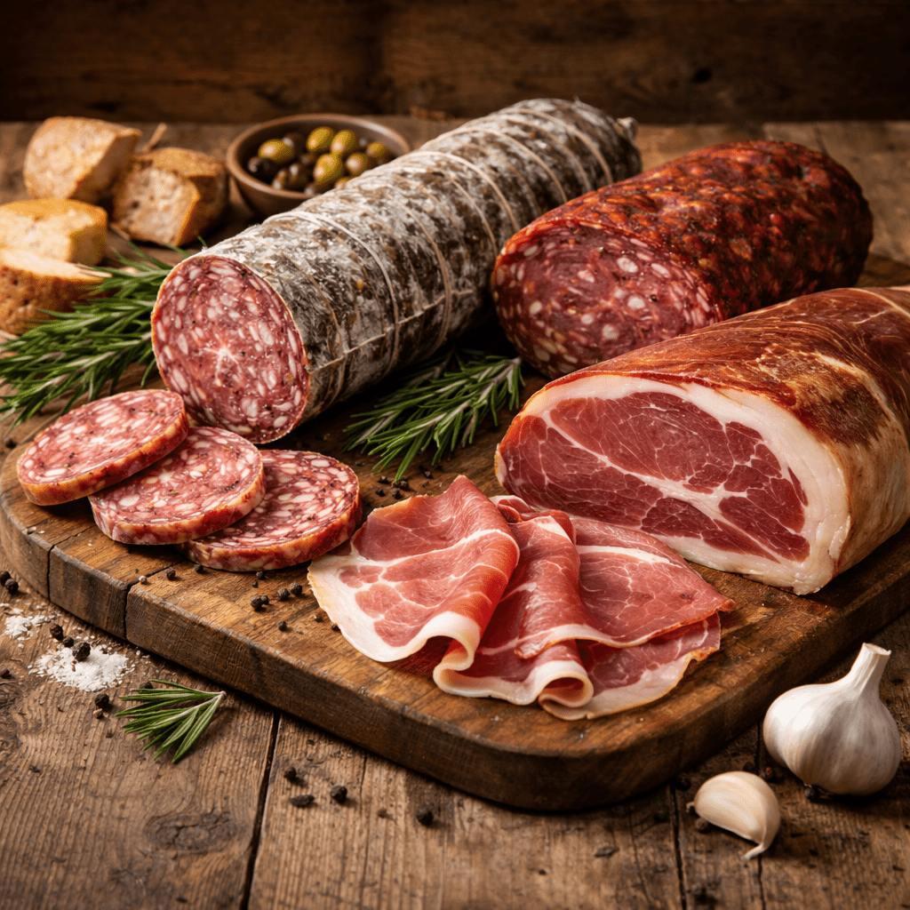

# Salumi (Whole-Muscle Dry Cure)

*The serious end of home charcuterie. A whole muscle, weighed; a salt-and-nitrate cure applied by percentage; six to twelve weeks at controlled cool humidity until the meat has lost a third of its weight and slices thin into a paper-fine cured slab.*

## Overview
Salumi is the Italian word for whole-muscle dry-cured meats: bresaola (beef eye round), lonza (pork loin), coppa (pork collar/shoulder), capocollo (same as coppa, regional spelling), culatello (pork rump), pancetta arrotolata (rolled belly), prosciutto (whole leg). These are the products that started the Italian salami tradition and remain the home charcuterist's main objective when going beyond bacon.

The home-achievable end of the spectrum is bresaola and lonza. Both use single, lean, easy-to-shape muscles that cure in 4-8 weeks. Coppa is the next step (slightly larger, fattier, takes 8-10 weeks). Culatello and full prosciutto are months-to-years projects that require commercial-scale infrastructure.

The hard part is not the recipe. It is the curing chamber: a space that holds 12-14 C and 70-75% humidity for the full cure period, with enough air movement to prevent surface mould but not so much that the meat dries on the outside before the centre has equilibrated. A converted second-hand fridge with a temperature controller and a humidifier is the standard home setup.

## What You Need

**Meat.** Single whole muscles, trimmed of all silver skin and excess fat. Buy from a butcher, asking for the specific cut:

- Bresaola: beef eye of round (girello in Italian)
- Lonza: pork loin
- Coppa: pork collar (the muscle along the top of the shoulder)
- Pancetta arrotolata: pork belly, rolled

The meat must be very fresh, refrigerated, never previously frozen. Buy as close to the date you start curing as possible.

**Cure #2.** Not cure #1 - the long cure needs the slow nitrate release. 0.25% by weight, weighed to 0.1 g precision.

**Salt.** Non-iodised, fine. 3% by weight.

**Sugar.** 1-2% by weight, depending on the recipe.

**Aromatics.** Black pepper, garlic, juniper, rosemary, fennel pollen, red wine. Each cut has traditional associations:
- Bresaola: red wine soak, juniper, black pepper, rosemary
- Lonza: black pepper, fennel pollen, garlic
- Coppa: black pepper, smoked paprika, garlic, white wine

**Casings.** For coppa: a beef bung (the large diameter casing) or a netted-and-wrapped collagen sheet. For bresaola and lonza: bezel beef middles or beef bungs. The casing is not strictly required but slows the drying and prevents the surface hardening into a barrier.

**Curing chamber.** 12-14 C, 70-75% humidity, slow air movement. A converted fridge with an Inkbird controller, a small ultrasonic humidifier, and a small fan is the standard. A wine cooler with a humidifier works. A cool basement that happens to hold those conditions year-round is the ideal.

**Digital scales.** One for the meat (gram precision); one for the cure (0.1 g precision).

## The Universal Cure Ratios

Every salumi recipe uses these baseline percentages by raw weight:

| Ingredient | Percentage |
|------------|------------|
| Salt       | 3%         |
| Cure #2    | 0.25%      |
| Sugar      | 1-2%       |
| Black pepper, cracked | 1% |
| Other aromatics (garlic, juniper, herbs) | to taste |

The salt and cure #2 are non-negotiable; the rest is recipe-specific.

## Bresaola (the entry-level salumi)

### Ingredients (per kg of beef eye of round)

- 30 g sea salt
- 2.5 g cure #2 (weigh to 0.1 g)
- 10 g sugar
- 10 g cracked black peppercorns
- 6 juniper berries, crushed
- 1 tsp dried rosemary, finely chopped
- 2 cloves garlic, finely minced
- 100 ml dry red wine (Barbera, Sangiovese, Cabernet)

### Method

1. **Trim the meat.** Remove all silver skin and external fat. Should be a single clean cylinder of meat.
2. **Weigh.** Record the weight; this is your reference point for tracking weight loss during curing.
3. **Calculate the cure.** Use the percentages above.
4. **Apply.** Mix all dry cure ingredients in a bowl. Place the meat on a tray, sprinkle wine over the meat, then coat thoroughly with the dry cure. Rub it in.
5. **Vacuum-bag.** Place in a vacuum bag with all the cure that has fallen off (pour it in with the meat). Vacuum-seal. If no vacuum sealer, use a heavy-duty resealable bag with as much air pressed out as possible.
6. **Refrigerate 14 days.** Flip every 2-3 days. The cure equilibrates throughout the meat over this period. The meat will feel firm by the end.
7. **Remove and rinse.** Open the bag, rinse the meat briefly under cold water, pat very dry.
8. **Case (optional).** Slide a beef middle or beef bung over the meat. Tie at both ends with butcher's twine.
9. **Tie for hanging.** Create a hanging loop from twine at one end.
10. **Hang in the curing chamber.** 12-14 C, 70-75% humidity. For 6-8 weeks.

### Tracking weight loss

The cure is finished when the bresaola has lost 30-40% of its original weight. A 1 kg starting weight finishes at 600-700 g.

Weigh weekly. The loss curve is fastest in the first 2 weeks (10-15% per week) and slows over time. Week 6-8 should land in the target range.

### Cure complete - what to expect

The finished bresaola is firm to the touch, slightly springy. Slicing it reveals a deep ruby-red interior with no soft or grey patches. A faint white surface mould (Penicillium nalgiovense, the cured-meat mould) on the casing is desirable and expected.

Slice paper-thin on a slicer or on the bias with a sharp knife. Eat over a few weeks; once started, the cut surface dries out and the bresaola loses quality faster - wrap loosely in greaseproof paper to slow this.

## Lonza (Pork Loin)

Same method as bresaola, substituting pork loin for the beef eye of round and adjusting the aromatics:

- 30 g salt, 2.5 g cure #2, 10 g sugar per kg
- 10 g cracked black pepper
- 1 tbsp fennel pollen (or 1 tbsp toasted fennel seed, ground)
- 3 cloves garlic, finely minced
- Skip the wine; or use 50 ml white wine instead of red

Cure 14 days vacuum-sealed; hang 5-7 weeks. Pork loin is fattier than beef eye of round and reaches the 30-35% weight loss point a week or so faster.

## Coppa (Pork Collar)

The next step up. The meat is fattier (the collar / shoulder muscle has marbling running through it) and the cure is correspondingly longer.

Same baseline ratios. The aromatics typically include smoked paprika (1-2 tsp per kg), giving the rosy interior colour that distinguishes a coppa from a lonza.

Cure 14-21 days vacuum-sealed (the larger muscle needs longer for the cure to penetrate). Hang 8-10 weeks. Target 30% weight loss.

## Pancetta Arrotolata

Rolled pancetta. Use a pork belly (skinless), cure it like bacon-with-cure-#2 instead of cure-#1, then roll it into a tight cylinder and tie with twine before hanging. Cure 14 days, then 4-5 weeks of hanging.

Per kg of pork belly:
- 30 g salt
- 2.5 g cure #2
- 15 g sugar
- 10 g cracked black pepper
- 1 tsp ground nutmeg
- 4 cloves garlic, minced
- 3 bay leaves, finely crumbled

After cure, lay the belly flat (cure inside facing up), roll tightly from one long edge, tie at 2 cm intervals along the roll with butcher's twine. Hang.

## The Curing Chamber

The thing that separates home bacon (a week in the fridge) from home bresaola (8 weeks at controlled temperature and humidity) is the chamber. Without it, the surface of the meat dries faster than the centre, forming a hardened crust (case hardening) that prevents the centre from drying further. The result is over-cured outside, raw-and-spoiled inside.

A working home chamber:

- **Old fridge or wine cooler.** Frost-free is fine; non-frost-free works.
- **Temperature controller.** Inkbird or similar. Holds the temperature at 12-14 C; the chamber will be slightly cool by default. The controller may need to switch a heat source (a small heat mat or low-watt bulb) to bring the temperature up.
- **Humidifier.** A small ultrasonic humidifier on a timer or a humidity controller. Target 70-75%. A hygrometer/data logger to monitor.
- **Air movement.** A small fan running for 15 minutes every 2-3 hours. Stagnant air encourages bad mould; constant strong air dries the surface too fast.
- **Hanging hardware.** Stainless steel hooks suspended from a rail at the top of the chamber.

Standard troubleshooting:

- **Surface dries hard, centre still soft (case hardening).** Humidity too low. Raise to 80% briefly to let the surface re-equilibrate.
- **Black mould patches.** Bad mould. Wipe with white vinegar; raise air movement; check that humidity is not stuck at 90%+.
- **Sour or putrid smell.** Probably spoilage. Bin. Review temperature; check the cure was correctly weighed.
- **No white mould.** Most home setups eventually develop the good white mould; it can take weeks. Some home charcuterists inoculate with a commercial Mold 600 spray; some let it happen naturally. Either is fine.

## Where Next
- [Sausages](sausages.md): the dry-cured-salami step beyond whole-muscle. Same chamber, ground meat plus casing plus fermentation step.
- [Smoking](smoking.md): a cold smoke after the cure-equilibration phase adds a different flavour direction (speck, smoked coppa, smoked pancetta).
- [Safety](safety.md): re-read before any long cure. The risks compound at this timescale.
