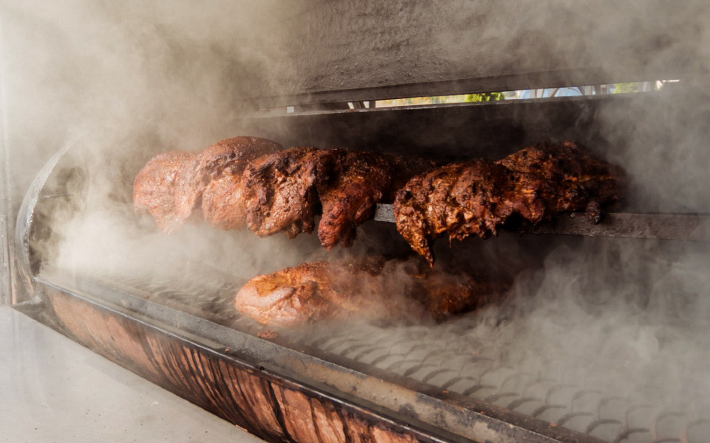

# Smoking

*Two completely different techniques sharing one name. Cold smoke (under 30 C) adds flavour without cooking. Hot smoke (60-120 C) cooks and flavours at once. Different gear, different products, different rules.*

## Overview
Smoke is a flavour, a preservative, and an antimicrobial all at once. The phenols and aldehydes in wood smoke kill surface bacteria, slow oxidation, and impart the complex aromatic that defines bacon, smoked salmon, pastrami, ham and dozens of other cured products.

The single distinction that matters in this lesson: smoke at low temperatures (cold smoke, under 30 C) flavours without cooking, leaving you with a salt-cured-and-smoked raw product that you finish another way (or eat as raw cured, like cold-smoked salmon). Smoke at higher temperatures (hot smoke, 60-120 C) cooks the meat as it smokes, producing a ready-to-eat product (brisket, pulled pork, hot-smoked salmon, kielbasa).

The food-safety implications are completely different. Cold-smoked products must have been cured first (salt + nitrite at the correct ratios) - the smoke does not preserve. Hot-smoked products can use lighter cures because the cooking does the safety work. Equipment, wood choice, timing all follow.

## Cold Smoke

### What It Is

Smoke generated below 30 C, applied to a previously-cured product, for hours or days. The meat does not cook; the smoke flavour penetrates and the surface dries further. The salt cure has done the preservation work; the smoke adds flavour and a small amount of additional antimicrobial protection at the surface.

Classic cold-smoked products:
- Cold-smoked salmon (lox-style)
- Bacon (after the cure, before slicing)
- Smoked cheese
- Smoked salt
- Speck and other long-aged cold-smoked salumi

### Equipment

A cold smoker generates smoke without significant heat. Options:

1. **Maze pellet smoker.** A perforated metal maze packed with food-grade wood pellets. Lit at one corner, smoulders along the maze for 4-8 hours. Place inside a larger box or chamber with the meat hanging above. The maze itself does not significantly heat the chamber.
2. **Cold smoke generator (e.g. ProQ, Smokai).** A small electric or air-driven device that smoulders wood dust into smoke and pumps it through a tube into a chamber. Cleanest control; the chamber stays cool.
3. **External smoker, long pipe to chamber.** The classic outdoor setup. A fire smoulders in a box; smoke travels through a 2-3 metre pipe (the heat dissipates in the pipe) into a smoking chamber. Traditional in cold-climate fish and ham producing regions.
4. **Ice-cooled converted barbecue.** A kettle barbecue with a small amount of wood smouldering on one side and a tray of ice on the other. Marginal for hot summer days; works fine in cool weather.

The chamber: any insulated box with hooks at the top and a smoke inlet. A converted fridge with the cooling disabled works; a wood-and-foil box works; a dedicated commercial smoker is the ideal.

### Method

1. **Cure first.** The product must already be cured. Salt + cure #1 + sugar + aromatics applied at percentages from the relevant cure lesson.
2. **Form the pellicle.** After rinsing the cure off, place the product on a wire rack in the fridge uncovered for 12-24 hours. The surface dries to a slightly tacky pellicle; this is what holds the smoke.
3. **Smoke.** Place in the cold smoker. Smoke for 4-12 hours depending on the product and your taste. Outdoor temperature matters - cold-smoking is only safe when the chamber stays below 30 C, which means cool weather or active cooling.

| Product | Cold-smoke duration | Wood (commonly) |
|---------|---------------------|-----------------|
| Salmon (gravlax-cured, sliced thin) | 4-8 hours | Apple, oak, alder |
| Bacon (after rinsing) | 6-10 hours | Apple, hickory, cherry |
| Cheese (block or wheel) | 2-4 hours | Apple, hickory |
| Salt (in shallow pans) | 6-12 hours | Apple, oak |

4. **Rest before eating.** After smoking, refrigerate the product for 24-48 hours before slicing. The smoke flavour penetrates further during this rest; a freshly-smoked product tastes harsher than one rested for a day.

### Safety Notes

- Outdoor temperature must be below 16 C for safe cold smoking with no active cooling. At 20-25 C the chamber will warm into the danger zone (4-60 C, where pathogens grow).
- The product must be fully cured before smoking. Cold smoke does not preserve uncured meat or fish.
- Long cold smokes (over 12 hours total) are not necessary at home; the flavour saturates earlier.

## Hot Smoke

### What It Is

Smoke generated at 60-120 C, applied to a lightly cured (or uncured, brined) product, until the product is cooked. The smoke flavour penetrates while the meat cooks; the result is ready to eat.

Classic hot-smoked products:
- Brisket
- Pulled pork
- Ribs (St Louis, baby back, beef short)
- Hot-smoked salmon
- Smoked turkey
- Pastrami (after the cure; finished in the smoker)
- Smoked sausages (kielbasa, frankfurters)

### Equipment

A hot smoker maintains a controlled cooking temperature with smoke as the heat source (or alongside it).

1. **Offset smoker (stick burner).** A separate firebox attached to the side of a cooking chamber. Wood logs (or chunks) burn in the firebox; smoke and heat travel through the chamber. Temperature control is by managing the fire. The classic American barbecue smoker.
2. **Drum smoker (Ugly Drum Smoker, UDS).** A 200-litre barrel with charcoal in the bottom and the meat on a rack above. Indirect heat; the smoke comes from wood chunks placed on top of lit charcoal.
3. **Kettle barbecue (Weber).** Charcoal heaped to one side, meat on the cool side, wood chunks added for smoke. The simplest entry point; suitable for shorter smokes (4-6 hours).
4. **Pellet smoker (Traeger and similar).** An electric auger feeds wood pellets into a burn pot at a controlled rate. Temperature is set on a thermostat; the smoker maintains it automatically. Cleanest control; the smoke flavour is lighter than a stick burner.
5. **Electric smoker.** An electric heating element with a wood-chip tray. Temperature-controlled. Lowest skill ceiling; smoke flavour is mild.

The choice of smoker is partly skill (the offset stick burner takes the most learning), partly budget (kettle barbecue cheapest; offset stick burner cheapest-for-real-barbecue; pellet most expensive), partly product (an offset gives the deepest smoke flavour; a pellet gives the cleanest control over a long cook).

### Method (Brisket as the Worked Example)

1. **Trim the brisket.** Leave 5-8 mm of fat cap on the top. Trim hard fat and silver skin from the bottom.
2. **Rub.** A simple Texas-style rub: 50% kosher salt, 50% coarse black pepper, by volume. Apply heavily.
3. **Set up the smoker.** Target 110 C (225 F) cooking temperature. Hardwood: oak, hickory, mesquite, post oak.
4. **Smoke.** Place fat-side-up on the grate. Smoke at 110 C for 6-8 hours until the bark has formed and the internal temperature has reached 75-80 C.
5. **Wrap and continue.** Wrap tightly in butcher paper (the "Texas crutch"). Return to smoker; continue at 110 C until the internal temperature reaches 93-96 C. Total time: 12-18 hours for a 5-6 kg brisket.
6. **Probe test.** The brisket is done when a thermometer probe slides into the meat with no resistance (like butter).
7. **Rest.** Wrap in towels, place in an insulated cooler for 1-2 hours minimum. The internal juices redistribute; the meat finishes setting.
8. **Slice.** Across the grain. The flat (lean section) slices like a steak; the point (fatty section) shreds for sandwiches or eats as burnt ends.

### Hot-Smoke Temperatures by Product

| Product | Smoker temperature | Internal target | Time (approx) |
|---------|--------------------|-----------------| --------------|
| Brisket | 105-120 C | 95-98 C, probe-tender | 12-18 hours |
| Pulled pork (shoulder/butt) | 105-115 C | 90-95 C, probe-tender | 10-14 hours |
| St Louis ribs | 110-120 C | Bend test, 88-91 C | 5-6 hours |
| Beef short ribs | 110-120 C | 95-98 C, probe-tender | 8-10 hours |
| Hot-smoked salmon | 80-95 C (start cool, ramp up) | 60-63 C internal | 1.5-3 hours |
| Whole chicken | 135 C | 75 C breast | 3-4 hours |
| Pork loin | 110-120 C | 65 C | 2-3 hours |

### Hot-Smoke Safety

The cooking does the food-safety work. Cure #1 is not strictly required for hot-smoked products that come from a fresh-meat starting point, though many recipes use cure to enhance flavour and colour. If a hot smoke takes longer than 4 hours to bring meat from 4 C up to 60 C internal (the danger-zone passage), cure #1 is advised for safety - this is why brisket and pulled pork often include cure in the rub.

## Wood Choice

The wood matters. Different woods give different flavour profiles.

| Wood | Character | Best for |
|------|-----------|----------|
| Apple | Mild, slightly sweet, fruity | Pork, poultry, salmon, cheese |
| Cherry | Mild, fruity, gives a reddish colour | Pork, poultry, beef |
| Hickory | Bold, classic American "smoky" | Brisket, ribs, pulled pork, bacon |
| Mesquite | Strong, slightly acrid, very intense | Brisket (in short bursts), Mexican-style red meat |
| Oak | Medium, well-balanced, the universal choice | Almost anything, including long smokes |
| Pecan | Medium-mild, slightly sweet, hickory-adjacent | Brisket, ribs, poultry |
| Alder | Mild, slightly sweet, traditional in PNW | Salmon, fish, poultry |
| Beech | Mild, traditional in northern Europe | Salmon, ham, sausage |
| Maple | Mild, slightly sweet | Bacon, ham, poultry, cheese |
| Whisky barrel oak | Oak with a residual sweet whisky note | Specialty smokes |

What to avoid: any softwood (pine, fir, cedar - resinous, bitter smoke), green/unseasoned wood (acrid), treated lumber (toxic), wood from unknown sources (potentially treated or contaminated).

## The Single Most Important Lesson

Smoke is a seasoning, not a sledgehammer. Over-smoked meat tastes acrid and bitter; the right amount of smoke is when you can identify the smoke as a note in the flavour, not as the dominant flavour. Most home smokers err on the side of too much.

Two corrections that work:

1. **Use less wood than you think.** Particularly in pellet smokers and electric smokers, which produce more smoke than people often realise. A handful of wood chunks in a charcoal smoker is usually right; whole logs in an offset is right for the offset's airflow.
2. **Smoke for less time.** Brisket needs the long cook; that does not mean it needs smoke for the entire cook. The "smoke ring" - the pink layer just under the surface - forms in the first 3-4 hours of cooking, at which point the meat has set enough that further smoke is just surface deposit. Many barbecue cooks load the smoker with wood for the first 4 hours, then continue the cook with just charcoal.

## Where Next
- [Bacon](bacon.md): cold or warm-smoked after the cure.
- [Salumi](salumi.md): some traditional salumi are cold-smoked (speck, smoked coppa).
- [Sausages](sausages.md): semi-dry sausages are hot-smoked.
