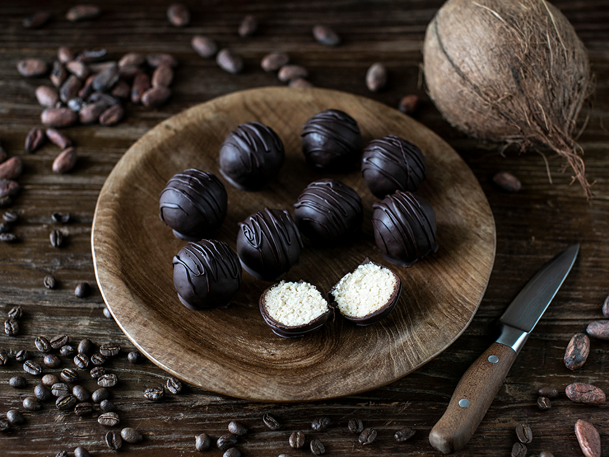

# Bars and Bonbons

*Moulded chocolate is the most professional-looking home chocolate work. A polycarbonate mould, tempered chocolate, a filling, and a sealed back. The result snaps cleanly, glides off the mould with a glossy finish, and looks like it came from a Parisian patisserie.*

## Overview
This is the centrepiece application of tempered chocolate. Moulded bars and bonbons take everything from the previous lessons - tempering, ganache, infusions - and assemble them into the most recognisable form of artisan chocolate. The technique is simple once you know it; the result is impressive because most people have never tried it at home.

The two formats:

- **Bars.** Tempered chocolate poured into a bar mould, often with inclusions (nuts, dried fruit, sea salt, edible decorations) pressed into the surface before setting.
- **Bonbons.** Tempered chocolate moulded into a shell shape; filled with ganache, caramel, praline or other centres; sealed with a tempered chocolate base.

Both rely on polycarbonate moulds (the rigid, clear, sectioned mould trays sold for chocolate work). Silicone moulds work but give a duller finish.

## Tools You Need

- Polycarbonate chocolate mould (bar-shaped or cavity-shaped, depending on what you want)
- Tempered chocolate per the [Tempering](tempering.md) lesson
- Offset palette knife or bench scraper
- Piping bag and small round nozzle (for bonbon filling)
- Sheet pan for inverting moulds
- Optional: paint or shimmer dust for decorating cavities

## Bars

The easiest moulded chocolate project.

### Method

1. **Polish the mould.** Buff the cavities with a soft dry cotton cloth. The polycarbonate surface is what creates the gloss; any fingerprint or smudge transfers to the chocolate. Some chocolatiers wear cotton gloves.
2. **Temper the chocolate.** Per the tempering lesson. The chocolate should be at working temperature when you pour.
3. **Pour into the mould cavities.** Fill each cavity to just over the top.
4. **Tap the mould.** Tap firmly on the bench several times to release air bubbles and level the surface.
5. **Scrape off excess.** Run a bench scraper across the top of the mould; excess chocolate falls back into the bowl.
6. **Decorate (optional).** While the chocolate is still wet on the surface, press chopped nuts, freeze-dried fruit, sea salt flakes, or other inclusions into the surface. They should sit just slightly into the chocolate.
7. **Set.** Leave at room temperature (18-22 C) for 30-60 minutes. Once fully set, the chocolate will visibly contract from the sides of the cavities; this is the cue that they are ready to release.
8. **Unmould.** Flip the mould over a clean sheet pan or board; tap gently. The bars should drop out cleanly. If any stick, the temper was off; the bar will be slightly matte or streaky.

### Inclusion Bars

The classic bars are dark with sea salt; milk with hazelnuts; white with pistachios. The base is the same; the inclusion changes everything.

- **Dark + sea salt:** 70% dark, sprinkle Maldon flakes after pouring.
- **Dark + raspberry:** 70% dark, press freeze-dried raspberries into the surface.
- **Milk + caramelised hazelnuts:** Milk chocolate, press caramelised whole hazelnuts (covered later in this lesson).
- **Milk + sea salt + caramel:** Milk chocolate, drizzle of soft caramel before pouring (creates a marbled effect).
- **White + pistachio + rose:** White chocolate, chopped pistachios + dried rose petals.
- **Dark + chilli + lime zest:** 70% dark, fine chilli flakes plus fresh lime zest. Reads as bright and warm.

## Bonbons

The harder, more rewarding project. Filled chocolates with a hard shell and a soft (or firm) centre.

### Step 1: Decorate (Optional)

Before pouring chocolate into the cavities, you can paint or splatter colour into them. This is what gives "fancy" bonbons their swirled, marbled or jewel-toned appearance.

Methods:
- Brush coloured cocoa butter (sold tinted; warm to 30 C to liquify) into selected cavities with a small paintbrush
- Splatter cocoa butter from a brush flicked across the mould
- Drag the brush across a single point in each cavity
- Use multiple colours layered

Allow the cocoa butter to set fully (5-10 minutes at room temperature) before proceeding.

### Step 2: Pour the Shell

1. Pour tempered chocolate into the cavities until brim-full.
2. Tap firmly to release air bubbles.
3. **Now do the unique-to-bonbons step:** invert the mould over the chocolate bowl. The excess chocolate drains out; what remains is a thin shell coating the inside of each cavity.
4. While inverted, scrape the bench-scraper across the top edge to clean it.
5. Place the inverted mould on a sheet of greaseproof paper for 1-2 minutes; the shell sets enough to handle.
6. Flip back up; clean the top edge again with the scraper.
7. Allow to set fully at room temperature, 10-15 minutes. The shells should be hardened.

A properly tempered shell will be 2-3 mm thick - just thick enough to snap cleanly, not so thick that the filling-to-shell ratio is unbalanced.

### Step 3: Fill

Pipe filling into each shell. The fill should reach about 80-85% of the shell's depth, leaving 2-3 mm at the top for the sealing base.

Filling options:

- **Dark chocolate ganache** (2:1 ratio) - the classic.
- **Milk chocolate praline ganache** - milk chocolate + cream + praline paste (hazelnut paste).
- **Salted caramel** - thick soft caramel made with butter, cream and sea salt.
- **Fruit ganache** - dark ganache flavoured with fruit puree (raspberry, passionfruit). The fruit acidity slightly destabilises the emulsion; balance with a little extra chocolate.
- **Liqueur ganache** - per the [Ganache](ganache.md) variations.
- **Mixed centres** - layer dark ganache (firmer) at the bottom, then a softer caramel on top, for two-textured bonbons.

The filling should be at 28-30 C when piped - cool enough not to melt the shell, warm enough to flow into the cavity. If too hot, the shell partially melts and the filling and shell blend. If too cold, the filling sits as a stiff lump and creates an air pocket.

### Step 4: Cool, Then Seal

1. Allow the filled bonbons to cool at room temperature for 30 minutes. The filling should be slightly set but not hard. (If you proceed too quickly while the filling is hot, it melts the seal as you pour.)
2. Re-temper the chocolate (or reheat your existing tempered chocolate to working temperature - it has cooled while you worked).
3. Pour a small amount of tempered chocolate over the entire mould, covering the open backs of the bonbons.
4. With a bench scraper, scrape across the top of the mould, sealing each cavity and removing all excess. The seal becomes the "bottom" of the finished bonbon.
5. Set at room temperature for 20-30 minutes until fully hardened.

### Step 5: Unmould

Flip the mould over a sheet pan. Tap firmly. Bonbons should drop out cleanly. The painted/decorated side that was the bottom of the mould is now the top of the finished bonbon.

### Common Failures

- **Bonbons stuck in the mould** - improper temper. Re-melt the chocolate, re-temper, try again.
- **Shell too thick or too thin** - the invert-and-drain step had too long or too short a drain. 30-60 seconds inverted is right for the typical mould.
- **Filling leaking out the bottom** - the seal was applied while filling was too hot, or the seal layer was too thin.
- **Painted cavity colour doesn't transfer** - cocoa butter was warmer than the shell chocolate, or the shell chocolate's temperature melted the cocoa butter.
- **Air bubbles inside the shell** - tap harder when pouring the first layer; air bubbles are visible against the polycarbonate.

## Caramelised Hazelnuts (Worked Inclusion Recipe)

A useful inclusion that goes into bars, bonbons, or eaten alone.

- 100 g whole hazelnuts, skin on
- 80 g sugar
- 30 ml water
- pinch of salt

Method:
1. Toast hazelnuts in a 180 C oven for 12-15 minutes until golden and the skins crack.
2. Rub in a tea towel to remove most of the skins.
3. In a heavy-bottomed pan, combine sugar and water. Heat without stirring until the sugar reaches a deep amber caramel (170-180 C - see [Sugar Stages](../sugar-work/sugar-stages.md)).
4. Off heat, add the hazelnuts and salt; stir to coat each nut.
5. Tip onto greaseproof paper; quickly separate the nuts before they cool together.

Use whole as an inclusion; chopped in ganache; or scattered on top of a finished tart.

## Where Next
- [Ganache](ganache.md): the filling under most bonbons.
- [Tempering](tempering.md): re-read if your bars are sticking in the mould.
- [Sauce and Glaze](sauce-and-glaze.md): the remaining chocolate applications - pourable chocolate for cakes and desserts.
