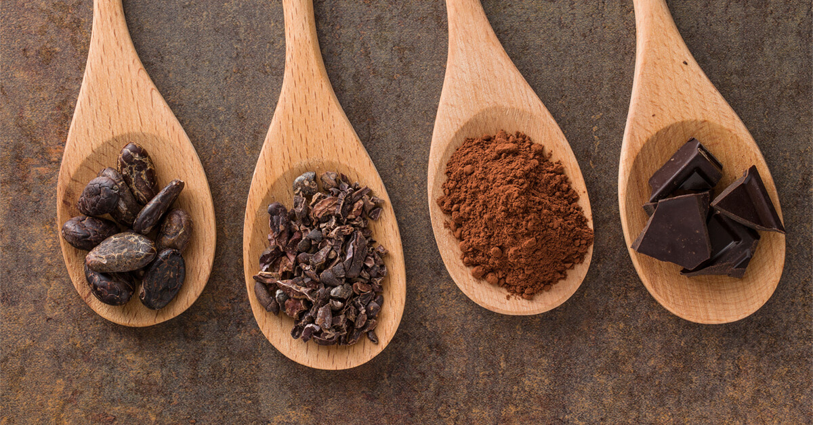

# Chocolate Work Course

*A chocolate course: how to temper it so a bar snaps cleanly, how to build a ganache that holds its shape and stays glossy, how to roll truffles that do not bloom, and the science of cocoa, crystal forms and conching that explains why supermarket chocolate behaves the way it does.*

## Overview
Chocolate is one of the most rewarding ingredients to learn properly and one of the most punishing to get wrong. The same bar of high-quality couverture, melted and cooled correctly, snaps with a clean break and a glossy sheen; melted and cooled incorrectly, it sets soft, dull, and streaked with white bloom. The difference is a 1 C temperature swing during cooling, and the difference is the entire reason commercial chocolate is the way it is.

This course is built around tempering. Tempering is the heat-and-cool cycle that produces the stable Form V cocoa-butter crystal, which is responsible for the snap, the gloss, the long shelf life, and the way chocolate releases cleanly from a mould. Everything else - ganache, truffles, moulded bonbons, dipped chocolates - depends on a properly tempered base. Get the temper right and the rest is following recipes.

A note on terminology: this course uses "chocolate" to mean **real chocolate** made with cocoa butter, not the wax-and-vegetable-fat compound coatings sold under names like "candy melts" or "compound chocolate". Compound coatings do not need tempering (they have no cocoa butter) but also do not deliver chocolate flavour or texture. Stick to real chocolate; buy couverture if you can.

## Course Outline

### 1. Foundations
- [Chocolate Science](science.md): cacao, conching, cocoa percentages, cocoa butter's six crystal forms, why Form V is the only stable form that produces good chocolate, the difference between dark, milk and white chocolate, and how to read a chocolate label.
- [Tempering](tempering.md): the centrepiece of the course. The classic tabling method, the seed method, the microwave method, the EZ-temper / Mycryo method. Plus how to check if your chocolate is properly tempered.

### 2. Building Blocks
- [Ganache](ganache.md): chocolate-and-cream emulsion, the foundation of truffles, glazes, fillings and frostings. The ratios for each use, the technique that produces a smooth glossy ganache rather than a broken grainy one.

### 3. Finished Products
- [Truffles](truffles.md): hand-rolled ganache centres, coated in cocoa powder, tempered chocolate, or chopped nuts. The simplest finished chocolate.
- [Bars and Bonbons](bars-and-bonbons.md): moulded chocolates. Smooth bars, layered bars, filled bonbons. The moulds, the tempered shells, the ganache filling, the seal.
- [Sauce and Glaze](sauce-and-glaze.md): liquid chocolate. Chocolate sauce for desserts; chocolate glaze (poured over cakes, dipping fruit); the difference between a glaze and a ganache.

## The Three Things That Matter

Most of the course collapses into three principles.

1. **Tempering is mandatory.** Without proper temper, chocolate is matte, soft, prone to bloom (the white-grey film of badly-crystallised cocoa butter), and unpleasant to eat. With proper temper, chocolate is glossy, snaps cleanly, releases from moulds, and keeps for months. Every shaped or moulded product needs tempered chocolate.

2. **Water is the enemy.** A single drop of water in a bowl of melting chocolate causes it to "seize" - the cocoa butter and the small amount of cocoa solids agglomerate into a gritty, broken mass that cannot be recovered. Bowls, spatulas, moulds, hands - all must be bone dry. The exception is ganache, where water (in the form of cream) is added in deliberate proportion and emulsified in.

3. **Temperature is precise.** The temperatures in this course are not approximate. Tempering dark chocolate needs to reach 50 C, drop to 27 C, and rise back to 31-32 C. A 2 C overshoot at any step ruins the temper. Use a digital thermometer with a thin probe; sample frequently.

## Where to Start

- Never made chocolate before: [Tempering](tempering.md) directly, learn the technique with a 200 g batch of decent couverture (Callebaut, Valrhona, Cacao Barry, Felchlin if budget allows). Once you can produce reliably tempered chocolate, every other lesson in the course is mostly about adding flavour and shape.
- Want a finished product fast: [Truffles](truffles.md). A simple ganache, an overnight set, a hand-roll into balls, a coat in cocoa powder. No tempering required for the coating; tempering only matters if you want a hard shell.
- Curious about the science: [Chocolate Science](science.md). Reads like a physics primer; explains everything else.
- Have a mould: [Bars and Bonbons](bars-and-bonbons.md). Filled bonbons are the showcase chocolate project. Hard, glossy, surprise-centred.

## Where Next
- [Patisserie](../patisserie/patisserie.md): chocolate is one of the foundation flavours of French patisserie. Many of the techniques (ganache, glaze, the seven-textures dessert) live in both courses.
- [Eggs - Custards](../eggs/custards.md): chocolate custard, pots de creme, chocolate ice cream all build on the egg-custard technique with chocolate added.
- [Sugar Work and Confectionery](../sugar-work/sugar-work.md): chocolate sits next to caramel, toffee and brittle in the confectioner's kit.

## A Note on Equipment

Minimum:
- A heatproof bowl that fits over a saucepan (for the double-boiler / bain-marie method)
- A digital thermometer with a thin probe (instant-read, accurate to 0.1 C)
- A silicone spatula
- A clean marble or stone surface (for the classic tabling method - optional but the most reliable temper for small batches)
- Moulds if you want to make bars and bonbons - polycarbonate moulds give the best gloss

Nice-to-haves:
- Bench scraper for the tabling method
- A small ice cream scoop or melon baller for sizing ganache for truffles
- Disposable gloves for hand-rolling (skin warmth would melt the chocolate)
- A chocolate guitar (a fine wire cutter for slabs of ganache or chocolate)
- An EZ-temper or similar Mycryo machine for the easiest tempering method

For a single starter project (250 g of tempered chocolate, 50-100 g of truffles), the minimum equipment above is enough.
