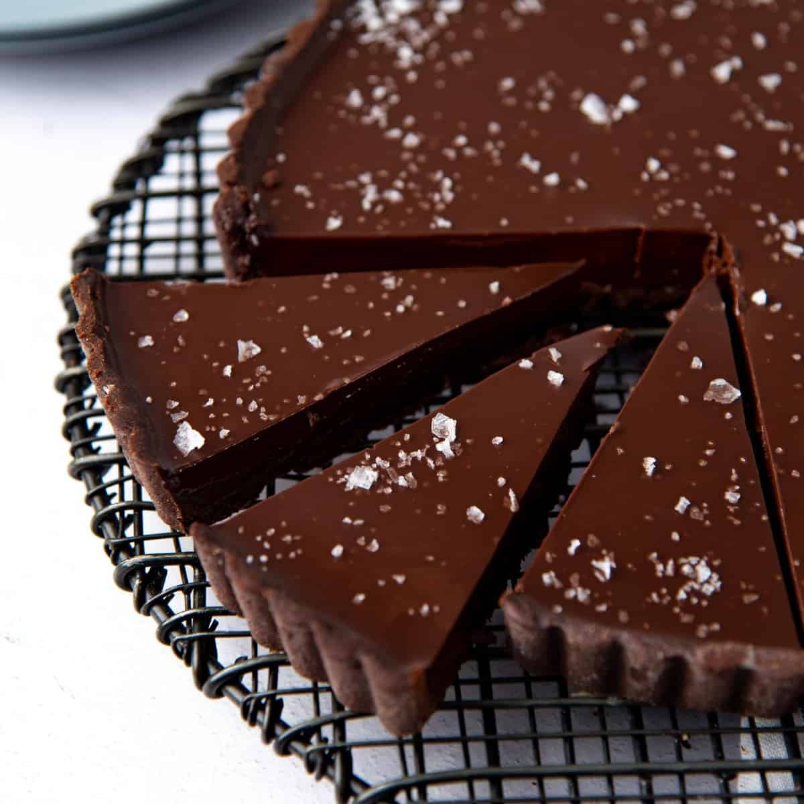

# Ganache

*Chocolate plus cream, plus the right ratio for the right job. A 2:1 chocolate-to-cream is a truffle filling; a 1:1 is a pourable glaze; a 1:2 is a sauce. The technique is the same; the ratio decides everything.*

## Overview
Ganache is an emulsion, the cocoa butter and the cream's milk fat held in stable suspension with the cocoa solids and sugar. It is the most useful application of chocolate in patisserie: it makes truffle centres, cake fillings, frostings, glazes, whipped cream alternatives, sauces and a dozen other things. The recipe is two ingredients; the technique is in the temperature and the stirring.

This lesson covers the standard ratios, the method that produces a glossy, stable ganache rather than a broken or grainy one, and the variations, whipped ganache, infused ganache, butter-finished ganache, that expand the technique into more advanced patisserie.

## The Basic Ratios

The ratio of chocolate to cream determines the final consistency. By weight:

| Ratio (chocolate:cream) | Result at room temp | Use |
|--------------------------|---------------------|-----|
| 2:1 | Firm, sliceable, holds a shape | Truffle filling, layered bonbons |
| 1:1 | Spreadable, slightly soft | Cake filling, frosting (when whipped), pourable glaze when warm |
| 1:1.5 | Pourable, slightly thick | Glaze, sauce |
| 1:2 | Pourable, thin | Dessert sauce, hot chocolate base |

Dark chocolate is the reference; milk chocolate has more dairy and sugar so the same ratio with milk produces a softer ganache, requiring more chocolate to firm up. Dial the chocolate up by 20-30% if substituting milk for dark.

## The Universal Method

The reliable way to make ganache, regardless of ratio:

1. **Chop chocolate finely** into a heatproof bowl. Fine chopping ensures the chocolate melts evenly when the hot cream is poured over.
2. **Heat the cream** to a simmer (90 C, just below boiling) in a small saucepan. Do not boil hard.
3. **Pour the hot cream over the chocolate.** Let it stand untouched for 60 seconds. The heat of the cream begins to melt the chocolate from the surface in.
4. **Stir gently from the centre outwards.** Use a small whisk or a silicone spatula. Start in a small circle in the centre; the chocolate emulsifies first there, forming a glossy core. Gradually widen the circle, pulling in more chocolate as you go.
5. **Continue until uniform.** The ganache should be completely smooth, glossy and homogenous. Initially it may look "broken" (greasy or grainy); keep stirring, it usually comes together. If it does not, see "Recovery" below.
6. **Add butter (optional).** Some recipes whisk in cold cubes of unsalted butter at the end. The butter adds shine, mouthfeel and a slightly softer final texture. 20-50 g butter per 200 g chocolate is typical.

## Recovery From a Broken Ganache

A broken ganache (greasy, grainy, oil separating from the chocolate) means the emulsion has failed. Three usual fixes:

**Add a small amount of cold cream and stir vigorously.** A tablespoon of cold cream per 200 g of broken ganache, whisked in hard, can rebuild the emulsion.

**Use a blender or immersion blender.** Pour the broken ganache into a tall narrow container. Insert an immersion blender; blend in short bursts. The high shear forces the emulsion back together. This is the most reliable fix.

**Strain and start over.** If neither works, strain the ganache to separate the oil from the chocolate solids. Melt fresh chocolate, pour in hot cream over it, start the emulsion correctly. The strained material can usually be re-incorporated.

## Variations

### Whipped Ganache

- A 1:1 dark chocolate ganache chilled overnight, then whipped to soft peaks with an electric mixer, becomes a chocolate frosting with a mousse-like texture. Use immediately, it sets firmer as it sits.

- For a chocolate buttercream alternative: combine 200 g dark chocolate, 200 g cream, 50 g butter; chill 4-6 hours; whip. Pipes beautifully on cakes.

### Infused Ganache

- Steep aromatics in the hot cream before pouring it over the chocolate. Add the aromatic, bring to a simmer, kill the heat, cover, steep for 15-30 minutes. Strain, then proceed as normal.

- Classic infusions:
- **Earl Grey** - 1 tbsp loose leaves per 200 g cream. Steep 10 minutes.
- **Cardamom** - 4-5 crushed green pods per 200 g cream. Steep 15 minutes.
- **Lavender** - 1 tsp dried flowers per 200 g cream. Steep 5 minutes (longer turns soapy).
- **Ginger** - 30 g fresh ginger, grated. Steep 20 minutes.
- **Mint**: large bunch of fresh mint, bruised. Steep 15 minutes.
- **Espresso** - 2 tbsp coffee beans, crushed, per 200 g cream. Steep 10 minutes.
- **Vanilla** - 1 split bean per 200 g cream. Steep 20 minutes, scrape seeds back in.
- **Smoke**: cold-smoke the cream briefly before heating. Unusual; effective.

### Butter Ganache

- Add butter at the finishing stage as described above. The proportions for a butter-rich ganache:

- 200 g dark chocolate
- 200 g cream
- 60 g unsalted butter, cubed, cold

- The butter increases the mouthfeel without changing the firmness much. Common for the highest-grade truffle centres.

### Ganache With Alcohol

- For boozy ganache (rum, whisky, Cointreau, Grand Marnier), add the alcohol at the end after the ganache has cooled to 35 C. The alcohol disturbs the emulsion if added hot. Maximum addition: about 10% of the ganache weight; more than that disrupts the structure.

- For 200 g chocolate + 200 g cream ganache: add 30-40 ml alcohol. Reduce the cream by the same volume to compensate.

### Water-Based Ganache (Vegan)

- Replace cream with sweetened almond milk, coconut cream, or water-and-sugar syrup. The technique is the same but the result is firmer and less luxurious. Coconut cream is the closest substitute for dairy cream; water-and-sugar is the most stable.

- For 200 g dark chocolate, vegan version:
- 200 g coconut cream (the thick part from the top of a can), OR
- 150 ml water + 40 g sugar (dissolve sugar in water, heat to simmer, proceed)

- Coconut versions taste slightly of coconut; the sugar-water version is cleaner.

## Truffle Centres

Truffle ganache uses a higher chocolate ratio (2:1 chocolate-to-cream) for a firm, hand-rollable centre.

- 300 g dark chocolate (60-70%)
- 150 g cream
- 30 g butter (optional)
- 1-2 tbsp liqueur (optional)

Method as above. Pour into a shallow dish; refrigerate 4 hours. Scoop with a melon baller or small ice cream scoop into balls; refrigerate another 30 minutes; hand-roll to smooth (wear gloves to keep the chocolate cold); coat. See [Truffles](truffles.md).

## Layered Bonbon Centres

For filled bonbons with a layered ganache (e.g. a dark layer plus a coloured fruit-infused milk layer), pipe the firmer (2:1) ganache as the bottom layer in the shell, allow to set 4 hours, then pipe the second layer. See [Bars and Bonbons](bars-and-bonbons.md).

## Storage

Ganache keeps refrigerated 1-2 weeks. The texture firms in the fridge; let it come to room temperature before serving for the right consistency. It freezes for 1-2 months but may need brief gentle reheating and re-emulsifying with a stir on thaw.

A ganache layered inside a fully-set tempered chocolate shell (bonbon) keeps a month at room temperature, the chocolate shell protects the soft centre from oxygen and humidity.

## Where Next
- [Truffles](truffles.md): hand-rolled ganache centres. The simplest finished chocolate product.
- [Bars and Bonbons](bars-and-bonbons.md): moulded shells filled with ganache.
- [Tempering](tempering.md): the foundation under any shaped, dipped or moulded chocolate work that uses ganache.
