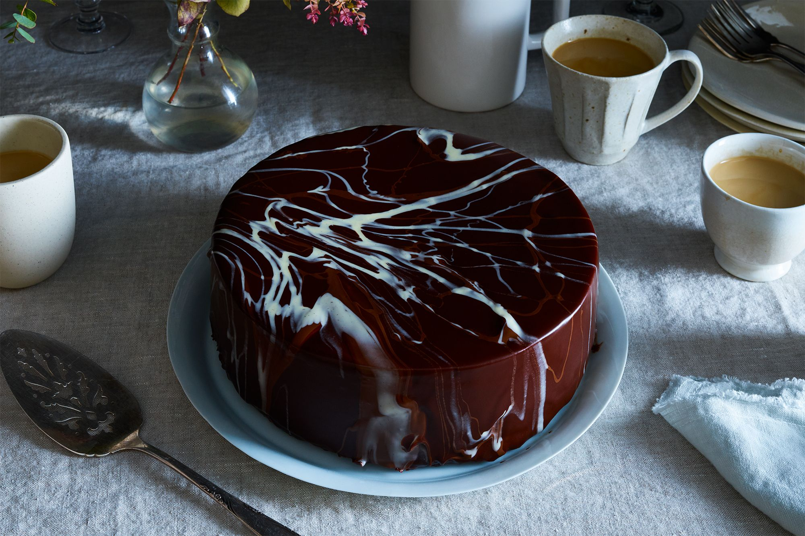

# Sauce and Glaze

*The pourable chocolate applications. Chocolate sauce for desserts, ganache-based glazes for poured cakes, mirror glaze for the gloss-mirrored finish. No tempering required, these are by-design soft applications.*

## Overview
This lesson rounds out the chocolate course with the liquid applications, the pourable, brushable, dippable versions that do not need tempering because they are by-design soft. Chocolate sauce is a sweet finishing sauce for ice cream, profiteroles, fruit. Chocolate glaze is the thicker pourable layer over a cake. Mirror glaze is the high-gloss showstopper for fancy entremets.

Each is a slightly different chocolate-and-fat-and-sugar emulsion or solution. Each has its place; none requires the tempering precision of moulded chocolate work.

## Chocolate Sauce

A classic sauce for vanilla ice cream, profiteroles, banana splits and dipping fresh fruit. Smooth, glossy, pours like thick double cream when warm; sets slightly stiffer when cool.

### The Classic Sauce

- 200 g dark chocolate (60-70%), chopped
- 250 ml double cream
- 50 g caster sugar
- 30 g unsalted butter
- 2 tbsp water
- 1 tsp vanilla extract
- pinch of salt

Method:
1. In a heavy saucepan, combine cream, sugar, water and salt. Heat to a gentle simmer; stir until the sugar dissolves.
2. Off heat, add the chocolate and butter. Stir until smooth and glossy.
3. Stir in vanilla.

Serve warm. Reheats gently in the microwave or over very low heat. Keeps refrigerated 2 weeks; gentle reheat restores the pour.

### Variations

- **Mocha sauce.** Replace 2 tbsp water with 2 tbsp strong espresso.
- **Whisky-chocolate sauce.** Add 2-3 tbsp whisky off the heat. Lights up the dark chocolate flavour without dominating.
- **Salted caramel chocolate sauce.** Increase sugar to 80 g; allow to caramelise to a deep amber before adding the cream (carefully, the steam burst is intense). Continue as normal.
- **Spicy hot chocolate sauce.** Steep 1 cinnamon stick + 1 chilli (split) + 1 star anise in the cream first; strain out before adding chocolate. Mexican / mole-adjacent.

### What This Is Not

This is not a ganache. The high water content (the 30 ml plus the water in the cream) keeps it pourable; a ganache has less water and sets firmer. The butter and water content also make this sauce less stable than ganache, it does not have ganache's two-week refrigerated shelf life if no preservatives are added; figure 7-10 days refrigerated.

## Chocolate Glaze (Ganache-Based)

A glaze is a pourable ganache. Same ratio as a 1:1 ganache (chocolate + cream by weight) but slightly thinner and used hot or warm rather than at cooler set temperatures.

### Standard Glaze

- 200 g dark chocolate, chopped
- 200 g double cream
- 50 g unsalted butter
- 30 g golden syrup, light corn syrup or honey (adds gloss and prevents the glaze from becoming too dull)

Method:
1. Heat cream to a simmer (90 C).
2. Pour over chopped chocolate. Wait 60 seconds. Stir from the centre.
3. Whisk in butter and syrup. The result is glossy, deeply chocolatey, pourable.
4. Cool to 32-35 C before pouring (any warmer and it runs off; any cooler and it sets before levelling).

Pour over a cake on a rack with a tray underneath. The glaze pours over the top; the excess drips down the sides and is caught in the tray (and can be reused).

### Use Cases

- Glazed chocolate cake (e.g. flourless chocolate torte)
- Eclairs and profiteroles
- Glazed brownies
- Drip cakes (pour around the edges so the glaze drips dramatically)

## Mirror Glaze

The high-gloss showcase glaze. Creates the mirror-like finish on French entremets. Hard to nail at first; spectacular when right.

### Recipe

- 150 ml water
- 300 g caster sugar
- 300 ml glucose syrup (or light corn syrup, or invert sugar)
- 200 g sweetened condensed milk
- 20 g powdered gelatin (or 8 sheets, soaked)
- 300 g dark chocolate (or white chocolate for tinted glazes)

Method:
1. Soften the gelatin in cold water (about 100 ml). Leave 5 minutes.
2. In a saucepan, combine water, sugar and glucose syrup. Heat to a strong simmer; bring to 103 C (just past the soft-ball stage, see [Sugar Stages](../sugar-work/sugar-stages.md)).
3. Off heat, stir in the condensed milk.
4. Stir in the softened gelatin until dissolved.
5. Strain over the chopped chocolate; wait 60 seconds; stir to emulsify.
6. Use an immersion blender to fully emulsify, this is what makes the glaze glossy. Avoid creating air bubbles (keep the blender head submerged); blend for 1-2 minutes until utterly smooth.
7. Cool to **32-35 C**. This temperature is critical, too warm and the glaze runs off the cake; too cool and it sets before levelling. A digital thermometer is essential.

### Application

1. **The cake must be frozen.** Mirror glaze sets on contact with a cold surface, so the cake or entremet underneath must be at -18 C (out of a freezer). The glaze pours over and sets immediately to a thin glossy layer.
2. Place the frozen cake on a small inverted bowl over a tray (so excess glaze drains away).
3. Pour the glaze in a single confident motion over the top centre of the cake, letting it run down the sides and cover the surface evenly.
4. Lightly tap the supporting bowl to encourage even coverage; resist the urge to spread with a spatula (this disturbs the mirror finish).
5. Transfer the glazed cake to a serving plate with a large palette knife.
6. Defrost in the fridge before serving.

### Tinted Mirror Glaze

Replace dark chocolate with white chocolate, plus add a small amount of gel food colouring (a few drops, blended in with the immersion blender). The result: jewel-toned mirror glazes, magenta, gold, royal blue, etc.

Common decorative colours: 50/50 milk and white chocolate produces a soft beige; white plus rose food colour produces a soft pink; white plus gold lustre dust plus green colour produces a marble effect.

## Quick Glazes for Practical Use

For everyday baking, the elaborate mirror glaze is overkill. Two simpler options:

**Chocolate buttercream glaze.** Beat 100 g softened butter with 100 g icing sugar; add 80 g melted chocolate and 30 ml milk. Pourable when warm; spreadable when cool.

**Powder-and-syrup glaze.** Sift 200 g icing sugar with 30 g cocoa powder; whisk in 60 ml warm water plus 1 tbsp golden syrup. Easy. Sets to a glossy finish but with less depth.

## Storage

- **Chocolate sauce.** Refrigerate 2 weeks; gentle reheat to restore.
- **Glaze (ganache-based).** Best used fresh; refrigerate 3-4 days.
- **Mirror glaze.** Refrigerate up to 3 days; reheat gently to 35 C before re-using. Keep covered to prevent skin formation.

## A Note on "No Temper Needed"

The applications in this lesson set without tempering because:

1. **Sauce stays liquid** at serving temperatures (warm): no setting required.
2. **Ganache-glaze and mirror glaze** set into a stable structure because of the cream, sugar and gelatin (mirror glaze): the cocoa butter contribution to the set is small, and the surface set looks glossy because of the syrup or gelatin, not because of Form V crystals.

This means you can use lower-cost chocolate for these applications, couverture is wasted on a sauce that will be slathered over ice cream anyway. Save the expensive chocolate for bars and bonbons; use everyday chocolate for sauce and glaze.

## Where Next
- [Ganache](ganache.md): the foundation under both sauce and glaze.
- [Tempering](tempering.md): the technique you do not need for these applications but do need for moulded chocolate.
- [Bars and Bonbons](bars-and-bonbons.md): the moulded application that contrasts with these liquid applications.
- [Sugar Work](../sugar-work/sugar-work.md): the caramels and sugar manipulations that pair with chocolate in bonbon centres and showpieces.
