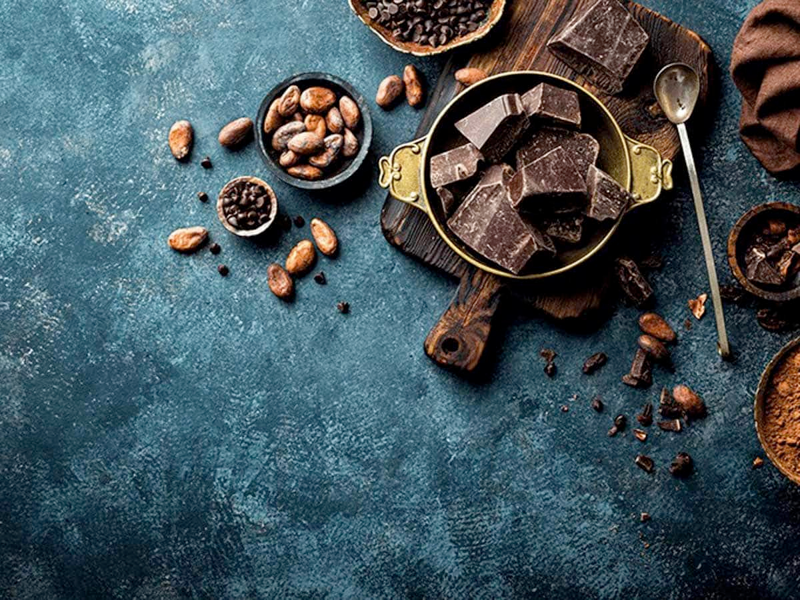

# Chocolate Science

*Cacao is a tropical tree, chocolate is a slab of fat with particles in it, and the same fat can crystallise into six different forms - only one of which makes a chocolate that snaps and shines. Understanding the science explains the labels, the price ranges and the cooking technique that follows.*

## Overview
Chocolate is a remarkable material. It is a stable solid at room temperature but melts neatly at body temperature (35 C), which is why it dissolves on the tongue. It is a fat-and-particle suspension where the fat (cocoa butter) sets in crystal forms; the particles (cocoa solids and sugar) sit suspended in that fat. The ratios determine whether it is dark, milk or white; the crystal form of the cocoa butter determines whether the bar is glossy or dull, snappy or soft, smooth or sandy.

This lesson covers the journey from cacao tree to chocolate bar, the chemistry that defines the major chocolate categories, and the cocoa butter crystal system that is the foundation of tempering.

## From Cacao Pod to Chocolate Bar

The chocolate tree is Theobroma cacao, native to the tropics of Central and South America. The bean is the seed inside the football-sized fruit pods. Three traditional varieties:

- **Criollo** - rare (less than 5% of world production), delicate, complex, premium. Mainly Central America.
- **Forastero** - the workhorse (about 80% of world production), robust, deep "cocoa" flavour, less complex.
- **Trinitario** - a hybrid, somewhere between the two.

Modern producers identify by region as well as variety - Madagascar, Ecuador (Arriba), Venezuela (Chuao), Ghana, Ivory Coast - each with characteristic flavour profiles, just as wine has region-specific character.

The journey:

1. **Harvest.** Pods are cut off the trunk (where they grow). Inside each pod are 30-50 beans surrounded by sweet white pulp.
2. **Fermentation.** Pods are cracked open; beans and pulp pile into boxes or under banana leaves and ferment for 4-7 days. The pulp's sugars feed yeast and bacteria; the bean's flavour precursors develop. This is when chocolate becomes "chocolate" - without fermentation, the bean tastes of generic plant matter.
3. **Drying.** Beans are sun-dried for 1-2 weeks until moisture drops below 7%.
4. **Roasting.** Beans are roasted at 110-140 C for 30-90 minutes. Maillard browning develops the deep chocolate aroma; lower temperatures preserve more delicate notes (and are used for premium "fine" chocolate), higher temperatures produce a darker, more uniform flavour (mass-market).
5. **Cracking and winnowing.** The roasted bean is crushed and the husks separated from the nibs (the bean meat).
6. **Grinding.** Nibs are ground - first into a coarse paste (cocoa mass / cocoa liquor), then progressively finer through stone mills or steel rollers. Below about 30 microns, the mouthfeel becomes smooth; above 30 microns it feels gritty.
7. **Conching.** The chocolate is mixed slowly in heated tanks for hours to days. The friction generates heat and shears the cocoa solids; volatile off-flavours (acetic acid, undesirable aldehydes) evaporate; the texture becomes silky. This is the step that separates "good" chocolate from "industrial". A 72-hour conching produces dramatically smoother chocolate than a 6-hour one.
8. **Tempering and moulding.** The finished chocolate is tempered (the [Tempering](tempering.md) lesson) and moulded into bars.

## The Three Major Categories

What makes dark, milk and white chocolate different is the recipe ratio of three ingredients: cocoa solids, cocoa butter, sugar (plus milk solids in milk and white).

**Dark chocolate** is cocoa solids + cocoa butter + sugar. Sometimes lecithin (a tiny amount, about 0.5%, for flow). Sometimes vanilla. That is the whole list.

- 70% dark: 70% cocoa (combined mass and butter), 30% sugar
- 80% dark: 80% cocoa, 20% sugar
- 100% chocolate: pure cocoa mass, no sugar. Intense, bitter, used as an ingredient

**Milk chocolate** adds milk solids (dried milk powder) and usually more sugar. The result is sweeter, creamier, less intense.

- Typical Belgian/Swiss milk: 30-40% cocoa, 15-25% milk solids, 35-45% sugar
- American-style milk (Hershey): around 11% cocoa - legally the minimum allowed to be called chocolate in the US

**White chocolate** has no cocoa solids - it is cocoa butter + milk solids + sugar + vanilla. The "chocolate" name is technically valid because cocoa butter is from the bean, but the flavour is dairy-and-vanilla, not cocoa.

- Typical: 30-40% cocoa butter, 20-30% milk solids, 35-45% sugar

## Cocoa Percentage Decoded

The number on the label (60% / 70% / 85%) refers to the total cocoa content - cocoa solids plus cocoa butter combined. It does not tell you the ratio between the two.

Two bars at 70% can be quite different:
- 70% with high cocoa butter (e.g. 50% cocoa solids + 20% cocoa butter): smoother, more melt-on-tongue, less intensely bitter
- 70% with low cocoa butter (e.g. 60% cocoa solids + 10% cocoa butter): more intensely chocolatey, more bitter, slightly waxier mouthfeel

Couverture (the higher-grade chocolate intended for tempering and confectionery) usually has 31-39% cocoa butter, which is what allows it to flow nicely when molten. Supermarket eating chocolate usually has 20-30% cocoa butter - less flow, but cheaper and fine for eating.

Read the ingredient list. If "cocoa butter" appears separately from "cocoa mass" or "cocoa liquor", the bar has added cocoa butter for flow. If only "cocoa mass" appears, the chocolate uses only the cocoa butter naturally present in the bean.

## Cocoa Butter and the Six Crystal Forms

Cocoa butter is solid at room temperature but liquid above 35 C. The way it solidifies determines the entire personality of the chocolate.

Cocoa butter is composed of triglycerides (long fat molecules) that can pack together in six different crystal structures, called polymorphs. They are usually labelled with Roman numerals (I to VI) or with Greek letters (gamma, alpha, beta-prime, beta).

| Form | Melting point | Stability | Result |
|------|---------------|-----------|--------|
| I (gamma) | 17 C | Very unstable | Soft, melts in hand |
| II (alpha) | 21-24 C | Unstable | Soft, melts in hand |
| III | 26 C | Unstable | Soft, dull |
| IV (beta-prime 2) | 28 C | Unstable | Soft, dull, prone to bloom |
| V (beta 2) | 32-34 C | Stable | Glossy, snaps, smooth |
| VI (beta 1) | 36 C | Stable, develops over time | Dull, slightly chalky |

The point of tempering is to encourage **Form V** specifically. Untempered chocolate sets into a mix of forms I-IV; over time these convert to Form VI (which is what causes "fat bloom" - the white-grey film that appears on poorly tempered chocolate after storage). Properly tempered Form V chocolate is dimensionally stable, snaps when broken, releases from moulds because it shrinks slightly on setting, and resists bloom for months.

The next lesson, [Tempering](tempering.md), is entirely about how to produce Form V crystals reliably.

## Bloom

Two kinds of bloom appear on chocolate:

**Fat bloom.** The white-grey film of cocoa butter crystals that have migrated to the surface. Caused by:
- Improper tempering (chocolate set in unstable crystal forms that convert over time)
- Temperature fluctuations (cocoa butter melts and re-crystallises at the surface, leaving its sharper Form V behind in favour of Form VI)
- Long storage in warm conditions

Fat bloom is harmless and the chocolate is still edible. It is cosmetic but indicates poor handling.

**Sugar bloom.** A grainy, slightly crystalline white film. Caused by:
- Moisture on the chocolate surface (from condensation if moved from cold to warm)
- The moisture dissolves sugar at the surface; when the water evaporates, sugar recrystallises

Sugar bloom is also harmless but indicates the chocolate has been exposed to humidity or condensation. Both blooms can be largely reversed by melting and re-tempering.

## Reading a Chocolate Label

A 70% dark chocolate label might read:

> **Ingredients:** Cocoa mass, sugar, cocoa butter, soy lecithin, natural vanilla flavouring.

Decoding:
- **Cocoa mass** - the cocoa solids and the cocoa butter naturally in the bean, ground together
- **Cocoa butter** - additional cocoa butter for flow and mouthfeel (good sign, indicates couverture or near-couverture quality)
- **Soy lecithin** - 0.3-0.5% emulsifier; helps flow without affecting flavour. Standard. (A small number of premium bars omit it.)
- **Sugar** - the second ingredient, so 30% sugar by weight - matches the 70% claim
- **Natural vanilla flavouring** - small amount of vanilla, typical of European chocolate

A milk chocolate label might add:
- **Milk powder / milk solids** - 15-25%
- **Soy lecithin and PGPR** - PGPR is a separate emulsifier; PGPR-containing chocolate is mass-market, not premium

A "compound chocolate" or "candy coating" label will list **vegetable fat** or **palm oil** instead of cocoa butter. This is not real chocolate and does not need tempering.

## Where Next
- [Tempering](tempering.md): the technique that produces Form V crystals. The most important lesson in the course.
- [Ganache](ganache.md): how chocolate emulsifies with cream.
- [Bars and Bonbons](bars-and-bonbons.md): putting tempered chocolate into a mould.
