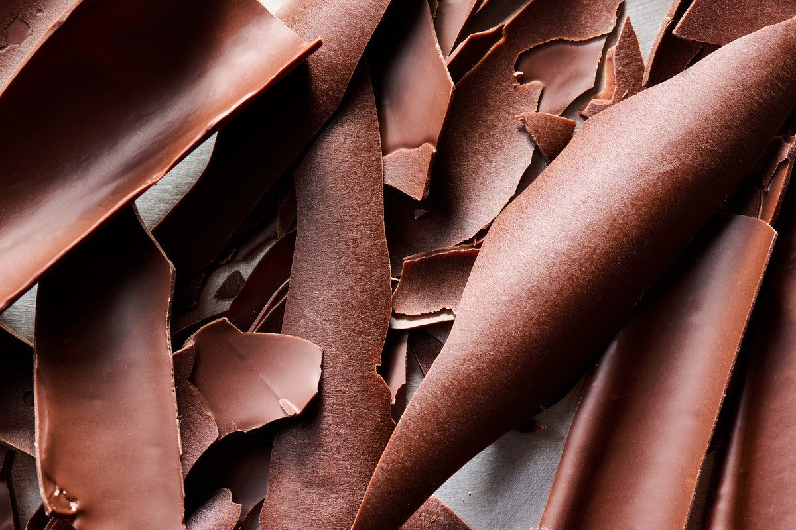

# Tempering

*The heat-and-cool cycle that produces stable Form V cocoa-butter crystals. Without it, chocolate is matte, soft and prone to bloom. With it, chocolate snaps cleanly, shines, and releases from moulds. The whole rest of the course depends on this lesson.*

## Overview
Tempering is the controlled crystallisation of cocoa butter into Form V (the [Chocolate Science](science.md) lesson covers why this matters). The technique is a temperature cycle: heat the chocolate well above all six crystal forms' melting points (around 50 C); cool it past the Form V melting point so that crystals begin to form (around 27 C); warm it slightly back up to a temperature where only the stable Form V crystals survive (31-32 C for dark; 30-31 C for milk and white).

Done right, you have working chocolate. You can pour it into moulds, dip strawberries in it, coat truffles - any of which will set in 5-10 minutes to a glossy, snappy finish. Done wrong, you have a sticky soft mess that will set into bloom in a few hours.

This lesson covers four methods. The first two (tabling, seeding) are classical and reliable. The third (microwave) is fast and works well with practice. The fourth (Mycryo / EZ-temper) is fool-proof and faster but needs special powdered cocoa butter.

## The Target Temperatures

These are the temperatures every method aims for. Memorise them, or write them on a sticky note next to the bowl.

| Chocolate | Melt to | Cool to | Working temperature |
|-----------|---------|---------|---------------------|
| Dark      | 45-50 C | 27-28 C | 31-32 C             |
| Milk      | 40-45 C | 27 C    | 29-30 C             |
| White     | 40-45 C | 26-27 C | 28-29 C             |

The differences come from the milk and dairy fat in milk and white chocolate, which slightly lower the Form V melting point.

## Method 1: Classical Tabling

The traditional patisserie school method. Reliable, dramatic to watch, the best for small batches (100-500 g).

You need:
- Couverture chocolate (200-300 g)
- A clean marble or granite slab (cool stone, not warm)
- A bench scraper or pastry scraper
- An offset palette knife
- A digital thermometer
- A heatproof bowl over a saucepan (bain-marie)

### Steps

1. **Melt completely.** Chop the chocolate finely (or use callets/pistoles - small disc-shaped pieces sold for tempering). Melt in a bain-marie or a microwave (low power, short bursts), stirring frequently, until completely smooth and at 45-50 C for dark (40-45 C for milk and white). All six crystal forms are now liquid; no seed crystals remain.

2. **Pour 2/3 onto the slab.** Set aside 1/3 of the chocolate in the bowl - this stays warm. Pour the other 2/3 onto the marble slab in a wide pool.

3. **Spread and gather.** With the bench scraper and palette knife, spread the chocolate thin across the slab; then gather it back to the centre. Repeat. The thinning spreads the chocolate over the cool stone (which absorbs heat); the gathering keeps it together as a working mass.

4. **Watch the thermometer.** Continue spreading and gathering until the chocolate cools to **27-28 C** for dark (26-27 C for white/milk). At this temperature it has thickened noticeably - it is now a stiff paste, no longer a pourable liquid. Form IV and V crystals have started to nucleate.

5. **Add back to the warm 1/3.** Scrape the tempered mass back into the bowl with the reserved warm chocolate. Stir gently and thoroughly to combine. The mass should rise to **31-32 C** for dark (29-30 C for milk and white). This is the working temperature - Form IV and unstable crystals melt; Form V remains. The chocolate is now tempered.

6. **Test.** Dip the end of a clean offset palette knife or a small spoon into the chocolate. Set aside at room temperature (around 20 C, not a cold fridge). It should set within 3-5 minutes to a glossy snap. If it sets to a streaky dull surface, the temper is off - usually because the working temperature was too high (over-warm, melting the seed) or too low (under-warm, insufficient flow). Adjust and try again.

7. **Work fast.** Tempered chocolate stays in temper for about 20-30 minutes at room temperature before the working temperature drops and it becomes too thick. To extend the working window, place the bowl on a folded tea towel over a heat source (a low warming pad set to 30 C, the lowest setting of an electric heating pad) so the temperature stays in the working range.

### Why It Works

The cool slab pulls the chocolate down through the Form IV/V crystal nucleation temperature. Spreading thin maximises contact with the cool stone; gathering brings the mass together so it crystallises evenly. The final warm-up phase melts away unstable Form IV crystals while leaving Form V intact - "seeding" the bulk of the chocolate with the right crystal structure.

## Method 2: Seed Tempering

The simplest reliable method. Faster than tabling, no marble slab needed. Works well for medium batches.

You need:
- Couverture chocolate, 1 kg of which 200 g is set aside as "seed"
- A heatproof bowl over a bain-marie
- A digital thermometer
- A silicone spatula

### Steps

1. **Melt 800 g.** Heat to 45-50 C. All crystals melted.
2. **Remove from heat.** Add the 200 g of unmelted chocolate (the seed). Stir gently.
3. **Stir until cooled to the working temperature.** The seed pieces are at room temperature (around 20 C). As they melt into the warm chocolate, they cool the mass and donate their crystal structure. Stir steadily; some seed pieces may not fully melt - that is fine.
4. **Reach 31-32 C for dark.** Once the chocolate is at the working temperature and any unmelted seed has been removed (or has fully melted), test by dipping a knife and letting it set at room temperature. A clean glossy snap means tempered.

### Why It Works

The unmelted seed brings Form V crystals into the melted mass. Stirring distributes them. Cooling slows down so the crystal structure of the seed propagates through the bulk. The unstable crystals from the melted-and-cooled chocolate get incorporated into the Form V structure of the seed - they all align together.

This works best with couverture chocolate that has been properly tempered when bought (most commercial couverture is). It does not work with badly-stored chocolate that has already bloomed.

## Method 3: Microwave

Fast, no special equipment, easy to control. Good for small batches (100-300 g).

### Steps

1. **Chop the chocolate.** Fine chips melt evenly; large chunks heat unevenly and overheat the surface.
2. **Place in a microwave-safe bowl.** Microwave on **medium-low** (300-500 W, around 50% power on most home microwaves) for **30-45 second bursts**. Stir thoroughly between each burst.
3. **Stop melting at 30-32 C.** This is critical: do not melt fully. Stop when about 75-80% of the chocolate is melted; small chunks should still be visible.
4. **Stir continuously.** The residual heat in the melted chocolate finishes melting the remaining chunks while the chunks themselves act as seed crystals.
5. **Reach 31-32 C.** Test for temper by dipping a knife.

The trick: starting from cool chocolate, do not let the temperature exceed the working temperature (31-32 C for dark). The chocolate never goes above the Form V melting point, so the existing Form V crystals from the original chocolate are preserved - they seed the rest.

### Why It Works

This is "incremental tempering" - you never destroy the Form V crystals in the first place, so you do not need to recreate them. The bulk of the original chocolate is already tempered; partial melting keeps that crystal structure intact while liquefying the chocolate.

### Failure modes

- Overheating any single portion to over 35 C destroys local Form V; the result is uneven temper.
- Microwaves vary; medium-low on one microwave is different from another. Calibrate with a test batch.
- Large chunks at the end can stay solid while the surrounding chocolate is too warm; the result is correctly-tempered chocolate plus chunks of solid chocolate. Either chop finer next time or hand-warm the chocolate slightly with the residual heat of the bowl.

## Method 4: Mycryo / EZ-temper

The easiest method. Buy a small bag of powdered cocoa butter (sold as Mycryo by Cacao Barry, or as cocoa butter silk from EZ-temper machines). The powdered cocoa butter is pure Form V crystals.

### Steps

1. **Melt the chocolate** to 40-42 C (not as hot as the other methods - we are not destroying existing crystals).
2. **Add 1% Mycryo by weight.** For 500 g of chocolate, add 5 g.
3. **Stir thoroughly.** The Mycryo melts in and donates Form V crystals.
4. **Cool to working temperature.** Let it sit until it reaches 31-32 C. Tempered.

### Why It Works

The Mycryo is essentially pure Form V seed in powder form. Adding 1% directly to molten chocolate provides millions of crystal nucleation sites; the chocolate sets in Form V naturally.

This is the home cook's cheat code. It is the most reliable method available, requires no specialised equipment beyond a thermometer, and produces excellent results. The only downside: Mycryo is not cheap (around £25/kg) and not always available at supermarkets - order online.

## Testing for Temper

Drop a spoonful of tempered chocolate onto a piece of greaseproof paper or a clean cold plate. After 3-5 minutes at room temperature (18-22 C):

- **Properly tempered:** Set, glossy, snaps cleanly when broken. Smooth texture, no white streaks. This is the goal.
- **Under-tempered (too warm):** Still slightly soft and sticky after 5 minutes. May set eventually but with white streaks or bloom appearing within hours.
- **Over-tempered (too cool or too thick):** Set quickly but matte or with a slightly grainy appearance. Snaps but not glossy.

If the test fails, you have two choices:
1. Reheat to 45-50 C to fully melt, and restart the temper.
2. Adjust the working temperature: if under-tempered, gently warm 0.5-1 C; if over-tempered, gently cool 0.5-1 C.

## Common Failures and Fixes

| Symptom | Cause | Fix |
|---------|-------|-----|
| Sets soft and sticky | Working temperature too high | Cool 1-2 C; agitate to encourage Form V crystals |
| White streaks on set chocolate | Under-tempered (Form V not propagated) | Reheat, restart with more seed or longer tempering |
| Grainy or thick chocolate | Over-tempered or partially seized | Reheat to 45 C, redo. If seized from water, throw out |
| Slow to set | Working temp too high or too much butter | Cool slightly; check chocolate has right cocoa butter ratio |
| Chocolate stuck in mould | Insufficient temper (no shrinkage on setting) | Re-temper; properly tempered chocolate releases cleanly |
| Bloom appears after a day | Crystal structure unstable; partial Form V | Re-temper and use fresh |

## Working Window

Tempered chocolate stays in temper for 20-40 minutes at room temperature before becoming too thick to work. To extend:

- Place the bowl on a folded towel over a low-warming pad (set to about 30 C).
- Stir frequently to keep the crystal structure even throughout.
- Test the temper occasionally - if the chocolate has been heated above 34 C at any point, the Form V is destroyed and you need to start again.

For continuous work, a chocolate tempering machine (small countertop unit, 1-2 kg capacity) holds chocolate at the working temperature indefinitely. For home use this is overkill; for any volume work it is essential.

## Where Next
- [Ganache](ganache.md): tempered chocolate is the base; ganache adds cream to make a softer filling.
- [Bars and Bonbons](bars-and-bonbons.md): the moulded product application of tempered chocolate.
- [Sauce and Glaze](sauce-and-glaze.md): the liquid applications that do not require temper.
