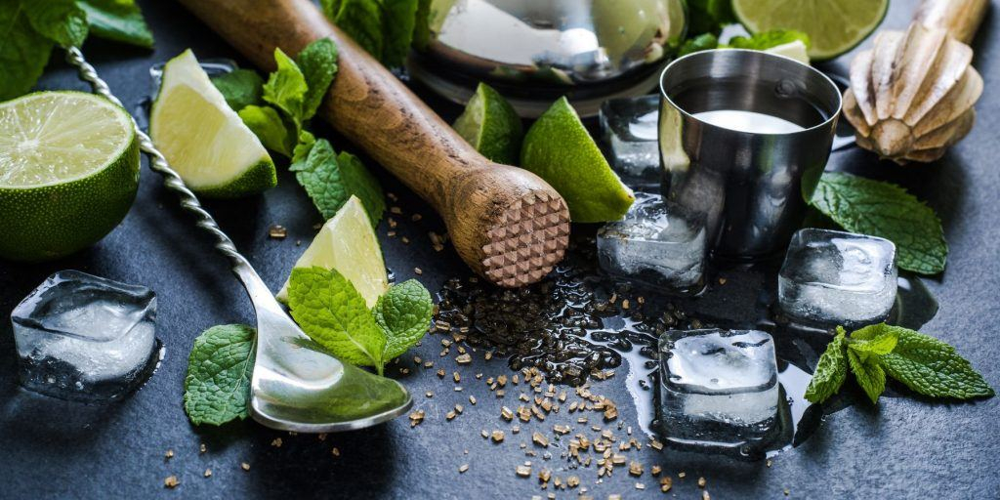

# Worked Examples

*Six cocktails, one from each family, made step-by-step with the principles from the previous pages. Make them in this order; the difficulty rises gradually. Once you've made all six, you can read any cocktail recipe and execute it.*

## Overview

The six families covered: Old Fashioned, Manhattan, Daiquiri, Martini, Sour, Highball. Worked examples below for one canonical cocktail from each. Each starts with the family principle (from the earlier pages), then gives the specific recipe with the bartender technique called out.

The order is from easiest to hardest:

1. Old Fashioned (stir; no citrus)
2. Daiquiri (shake; basic citrus + sugar)
3. Negroni (stir; equal parts; no measuring tricks)
4. Whisky Sour (dry shake + wet shake; egg white)
5. Mojito (build; muddle; soda top)
6. Aviation (shake; multiple modifiers)

## 1. Old Fashioned

**Family:** Old Fashioned (spirit + sugar + bitters + ice).
**Technique:** stir.
**Glass:** rocks glass.

### Ingredients (1 drink)
- 60 ml rye whisky (or bourbon if you prefer sweeter; Bulleit Rye or Knob Creek)
- 1 teaspoon demerara syrup (or 1 demerara sugar cube)
- 3 dashes Angostura bitters
- Orange twist (large strip, expressed)
- 1 large clear ice cube (or 3 regular cubes)

### Method
1. In the rocks glass, place the sugar cube (or syrup) and 3 dashes of bitters.
2. Add 5 ml of cold water; stir to dissolve.
3. Add the whisky.
4. Add the large ice cube.
5. Stir for 25 seconds with the bar spoon, tracing the wall of the glass - chills and dilutes.
6. Cut the orange peel; express the oils over the surface; rub the peel around the rim; drop in.
7. Serve.

### Why each step
- The sugar dissolves with bitters + water first because cold-spirit doesn't dissolve dry sugar well.
- The single large ice cube melts slowly, so the drink lasts 15-20 minutes without going watery.
- The orange twist is canonical - change to a lemon twist and you've made a Brandy Old Fashioned; add maple syrup and you've made a "modern Old Fashioned".

## 2. Daiquiri

**Family:** Daiquiri (spirit + citrus + sugar).
**Technique:** shake.
**Glass:** coupe.

### Ingredients (1 drink)
- 60 ml white rum (Bacardí is fine; Plantation 3-Star is better)
- 25 ml fresh lime juice (just squeezed)
- 15 ml simple syrup (1:1 sugar:water)
- Lime wheel (optional garnish)

### Method
1. Chill the coupe in the freezer or with ice for 5 minutes.
2. In the Boston shaker tin, combine rum, lime juice, syrup.
3. Fill the tin half-full with ice.
4. Cap with the smaller mixing glass; press firmly to seal.
5. Shake hard for 12 seconds (you'll feel the icy condensation through the tin).
6. Strain through the Hawthorne strainer into the chilled coupe.
7. Float a lime wheel or skip the garnish.

### Why each step
- The shake is HARD (over-the-shoulder, both arms) for 12-15 seconds - the goal is full chill + about 35% dilution.
- The fresh lime is non-negotiable. Bottled lime juice tastes wrong.
- Don't sweeten with regular sugar in the tin; it doesn't dissolve. Always simple syrup.

## 3. Negroni

**Family:** Manhattan (spirit + modifier + balancer).
**Technique:** stir.
**Glass:** rocks glass.

### Ingredients (1 drink)
- 30 ml gin (any decent London Dry - Tanqueray, Beefeater, Sipsmith)
- 30 ml sweet vermouth (Carpano Antica, Cocchi di Torino, or Punt e Mes)
- 30 ml Campari
- Orange twist (large strip, expressed)
- Ice cube (large or several regular cubes)

### Method
1. In the mixing glass, combine the gin, vermouth, and Campari.
2. Fill with ice (about ¾ full).
3. Stir with the bar spoon for 30 seconds, against the glass wall.
4. Strain over a single large ice cube in a rocks glass.
5. Express the orange peel over the drink; drop in.

### Why each step
- Equal parts is the canonical recipe (1:1:1). The Negroni works because the three ingredients pull in opposing directions: sweet vermouth (sweet), gin (juniper-bitter), Campari (bitter-orange). The balance is the cocktail.
- Stirring over 30 seconds gives the right dilution; the Negroni's first sip should be slightly cool and intensely bitter; subsequent sips soften as the ice melts.
- The orange twist's expression is essential - it adds an aromatic top-note that ties the gin and Campari's orange-pith bitterness together.

## 4. Whisky Sour

**Family:** Sour (spirit + citrus + sugar + egg white).
**Technique:** dry shake + wet shake.
**Glass:** coupe.

### Ingredients (1 drink)
- 50 ml bourbon (Buffalo Trace; Bulleit; Maker's Mark)
- 25 ml fresh lemon juice
- 15 ml simple syrup
- 15 ml egg white (from a separated small egg; about ½ an egg)
- 3 dashes Angostura bitters (for decoration on top of the foam)
- Maraschino cherry on a pick (optional)

### Method
1. Chill the coupe.
2. In the shaker tin, combine bourbon, lemon, syrup, egg white.
3. **Dry shake** (no ice) for 10 seconds - this aerates the egg white into thick foam.
4. Open the tin; add ice (half-full).
5. Close; **wet shake** for 12-15 seconds.
6. Double-strain through the Hawthorne AND a fine mesh strainer into the coupe (catches any tiny ice shards and gives a glassy surface to the foam).
7. Dash the bitters in a pattern on the foam (3 dots side-by-side; drag a pick through them for a heart shape).
8. Garnish with a cherry on a pick if you want.

### Why each step
- The dry shake aerates without dilution; the resulting foam is what makes a Sour a Sour.
- Egg whites pasteurise during the agitation and the alcohol content - safe at this proportion.
- Double-strain into the coupe so the foam stays clean.
- The bitters on top is decorative AND functional - dragging them gives you a brief lift of Angostura on the first sip.

## 5. Mojito

**Family:** Highball (spirit + long mixer).
**Technique:** build in glass with muddle.
**Glass:** highball.

### Ingredients (1 drink)
- 50 ml white rum
- 25 ml fresh lime juice
- 15 ml simple syrup
- 8-10 fresh mint leaves
- Soda water to top (about 120 ml)
- Crushed ice (or regular cubes)
- 1 long mint sprig (slapped, for garnish)

### Method
1. In the highball glass, add the mint leaves.
2. Pour the lime juice and simple syrup over the mint.
3. Gently muddle the mint with the back of a bar spoon (don't pulverise - just bruise to release the oils).
4. Add the rum.
5. Fill with crushed ice (or stacked regular cubes).
6. Top with soda water.
7. Stir briefly with the bar spoon.
8. Slap the mint sprig between your palms; insert into the drink.

### Why each step
- Muddle gently - over-muddled mint releases chlorophyll bitterness and tastes "green".
- The crushed ice is canonical for the textural reason - colder, slushier, more refreshing.
- The soda top is generous; the Mojito is a long drink meant for slow sipping.
- The slapped mint sprig perfumes the drink at every sip via the released aromatics.

## 6. Aviation

**Family:** Sour with multiple modifiers.
**Technique:** shake.
**Glass:** coupe.

### Ingredients (1 drink)
- 45 ml London Dry gin (the higher juniper, the better)
- 15 ml fresh lemon juice
- 15 ml maraschino liqueur (Luxardo)
- 8 ml crème de violette (or omit, see notes)
- Maraschino cherry (optional)

### Method
1. Chill the coupe.
2. In the shaker, combine gin, lemon, maraschino, violette.
3. Add ice; shake hard for 12-15 seconds.
4. Strain into the chilled coupe.
5. Drop in a maraschino cherry.

### Why each step
- The cocktail is named for its pale sky-blue colour from the violette.
- Without violette (rare in supermarkets), the cocktail is technically a "Casino" - still delicious, just clearer in colour.
- The proportions matter: maraschino is intensely sweet, so 15 ml is the maximum; violette is intensely floral, so 8 ml.
- This is the hardest of the six because the balance between four ingredients is more delicate than three. Get the gin-to-lemon ratio right (3:1) and the rest balances.

## After these six

You've now executed all six families. Every other classic cocktail in the world is a variant on one of these. Try:

- **Margarita** (Daiquiri family with tequila + Cointreau replacing rum + simple syrup).
- **Boulevardier** (Manhattan family with bourbon + sweet vermouth + Campari).
- **Sazerac** (Old Fashioned family with rye + sugar + Peychaud's bitters + absinthe-rinsed glass).
- **Last Word** (Sour family with gin + lime + maraschino + green Chartreuse, equal parts, shaken).
- **Gin and Tonic** (Highball family with gin + tonic, the simple endpoint).
- **Vesper** (Martini family with gin + vodka + Lillet Blanc).

Read any cocktail recipe; place it in a family; execute with the family's standard technique. The course's job is done.
