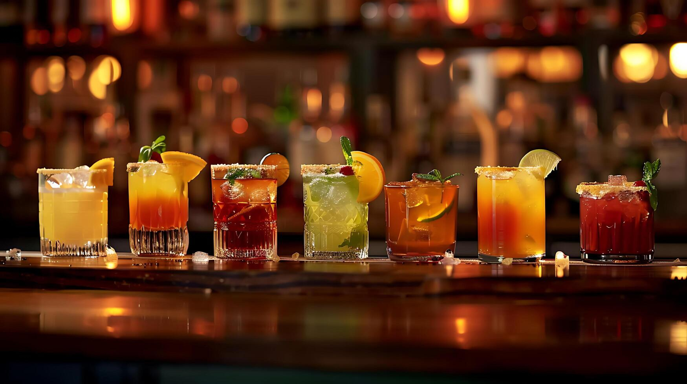

# What Cocktails Actually Are

*A cocktail is three things: a base spirit, a modifier, and a balancer. Get those three in proportion and you have a drink that's better than most bar versions; get the technique wrong and you're drinking watered-down spirits with an expensive garnish.*

## Overview

Every classic cocktail in the world fits a small set of shapes. The Manhattan is a base spirit (rye) + a modifier (sweet vermouth) + a balancer (bitters). The Daiquiri is a base spirit (rum) + a modifier (lime juice) + a balancer (sugar). The Negroni is gin + sweet vermouth + Campari, with all three pulling in different directions and the proportions making it work.

Learning cocktail-making is mostly learning to taste those three roles, choose ingredients that fill them well, and execute the technique that brings them together. The technique is small but precise: the right ice, the right method (shake or stir), the right dilution, the right glass, the right garnish. Each step matters.

This course covers all of that. The next pages walk through equipment, the shake-vs-stir decision (the single most common mistake), the six families that contain every classic, the role of ice and dilution, garnish craft, and finally worked examples that put it together.

## Where it sits

The cocktails on this site live under [drinks/cocktails/](../../drinks/cocktails/). Each page links to the recipes that demonstrate its principles. The Old Fashioned page references the [old-fashioned recipe](../../drinks/cocktails/old-fashioned.md); the Daiquiri page references the [daiquiri recipe](../../drinks/cocktails/daiquiri.md). Use the course to learn the technique; use the recipes when you want a specific drink.

## What you need

The course assumes you have basic kitchen tools (a knife, a citrus juicer, a peeler). The dedicated cocktail kit is small and explained on the next page: a shaker, a mixing glass, a jigger, a strainer, a bar spoon, and a few glasses. Total spend at decent quality: about £60-80. You won't outgrow any of it.

## How to use the course

1. **Read the six pages in order** the first time through.
2. **Pick one classic** from the worked-examples page (an Old Fashioned is easiest) and make it. Taste it.
3. **Vary one ingredient** the next time you make it. Notice the change.
4. **Move to a second classic** in a different family (a Daiquiri after an Old Fashioned shows the contrast).
5. **Repeat** until the six families feel familiar, then any cocktail recipe you read becomes immediately legible.

The whole thing takes about two weeks if you make one drink a night.
